```{=openxml}
<w:p><w:pPr><w:jc w:val="center"/><w:spacing w:before="0" w:after="120" w:line="360" w:lineRule="auto"/><w:rPr><w:rFonts w:ascii="Times New Roman" w:hAnsi="Times New Roman"/><w:b/><w:sz w:val="28"/></w:rPr></w:pPr><w:r><w:rPr><w:rFonts w:ascii="Times New Roman" w:hAnsi="Times New Roman"/><w:b/><w:sz w:val="28"/></w:rPr><w:t xml:space="preserve">ĐẠI HỌC TRÀ VINH</w:t></w:r></w:p><w:p><w:pPr><w:jc w:val="center"/><w:spacing w:before="0" w:after="120" w:line="360" w:lineRule="auto"/><w:rPr><w:rFonts w:ascii="Times New Roman" w:hAnsi="Times New Roman"/><w:b/><w:sz w:val="28"/></w:rPr></w:pPr><w:r><w:rPr><w:rFonts w:ascii="Times New Roman" w:hAnsi="Times New Roman"/><w:b/><w:sz w:val="28"/></w:rPr><w:t xml:space="preserve">TRƯỜNG KỸ THUẬT VÀ CÔNG NGHỆ</w:t></w:r></w:p><w:p><w:pPr><w:jc w:val="center"/><w:spacing w:before="0" w:after="120" w:line="360" w:lineRule="auto"/><w:rPr><w:rFonts w:ascii="Times New Roman" w:hAnsi="Times New Roman"/><w:b/><w:sz w:val="28"/></w:rPr></w:pPr><w:r><w:rPr><w:rFonts w:ascii="Times New Roman" w:hAnsi="Times New Roman"/><w:b/><w:sz w:val="28"/></w:rPr><w:t xml:space="preserve">KHOA CÔNG NGHỆ THÔNG TIN</w:t></w:r></w:p><w:p><w:pPr><w:rPr><w:sz w:val="26"/></w:rPr></w:pPr></w:p><w:p><w:pPr><w:rPr><w:sz w:val="26"/></w:rPr></w:pPr></w:p><w:p><w:pPr><w:rPr><w:sz w:val="26"/></w:rPr></w:pPr></w:p><w:p><w:pPr><w:rPr><w:sz w:val="26"/></w:rPr></w:pPr></w:p><w:p><w:pPr><w:jc w:val="center"/><w:spacing w:before="0" w:after="120" w:line="360" w:lineRule="auto"/><w:rPr><w:rFonts w:ascii="Times New Roman" w:hAnsi="Times New Roman"/><w:b/><w:sz w:val="30"/></w:rPr></w:pPr><w:r><w:rPr><w:rFonts w:ascii="Times New Roman" w:hAnsi="Times New Roman"/><w:b/><w:sz w:val="30"/></w:rPr><w:t xml:space="preserve">ĐỒ ÁN MÔN HỌC: CHUYÊN ĐỀ ASP.NET</w:t></w:r></w:p><w:p><w:pPr><w:jc w:val="center"/><w:spacing w:before="0" w:after="120" w:line="360" w:lineRule="auto"/><w:rPr><w:rFonts w:ascii="Times New Roman" w:hAnsi="Times New Roman"/><w:b/><w:sz w:val="26"/></w:rPr></w:pPr><w:r><w:rPr><w:rFonts w:ascii="Times New Roman" w:hAnsi="Times New Roman"/><w:b/><w:sz w:val="26"/></w:rPr><w:t xml:space="preserve">HỌC KỲ HÈ, NĂM HỌC 2025-2026</w:t></w:r></w:p><w:p><w:pPr><w:rPr><w:sz w:val="26"/></w:rPr></w:pPr></w:p><w:p><w:pPr><w:rPr><w:sz w:val="26"/></w:rPr></w:pPr></w:p><w:p><w:pPr><w:jc w:val="center"/><w:spacing w:before="0" w:after="120" w:line="360" w:lineRule="auto"/><w:rPr><w:rFonts w:ascii="Times New Roman" w:hAnsi="Times New Roman"/><w:b/><w:sz w:val="32"/></w:rPr></w:pPr><w:r><w:rPr><w:rFonts w:ascii="Times New Roman" w:hAnsi="Times New Roman"/><w:b/><w:sz w:val="32"/></w:rPr><w:t xml:space="preserve">XÂY DỰNG WEBSITE GỢI Ý NẤU ĂN</w:t></w:r></w:p><w:p><w:pPr><w:jc w:val="center"/><w:spacing w:before="0" w:after="120" w:line="360" w:lineRule="auto"/><w:rPr><w:rFonts w:ascii="Times New Roman" w:hAnsi="Times New Roman"/><w:b/><w:sz w:val="32"/></w:rPr></w:pPr><w:r><w:rPr><w:rFonts w:ascii="Times New Roman" w:hAnsi="Times New Roman"/><w:b/><w:sz w:val="32"/></w:rPr><w:t xml:space="preserve">VÀ LẬP THỰC ĐƠN CHO GIA ĐÌNH</w:t></w:r></w:p><w:p><w:pPr><w:rPr><w:sz w:val="26"/></w:rPr></w:pPr></w:p><w:p><w:pPr><w:rPr><w:sz w:val="26"/></w:rPr></w:pPr></w:p><w:p><w:pPr><w:rPr><w:sz w:val="26"/></w:rPr></w:pPr></w:p><w:p><w:pPr><w:rPr><w:sz w:val="26"/></w:rPr></w:pPr></w:p><w:p><w:pPr><w:spacing w:before="60" w:after="60" w:line="360" w:lineRule="auto"/><w:rPr><w:rFonts w:ascii="Times New Roman" w:hAnsi="Times New Roman"/><w:b/><w:sz w:val="26"/></w:rPr></w:pPr><w:r><w:rPr><w:rFonts w:ascii="Times New Roman" w:hAnsi="Times New Roman"/><w:b/><w:sz w:val="26"/></w:rPr><w:t xml:space="preserve">Giảng viên hướng dẫn: [ThS./TS. ..............................]</w:t></w:r></w:p><w:p><w:pPr><w:spacing w:before="60" w:after="60" w:line="360" w:lineRule="auto"/><w:rPr><w:rFonts w:ascii="Times New Roman" w:hAnsi="Times New Roman"/><w:b/><w:sz w:val="26"/></w:rPr></w:pPr><w:r><w:rPr><w:rFonts w:ascii="Times New Roman" w:hAnsi="Times New Roman"/><w:b/><w:sz w:val="26"/></w:rPr><w:t xml:space="preserve">Sinh viên thực hiện:</w:t></w:r></w:p><w:p><w:pPr><w:spacing w:before="60" w:after="60" w:line="360" w:lineRule="auto"/><w:rPr><w:rFonts w:ascii="Times New Roman" w:hAnsi="Times New Roman"/><w:sz w:val="26"/></w:rPr></w:pPr><w:r><w:rPr><w:rFonts w:ascii="Times New Roman" w:hAnsi="Times New Roman"/><w:sz w:val="26"/></w:rPr><w:t xml:space="preserve">Họ tên: Phan Thị Thanh Mai</w:t></w:r></w:p><w:p><w:pPr><w:spacing w:before="60" w:after="60" w:line="360" w:lineRule="auto"/><w:rPr><w:rFonts w:ascii="Times New Roman" w:hAnsi="Times New Roman"/><w:sz w:val="26"/></w:rPr></w:pPr><w:r><w:rPr><w:rFonts w:ascii="Times New Roman" w:hAnsi="Times New Roman"/><w:sz w:val="26"/></w:rPr><w:t xml:space="preserve">MSSV: [....................]</w:t></w:r></w:p><w:p><w:pPr><w:spacing w:before="60" w:after="60" w:line="360" w:lineRule="auto"/><w:rPr><w:rFonts w:ascii="Times New Roman" w:hAnsi="Times New Roman"/><w:sz w:val="26"/></w:rPr></w:pPr><w:r><w:rPr><w:rFonts w:ascii="Times New Roman" w:hAnsi="Times New Roman"/><w:sz w:val="26"/></w:rPr><w:t xml:space="preserve">Lớp: DK24TT102</w:t></w:r></w:p><w:p><w:pPr><w:rPr><w:sz w:val="26"/></w:rPr></w:pPr></w:p><w:p><w:pPr><w:rPr><w:sz w:val="26"/></w:rPr></w:pPr></w:p><w:p><w:pPr><w:rPr><w:sz w:val="26"/></w:rPr></w:pPr></w:p><w:p><w:pPr><w:jc w:val="center"/><w:spacing w:before="0" w:after="120" w:line="360" w:lineRule="auto"/><w:rPr><w:rFonts w:ascii="Times New Roman" w:hAnsi="Times New Roman"/><w:sz w:val="26"/></w:rPr></w:pPr><w:r><w:rPr><w:rFonts w:ascii="Times New Roman" w:hAnsi="Times New Roman"/><w:sz w:val="26"/></w:rPr><w:t xml:space="preserve">Vĩnh Long, tháng 7 năm 2026</w:t></w:r></w:p>
<w:p><w:r><w:br w:type="page"/></w:r></w:p>
<w:p><w:pPr><w:jc w:val="center"/><w:spacing w:before="0" w:after="120" w:line="360" w:lineRule="auto"/><w:rPr><w:rFonts w:ascii="Times New Roman" w:hAnsi="Times New Roman"/><w:b/><w:sz w:val="28"/></w:rPr></w:pPr><w:r><w:rPr><w:rFonts w:ascii="Times New Roman" w:hAnsi="Times New Roman"/><w:b/><w:sz w:val="28"/></w:rPr><w:t xml:space="preserve">TRƯỜNG KỸ THUẬT VÀ CÔNG NGHỆ</w:t></w:r></w:p><w:p><w:pPr><w:jc w:val="center"/><w:spacing w:before="0" w:after="120" w:line="360" w:lineRule="auto"/><w:rPr><w:rFonts w:ascii="Times New Roman" w:hAnsi="Times New Roman"/><w:b/><w:sz w:val="28"/></w:rPr></w:pPr><w:r><w:rPr><w:rFonts w:ascii="Times New Roman" w:hAnsi="Times New Roman"/><w:b/><w:sz w:val="28"/></w:rPr><w:t xml:space="preserve">KHOA CÔNG NGHỆ THÔNG TIN</w:t></w:r></w:p><w:p><w:pPr><w:rPr><w:sz w:val="26"/></w:rPr></w:pPr></w:p><w:p><w:pPr><w:rPr><w:sz w:val="26"/></w:rPr></w:pPr></w:p><w:p><w:pPr><w:rPr><w:sz w:val="26"/></w:rPr></w:pPr></w:p><w:p><w:pPr><w:rPr><w:sz w:val="26"/></w:rPr></w:pPr></w:p><w:p><w:pPr><w:jc w:val="center"/><w:spacing w:before="0" w:after="120" w:line="360" w:lineRule="auto"/><w:rPr><w:rFonts w:ascii="Times New Roman" w:hAnsi="Times New Roman"/><w:b/><w:sz w:val="30"/></w:rPr></w:pPr><w:r><w:rPr><w:rFonts w:ascii="Times New Roman" w:hAnsi="Times New Roman"/><w:b/><w:sz w:val="30"/></w:rPr><w:t xml:space="preserve">ĐỒ ÁN MÔN HỌC: CHUYÊN ĐỀ ASP.NET</w:t></w:r></w:p><w:p><w:pPr><w:jc w:val="center"/><w:spacing w:before="0" w:after="120" w:line="360" w:lineRule="auto"/><w:rPr><w:rFonts w:ascii="Times New Roman" w:hAnsi="Times New Roman"/><w:b/><w:sz w:val="26"/></w:rPr></w:pPr><w:r><w:rPr><w:rFonts w:ascii="Times New Roman" w:hAnsi="Times New Roman"/><w:b/><w:sz w:val="26"/></w:rPr><w:t xml:space="preserve">HỌC KỲ HÈ, NĂM HỌC 2025-2026</w:t></w:r></w:p><w:p><w:pPr><w:rPr><w:sz w:val="26"/></w:rPr></w:pPr></w:p><w:p><w:pPr><w:rPr><w:sz w:val="26"/></w:rPr></w:pPr></w:p><w:p><w:pPr><w:jc w:val="center"/><w:spacing w:before="0" w:after="120" w:line="360" w:lineRule="auto"/><w:rPr><w:rFonts w:ascii="Times New Roman" w:hAnsi="Times New Roman"/><w:b/><w:sz w:val="32"/></w:rPr></w:pPr><w:r><w:rPr><w:rFonts w:ascii="Times New Roman" w:hAnsi="Times New Roman"/><w:b/><w:sz w:val="32"/></w:rPr><w:t xml:space="preserve">XÂY DỰNG WEBSITE GỢI Ý NẤU ĂN</w:t></w:r></w:p><w:p><w:pPr><w:jc w:val="center"/><w:spacing w:before="0" w:after="120" w:line="360" w:lineRule="auto"/><w:rPr><w:rFonts w:ascii="Times New Roman" w:hAnsi="Times New Roman"/><w:b/><w:sz w:val="32"/></w:rPr></w:pPr><w:r><w:rPr><w:rFonts w:ascii="Times New Roman" w:hAnsi="Times New Roman"/><w:b/><w:sz w:val="32"/></w:rPr><w:t xml:space="preserve">VÀ LẬP THỰC ĐƠN CHO GIA ĐÌNH</w:t></w:r></w:p><w:p><w:pPr><w:rPr><w:sz w:val="26"/></w:rPr></w:pPr></w:p><w:p><w:pPr><w:rPr><w:sz w:val="26"/></w:rPr></w:pPr></w:p><w:p><w:pPr><w:rPr><w:sz w:val="26"/></w:rPr></w:pPr></w:p><w:p><w:pPr><w:rPr><w:sz w:val="26"/></w:rPr></w:pPr></w:p><w:p><w:pPr><w:spacing w:before="60" w:after="60" w:line="360" w:lineRule="auto"/><w:rPr><w:rFonts w:ascii="Times New Roman" w:hAnsi="Times New Roman"/><w:b/><w:sz w:val="26"/></w:rPr></w:pPr><w:r><w:rPr><w:rFonts w:ascii="Times New Roman" w:hAnsi="Times New Roman"/><w:b/><w:sz w:val="26"/></w:rPr><w:t xml:space="preserve">Giảng viên hướng dẫn: [ThS./TS. ..............................]</w:t></w:r></w:p><w:p><w:pPr><w:spacing w:before="60" w:after="60" w:line="360" w:lineRule="auto"/><w:rPr><w:rFonts w:ascii="Times New Roman" w:hAnsi="Times New Roman"/><w:b/><w:sz w:val="26"/></w:rPr></w:pPr><w:r><w:rPr><w:rFonts w:ascii="Times New Roman" w:hAnsi="Times New Roman"/><w:b/><w:sz w:val="26"/></w:rPr><w:t xml:space="preserve">Sinh viên thực hiện:</w:t></w:r></w:p><w:p><w:pPr><w:spacing w:before="60" w:after="60" w:line="360" w:lineRule="auto"/><w:rPr><w:rFonts w:ascii="Times New Roman" w:hAnsi="Times New Roman"/><w:sz w:val="26"/></w:rPr></w:pPr><w:r><w:rPr><w:rFonts w:ascii="Times New Roman" w:hAnsi="Times New Roman"/><w:sz w:val="26"/></w:rPr><w:t xml:space="preserve">Họ tên: Phan Thị Thanh Mai</w:t></w:r></w:p><w:p><w:pPr><w:spacing w:before="60" w:after="60" w:line="360" w:lineRule="auto"/><w:rPr><w:rFonts w:ascii="Times New Roman" w:hAnsi="Times New Roman"/><w:sz w:val="26"/></w:rPr></w:pPr><w:r><w:rPr><w:rFonts w:ascii="Times New Roman" w:hAnsi="Times New Roman"/><w:sz w:val="26"/></w:rPr><w:t xml:space="preserve">MSSV: [....................]</w:t></w:r></w:p><w:p><w:pPr><w:spacing w:before="60" w:after="60" w:line="360" w:lineRule="auto"/><w:rPr><w:rFonts w:ascii="Times New Roman" w:hAnsi="Times New Roman"/><w:sz w:val="26"/></w:rPr></w:pPr><w:r><w:rPr><w:rFonts w:ascii="Times New Roman" w:hAnsi="Times New Roman"/><w:sz w:val="26"/></w:rPr><w:t xml:space="preserve">Lớp: DK24TT102</w:t></w:r></w:p><w:p><w:pPr><w:rPr><w:sz w:val="26"/></w:rPr></w:pPr></w:p><w:p><w:pPr><w:rPr><w:sz w:val="26"/></w:rPr></w:pPr></w:p><w:p><w:pPr><w:rPr><w:sz w:val="26"/></w:rPr></w:pPr></w:p><w:p><w:pPr><w:jc w:val="center"/><w:spacing w:before="0" w:after="120" w:line="360" w:lineRule="auto"/><w:rPr><w:rFonts w:ascii="Times New Roman" w:hAnsi="Times New Roman"/><w:sz w:val="26"/></w:rPr></w:pPr><w:r><w:rPr><w:rFonts w:ascii="Times New Roman" w:hAnsi="Times New Roman"/><w:sz w:val="26"/></w:rPr><w:t xml:space="preserve">Vĩnh Long, tháng 7 năm 2026</w:t></w:r></w:p>
<w:p><w:r><w:br w:type="page"/></w:r></w:p>
<w:p><w:pPr><w:jc w:val="center"/><w:spacing w:before="0" w:after="120" w:line="360" w:lineRule="auto"/><w:rPr><w:rFonts w:ascii="Times New Roman" w:hAnsi="Times New Roman"/><w:b/><w:sz w:val="28"/></w:rPr></w:pPr><w:r><w:rPr><w:rFonts w:ascii="Times New Roman" w:hAnsi="Times New Roman"/><w:b/><w:sz w:val="28"/></w:rPr><w:t xml:space="preserve">NHẬN XÉT CỦA GIẢNG VIÊN HƯỚNG DẪN</w:t></w:r></w:p><w:p><w:pPr><w:rPr><w:sz w:val="26"/></w:rPr></w:pPr></w:p><w:p><w:pPr><w:jc w:val="center"/><w:spacing w:before="0" w:after="0" w:line="360" w:lineRule="auto"/><w:rPr><w:rFonts w:ascii="Times New Roman" w:hAnsi="Times New Roman"/><w:sz w:val="26"/></w:rPr></w:pPr><w:r><w:rPr><w:rFonts w:ascii="Times New Roman" w:hAnsi="Times New Roman"/><w:sz w:val="26"/></w:rPr><w:t xml:space="preserve">................................................................................................</w:t></w:r></w:p><w:p><w:pPr><w:jc w:val="center"/><w:spacing w:before="0" w:after="0" w:line="360" w:lineRule="auto"/><w:rPr><w:rFonts w:ascii="Times New Roman" w:hAnsi="Times New Roman"/><w:sz w:val="26"/></w:rPr></w:pPr><w:r><w:rPr><w:rFonts w:ascii="Times New Roman" w:hAnsi="Times New Roman"/><w:sz w:val="26"/></w:rPr><w:t xml:space="preserve">................................................................................................</w:t></w:r></w:p><w:p><w:pPr><w:jc w:val="center"/><w:spacing w:before="0" w:after="0" w:line="360" w:lineRule="auto"/><w:rPr><w:rFonts w:ascii="Times New Roman" w:hAnsi="Times New Roman"/><w:sz w:val="26"/></w:rPr></w:pPr><w:r><w:rPr><w:rFonts w:ascii="Times New Roman" w:hAnsi="Times New Roman"/><w:sz w:val="26"/></w:rPr><w:t xml:space="preserve">................................................................................................</w:t></w:r></w:p><w:p><w:pPr><w:jc w:val="center"/><w:spacing w:before="0" w:after="0" w:line="360" w:lineRule="auto"/><w:rPr><w:rFonts w:ascii="Times New Roman" w:hAnsi="Times New Roman"/><w:sz w:val="26"/></w:rPr></w:pPr><w:r><w:rPr><w:rFonts w:ascii="Times New Roman" w:hAnsi="Times New Roman"/><w:sz w:val="26"/></w:rPr><w:t xml:space="preserve">................................................................................................</w:t></w:r></w:p><w:p><w:pPr><w:jc w:val="center"/><w:spacing w:before="0" w:after="0" w:line="360" w:lineRule="auto"/><w:rPr><w:rFonts w:ascii="Times New Roman" w:hAnsi="Times New Roman"/><w:sz w:val="26"/></w:rPr></w:pPr><w:r><w:rPr><w:rFonts w:ascii="Times New Roman" w:hAnsi="Times New Roman"/><w:sz w:val="26"/></w:rPr><w:t xml:space="preserve">................................................................................................</w:t></w:r></w:p><w:p><w:pPr><w:jc w:val="center"/><w:spacing w:before="0" w:after="0" w:line="360" w:lineRule="auto"/><w:rPr><w:rFonts w:ascii="Times New Roman" w:hAnsi="Times New Roman"/><w:sz w:val="26"/></w:rPr></w:pPr><w:r><w:rPr><w:rFonts w:ascii="Times New Roman" w:hAnsi="Times New Roman"/><w:sz w:val="26"/></w:rPr><w:t xml:space="preserve">................................................................................................</w:t></w:r></w:p><w:p><w:pPr><w:jc w:val="center"/><w:spacing w:before="0" w:after="0" w:line="360" w:lineRule="auto"/><w:rPr><w:rFonts w:ascii="Times New Roman" w:hAnsi="Times New Roman"/><w:sz w:val="26"/></w:rPr></w:pPr><w:r><w:rPr><w:rFonts w:ascii="Times New Roman" w:hAnsi="Times New Roman"/><w:sz w:val="26"/></w:rPr><w:t xml:space="preserve">................................................................................................</w:t></w:r></w:p><w:p><w:pPr><w:jc w:val="center"/><w:spacing w:before="0" w:after="0" w:line="360" w:lineRule="auto"/><w:rPr><w:rFonts w:ascii="Times New Roman" w:hAnsi="Times New Roman"/><w:sz w:val="26"/></w:rPr></w:pPr><w:r><w:rPr><w:rFonts w:ascii="Times New Roman" w:hAnsi="Times New Roman"/><w:sz w:val="26"/></w:rPr><w:t xml:space="preserve">................................................................................................</w:t></w:r></w:p><w:p><w:pPr><w:jc w:val="center"/><w:spacing w:before="0" w:after="0" w:line="360" w:lineRule="auto"/><w:rPr><w:rFonts w:ascii="Times New Roman" w:hAnsi="Times New Roman"/><w:sz w:val="26"/></w:rPr></w:pPr><w:r><w:rPr><w:rFonts w:ascii="Times New Roman" w:hAnsi="Times New Roman"/><w:sz w:val="26"/></w:rPr><w:t xml:space="preserve">................................................................................................</w:t></w:r></w:p><w:p><w:pPr><w:jc w:val="center"/><w:spacing w:before="0" w:after="0" w:line="360" w:lineRule="auto"/><w:rPr><w:rFonts w:ascii="Times New Roman" w:hAnsi="Times New Roman"/><w:sz w:val="26"/></w:rPr></w:pPr><w:r><w:rPr><w:rFonts w:ascii="Times New Roman" w:hAnsi="Times New Roman"/><w:sz w:val="26"/></w:rPr><w:t xml:space="preserve">................................................................................................</w:t></w:r></w:p><w:p><w:pPr><w:jc w:val="center"/><w:spacing w:before="0" w:after="0" w:line="360" w:lineRule="auto"/><w:rPr><w:rFonts w:ascii="Times New Roman" w:hAnsi="Times New Roman"/><w:sz w:val="26"/></w:rPr></w:pPr><w:r><w:rPr><w:rFonts w:ascii="Times New Roman" w:hAnsi="Times New Roman"/><w:sz w:val="26"/></w:rPr><w:t xml:space="preserve">................................................................................................</w:t></w:r></w:p><w:p><w:pPr><w:jc w:val="center"/><w:spacing w:before="0" w:after="0" w:line="360" w:lineRule="auto"/><w:rPr><w:rFonts w:ascii="Times New Roman" w:hAnsi="Times New Roman"/><w:sz w:val="26"/></w:rPr></w:pPr><w:r><w:rPr><w:rFonts w:ascii="Times New Roman" w:hAnsi="Times New Roman"/><w:sz w:val="26"/></w:rPr><w:t xml:space="preserve">................................................................................................</w:t></w:r></w:p><w:p><w:pPr><w:jc w:val="center"/><w:spacing w:before="0" w:after="0" w:line="360" w:lineRule="auto"/><w:rPr><w:rFonts w:ascii="Times New Roman" w:hAnsi="Times New Roman"/><w:sz w:val="26"/></w:rPr></w:pPr><w:r><w:rPr><w:rFonts w:ascii="Times New Roman" w:hAnsi="Times New Roman"/><w:sz w:val="26"/></w:rPr><w:t xml:space="preserve">................................................................................................</w:t></w:r></w:p><w:p><w:pPr><w:jc w:val="center"/><w:spacing w:before="0" w:after="0" w:line="360" w:lineRule="auto"/><w:rPr><w:rFonts w:ascii="Times New Roman" w:hAnsi="Times New Roman"/><w:sz w:val="26"/></w:rPr></w:pPr><w:r><w:rPr><w:rFonts w:ascii="Times New Roman" w:hAnsi="Times New Roman"/><w:sz w:val="26"/></w:rPr><w:t xml:space="preserve">................................................................................................</w:t></w:r></w:p><w:p><w:pPr><w:rPr><w:sz w:val="26"/></w:rPr></w:pPr></w:p><w:p><w:pPr><w:rPr><w:sz w:val="26"/></w:rPr></w:pPr></w:p><w:p><w:pPr><w:jc w:val="center"/><w:spacing w:before="0" w:after="120" w:line="360" w:lineRule="auto"/><w:rPr><w:rFonts w:ascii="Times New Roman" w:hAnsi="Times New Roman"/><w:sz w:val="26"/></w:rPr></w:pPr><w:r><w:rPr><w:rFonts w:ascii="Times New Roman" w:hAnsi="Times New Roman"/><w:sz w:val="26"/></w:rPr><w:t xml:space="preserve">…………, ngày … tháng … năm ……</w:t></w:r></w:p><w:p><w:pPr><w:jc w:val="center"/><w:spacing w:before="0" w:after="120" w:line="360" w:lineRule="auto"/><w:rPr><w:rFonts w:ascii="Times New Roman" w:hAnsi="Times New Roman"/><w:b/><w:sz w:val="26"/></w:rPr></w:pPr><w:r><w:rPr><w:rFonts w:ascii="Times New Roman" w:hAnsi="Times New Roman"/><w:b/><w:sz w:val="26"/></w:rPr><w:t xml:space="preserve">Giảng viên hướng dẫn</w:t></w:r></w:p><w:p><w:pPr><w:jc w:val="center"/><w:spacing w:before="0" w:after="120" w:line="360" w:lineRule="auto"/><w:rPr><w:rFonts w:ascii="Times New Roman" w:hAnsi="Times New Roman"/><w:sz w:val="24"/></w:rPr></w:pPr><w:r><w:rPr><w:rFonts w:ascii="Times New Roman" w:hAnsi="Times New Roman"/><w:sz w:val="24"/></w:rPr><w:t xml:space="preserve">(Ký tên và ghi rõ họ tên)</w:t></w:r></w:p>
<w:p><w:r><w:br w:type="page"/></w:r></w:p>
<w:p><w:pPr><w:jc w:val="center"/><w:spacing w:before="0" w:after="120" w:line="360" w:lineRule="auto"/><w:rPr><w:rFonts w:ascii="Times New Roman" w:hAnsi="Times New Roman"/><w:b/><w:sz w:val="28"/></w:rPr></w:pPr><w:r><w:rPr><w:rFonts w:ascii="Times New Roman" w:hAnsi="Times New Roman"/><w:b/><w:sz w:val="28"/></w:rPr><w:t xml:space="preserve">NHẬN XÉT CỦA THÀNH VIÊN HỘI ĐỒNG</w:t></w:r></w:p><w:p><w:pPr><w:rPr><w:sz w:val="26"/></w:rPr></w:pPr></w:p><w:p><w:pPr><w:jc w:val="center"/><w:spacing w:before="0" w:after="0" w:line="360" w:lineRule="auto"/><w:rPr><w:rFonts w:ascii="Times New Roman" w:hAnsi="Times New Roman"/><w:sz w:val="26"/></w:rPr></w:pPr><w:r><w:rPr><w:rFonts w:ascii="Times New Roman" w:hAnsi="Times New Roman"/><w:sz w:val="26"/></w:rPr><w:t xml:space="preserve">................................................................................................</w:t></w:r></w:p><w:p><w:pPr><w:jc w:val="center"/><w:spacing w:before="0" w:after="0" w:line="360" w:lineRule="auto"/><w:rPr><w:rFonts w:ascii="Times New Roman" w:hAnsi="Times New Roman"/><w:sz w:val="26"/></w:rPr></w:pPr><w:r><w:rPr><w:rFonts w:ascii="Times New Roman" w:hAnsi="Times New Roman"/><w:sz w:val="26"/></w:rPr><w:t xml:space="preserve">................................................................................................</w:t></w:r></w:p><w:p><w:pPr><w:jc w:val="center"/><w:spacing w:before="0" w:after="0" w:line="360" w:lineRule="auto"/><w:rPr><w:rFonts w:ascii="Times New Roman" w:hAnsi="Times New Roman"/><w:sz w:val="26"/></w:rPr></w:pPr><w:r><w:rPr><w:rFonts w:ascii="Times New Roman" w:hAnsi="Times New Roman"/><w:sz w:val="26"/></w:rPr><w:t xml:space="preserve">................................................................................................</w:t></w:r></w:p><w:p><w:pPr><w:jc w:val="center"/><w:spacing w:before="0" w:after="0" w:line="360" w:lineRule="auto"/><w:rPr><w:rFonts w:ascii="Times New Roman" w:hAnsi="Times New Roman"/><w:sz w:val="26"/></w:rPr></w:pPr><w:r><w:rPr><w:rFonts w:ascii="Times New Roman" w:hAnsi="Times New Roman"/><w:sz w:val="26"/></w:rPr><w:t xml:space="preserve">................................................................................................</w:t></w:r></w:p><w:p><w:pPr><w:jc w:val="center"/><w:spacing w:before="0" w:after="0" w:line="360" w:lineRule="auto"/><w:rPr><w:rFonts w:ascii="Times New Roman" w:hAnsi="Times New Roman"/><w:sz w:val="26"/></w:rPr></w:pPr><w:r><w:rPr><w:rFonts w:ascii="Times New Roman" w:hAnsi="Times New Roman"/><w:sz w:val="26"/></w:rPr><w:t xml:space="preserve">................................................................................................</w:t></w:r></w:p><w:p><w:pPr><w:jc w:val="center"/><w:spacing w:before="0" w:after="0" w:line="360" w:lineRule="auto"/><w:rPr><w:rFonts w:ascii="Times New Roman" w:hAnsi="Times New Roman"/><w:sz w:val="26"/></w:rPr></w:pPr><w:r><w:rPr><w:rFonts w:ascii="Times New Roman" w:hAnsi="Times New Roman"/><w:sz w:val="26"/></w:rPr><w:t xml:space="preserve">................................................................................................</w:t></w:r></w:p><w:p><w:pPr><w:jc w:val="center"/><w:spacing w:before="0" w:after="0" w:line="360" w:lineRule="auto"/><w:rPr><w:rFonts w:ascii="Times New Roman" w:hAnsi="Times New Roman"/><w:sz w:val="26"/></w:rPr></w:pPr><w:r><w:rPr><w:rFonts w:ascii="Times New Roman" w:hAnsi="Times New Roman"/><w:sz w:val="26"/></w:rPr><w:t xml:space="preserve">................................................................................................</w:t></w:r></w:p><w:p><w:pPr><w:jc w:val="center"/><w:spacing w:before="0" w:after="0" w:line="360" w:lineRule="auto"/><w:rPr><w:rFonts w:ascii="Times New Roman" w:hAnsi="Times New Roman"/><w:sz w:val="26"/></w:rPr></w:pPr><w:r><w:rPr><w:rFonts w:ascii="Times New Roman" w:hAnsi="Times New Roman"/><w:sz w:val="26"/></w:rPr><w:t xml:space="preserve">................................................................................................</w:t></w:r></w:p><w:p><w:pPr><w:jc w:val="center"/><w:spacing w:before="0" w:after="0" w:line="360" w:lineRule="auto"/><w:rPr><w:rFonts w:ascii="Times New Roman" w:hAnsi="Times New Roman"/><w:sz w:val="26"/></w:rPr></w:pPr><w:r><w:rPr><w:rFonts w:ascii="Times New Roman" w:hAnsi="Times New Roman"/><w:sz w:val="26"/></w:rPr><w:t xml:space="preserve">................................................................................................</w:t></w:r></w:p><w:p><w:pPr><w:jc w:val="center"/><w:spacing w:before="0" w:after="0" w:line="360" w:lineRule="auto"/><w:rPr><w:rFonts w:ascii="Times New Roman" w:hAnsi="Times New Roman"/><w:sz w:val="26"/></w:rPr></w:pPr><w:r><w:rPr><w:rFonts w:ascii="Times New Roman" w:hAnsi="Times New Roman"/><w:sz w:val="26"/></w:rPr><w:t xml:space="preserve">................................................................................................</w:t></w:r></w:p><w:p><w:pPr><w:jc w:val="center"/><w:spacing w:before="0" w:after="0" w:line="360" w:lineRule="auto"/><w:rPr><w:rFonts w:ascii="Times New Roman" w:hAnsi="Times New Roman"/><w:sz w:val="26"/></w:rPr></w:pPr><w:r><w:rPr><w:rFonts w:ascii="Times New Roman" w:hAnsi="Times New Roman"/><w:sz w:val="26"/></w:rPr><w:t xml:space="preserve">................................................................................................</w:t></w:r></w:p><w:p><w:pPr><w:jc w:val="center"/><w:spacing w:before="0" w:after="0" w:line="360" w:lineRule="auto"/><w:rPr><w:rFonts w:ascii="Times New Roman" w:hAnsi="Times New Roman"/><w:sz w:val="26"/></w:rPr></w:pPr><w:r><w:rPr><w:rFonts w:ascii="Times New Roman" w:hAnsi="Times New Roman"/><w:sz w:val="26"/></w:rPr><w:t xml:space="preserve">................................................................................................</w:t></w:r></w:p><w:p><w:pPr><w:jc w:val="center"/><w:spacing w:before="0" w:after="0" w:line="360" w:lineRule="auto"/><w:rPr><w:rFonts w:ascii="Times New Roman" w:hAnsi="Times New Roman"/><w:sz w:val="26"/></w:rPr></w:pPr><w:r><w:rPr><w:rFonts w:ascii="Times New Roman" w:hAnsi="Times New Roman"/><w:sz w:val="26"/></w:rPr><w:t xml:space="preserve">................................................................................................</w:t></w:r></w:p><w:p><w:pPr><w:jc w:val="center"/><w:spacing w:before="0" w:after="0" w:line="360" w:lineRule="auto"/><w:rPr><w:rFonts w:ascii="Times New Roman" w:hAnsi="Times New Roman"/><w:sz w:val="26"/></w:rPr></w:pPr><w:r><w:rPr><w:rFonts w:ascii="Times New Roman" w:hAnsi="Times New Roman"/><w:sz w:val="26"/></w:rPr><w:t xml:space="preserve">................................................................................................</w:t></w:r></w:p><w:p><w:pPr><w:rPr><w:sz w:val="26"/></w:rPr></w:pPr></w:p><w:p><w:pPr><w:rPr><w:sz w:val="26"/></w:rPr></w:pPr></w:p><w:p><w:pPr><w:jc w:val="center"/><w:spacing w:before="0" w:after="120" w:line="360" w:lineRule="auto"/><w:rPr><w:rFonts w:ascii="Times New Roman" w:hAnsi="Times New Roman"/><w:sz w:val="26"/></w:rPr></w:pPr><w:r><w:rPr><w:rFonts w:ascii="Times New Roman" w:hAnsi="Times New Roman"/><w:sz w:val="26"/></w:rPr><w:t xml:space="preserve">…………, ngày … tháng … năm ……</w:t></w:r></w:p><w:p><w:pPr><w:jc w:val="center"/><w:spacing w:before="0" w:after="120" w:line="360" w:lineRule="auto"/><w:rPr><w:rFonts w:ascii="Times New Roman" w:hAnsi="Times New Roman"/><w:b/><w:sz w:val="26"/></w:rPr></w:pPr><w:r><w:rPr><w:rFonts w:ascii="Times New Roman" w:hAnsi="Times New Roman"/><w:b/><w:sz w:val="26"/></w:rPr><w:t xml:space="preserve">Thành viên hội đồng</w:t></w:r></w:p><w:p><w:pPr><w:jc w:val="center"/><w:spacing w:before="0" w:after="120" w:line="360" w:lineRule="auto"/><w:rPr><w:rFonts w:ascii="Times New Roman" w:hAnsi="Times New Roman"/><w:sz w:val="24"/></w:rPr></w:pPr><w:r><w:rPr><w:rFonts w:ascii="Times New Roman" w:hAnsi="Times New Roman"/><w:sz w:val="24"/></w:rPr><w:t xml:space="preserve">(Ký tên và ghi rõ họ tên)</w:t></w:r></w:p>
```

```{=openxml}
<w:p><w:r><w:br w:type="page"/></w:r></w:p>
```
# LỜI CẢM ƠN

Trước hết, em xin gửi lời cảm ơn chân thành tới giảng viên hướng dẫn đã tận
tình chỉ bảo, góp ý về định hướng đề tài, phương pháp phân tích thiết kế và
cách trình bày báo cáo trong suốt quá trình thực hiện đồ án.

Em xin cảm ơn quý thầy cô Khoa Công nghệ thông tin, Trường Kỹ thuật và Công
nghệ, Đại học Trà Vinh đã trang bị những kiến thức nền tảng về lập trình web,
cơ sở dữ liệu và phân tích thiết kế hệ thống, là cơ sở trực tiếp để em hoàn
thành đồ án này.

Mặc dù đã cố gắng, đồ án chắc chắn không tránh khỏi thiếu sót. Em rất mong
nhận được ý kiến đóng góp của quý thầy cô để đồ án được hoàn thiện hơn.

Em xin chân thành cảm ơn.


```{=openxml}
<w:p><w:r><w:br w:type="page"/></w:r></w:p>
```
# MỤC LỤC

TÓM TẮT ĐỒ ÁN .......................................................................... 1\
MỞ ĐẦU ................................................................................. 3\
\ \ \ \ 1. Lý do chọn đề tài ........................................................... 3\
\ \ \ \ 2. Mục tiêu của đề tài ......................................................... 3\
\ \ \ \ 3. Đối tượng và phạm vi nghiên cứu ............................................. 4\
\ \ \ \ 4. Phương pháp nghiên cứu ...................................................... 4\
\ \ \ \ 5. Bố cục báo cáo .............................................................. 5\
CHƯƠNG 1. TỔNG QUAN .................................................................... 6\
\ \ \ \ 1.1. Bối cảnh và nhu cầu thực tiễn ............................................. 6\
\ \ \ \ 1.2. Khảo sát các ứng dụng tương tự ............................................ 6\
\ \ \ \ 1.3. Nhận xét chung và khoảng trống nghiên cứu ................................. 9\
\ \ \ \ 1.4. Vấn đề tập trung giải quyết và đóng góp của đồ án ........................ 10\
CHƯƠNG 2. NGHIÊN CỨU LÝ THUYẾT ........................................................ 12\
\ \ \ \ 2.1. Kiến trúc MVC và nền tảng ASP.NET Core ................................... 12\
\ \ \ \ 2.2. Entity Framework Core và tiếp cận Code-First ............................. 13\
\ \ \ \ 2.3. ASP.NET Core Identity .................................................... 14\
\ \ \ \ 2.4. Hệ quản trị cơ sở dữ liệu SQL Server và triển khai đa nền tảng ........... 15\
\ \ \ \ 2.5. Cơ sở thuật toán ......................................................... 15\
\ \ \ \ 2.6. Kết luận chương .......................................................... 18\
CHƯƠNG 3. HIỆN THỰC HÓA NGHIÊN CỨU .................................................... 20\
\ \ \ \ 3.1. Mô tả bài toán ........................................................... 20\
\ \ \ \ 3.2. Đặc tả yêu cầu ........................................................... 21\
\ \ \ \ 3.3. Mô hình cơ sở dữ liệu .................................................... 23\
\ \ \ \ 3.4. Lược đồ use case ......................................................... 26\
\ \ \ \ 3.5. Kiến trúc hệ thống ....................................................... 26\
\ \ \ \ 3.6. Thiết kế lớp ............................................................. 28\
\ \ \ \ 3.7. Thiết kế luồng xử lý ..................................................... 29\
\ \ \ \ 3.8. Cài đặt các thuật toán lõi ............................................... 30\
\ \ \ \ 3.9. Một số điểm cài đặt khác ................................................. 35\
CHƯƠNG 4. KẾT QUẢ NGHIÊN CỨU .......................................................... 36\
\ \ \ \ 4.1. Môi trường triển khai và dữ liệu thử nghiệm .............................. 36\
\ \ \ \ 4.2. Giao diện các chức năng .................................................. 36\
\ \ \ \ 4.3. Kịch bản demo ............................................................ 47\
\ \ \ \ 4.4. Kết quả kiểm thử ......................................................... 48\
\ \ \ \ 4.5. Kiểm thử giao diện ....................................................... 52\
\ \ \ \ 4.6. Đánh giá ................................................................. 53\
CHƯƠNG 5. KẾT LUẬN VÀ HƯỚNG PHÁT TRIỂN ................................................ 54\
\ \ \ \ 5.1. Kết luận ................................................................. 54\
\ \ \ \ 5.2. Hướng phát triển ......................................................... 55\
DANH MỤC TÀI LIỆU THAM KHẢO ........................................................... 57\
PHỤ LỤC ............................................................................... 59\
\ \ \ \ Phụ lục A. Hướng dẫn cài đặt và chạy hệ thống ................................. 59\
SQL Server lắng nghe ở localhost:1433, tài khoản sa / CookAdvisor@2026 ................ 59\
từ thư mục gốc của repository ......................................................... 60\
\ \ \ \ Phụ lục B. Cấu trúc mã nguồn .................................................. 61\
\ \ \ \ Phụ lục C. Nguồn ảnh minh họa món ăn .......................................... 61\
\ \ \ \ Phụ lục D. Mã nguồn tiêu biểu ................................................. 62


```{=openxml}
<w:p><w:r><w:br w:type="page"/></w:r></w:p>
```
# DANH MỤC HÌNH ẢNH

Hình 3.1. Sơ đồ mô tả bài toán ở mức tổng quát ........................................ 20\
Hình 3.2. Sơ đồ ERD ................................................................... 23\
Hình 3.3. Sơ đồ use-case tổng quát .................................................... 26\
Hình 3.4. Kiến trúc phân tầng và luồng xử lý một yêu cầu .............................. 27\
Hình 3.5. Sơ đồ lớp tầng thực thể ..................................................... 28\
Hình 3.6. Sơ đồ lớp tầng dịch vụ và quan hệ với tầng điều khiển ....................... 28\
Hình 3.7. Sơ đồ tuần tự chức năng gợi ý theo nguyên liệu .............................. 29\
Hình 3.8. Sơ đồ tuần tự chức năng sinh thực đơn tuần .................................. 29\
Hình 3.9. Sơ đồ tuần tự chức năng sinh danh sách đi chợ ............................... 30\
Hình 3.10. Lưu đồ thuật toán gợi ý theo nguyên liệu ................................... 30\
Hình 3.11. Lưu đồ thuật toán sinh thực đơn tuần ....................................... 32\
Hình 4.1. Trang chủ ................................................................... 36\
Hình 4.2. Trang danh sách món ăn với bộ lọc bên trái và lưới kết quả .................. 37\
Hình 4.3. Trang chi tiết món ăn ....................................................... 37\
Hình 4.5. Trạng thái ban đầu khi người dùng chưa chọn nguyên liệu nào ................. 38\
Hình 4.6. Kết quả gợi ý với 8 nguyên liệu đầu vào ..................................... 39\
Hình 4.7. Biểu mẫu sinh thực đơn và danh sách thực đơn đã lưu ......................... 39\
Hình 4.8. Lịch thực đơn 7 ngày × 3 bữa ................................................ 40\
Hình 4.9. Danh sách đi chợ sinh từ thực đơn ở Hình 4.8 ................................ 40\
Hình 4.10. Màn hình đăng nhập ......................................................... 41\
Hình 4.11. Màn hình đăng ký tài khoản ................................................. 41\
Hình 4.12. Thông báo lỗi khi nhập dữ liệu không hợp lệ ................................ 42\
Hình 4.13. Kết quả khi tài khoản không phải quản trị viên truy cập khu vực quản trị ... 42\
Hình 4.14. Danh sách món yêu thích .................................................... 43\
Hình 4.15. Bảng điều khiển quản trị ................................................... 43\
Hình 4.16. Danh sách quản lý món ăn ................................................... 44\
Hình 4.17. Biểu mẫu sửa món ăn với phần gán nguyên liệu ............................... 44\
Hình 4.18. Danh sách quản lý nguyên liệu .............................................. 45\
Hình 4.19. Trang chủ trên màn hình rộng 390 px ........................................ 45\
Hình 4.20. Bộ lọc chuyển thành ngăn kéo trượt trên màn hình hẹp ....................... 46\
Hình 4.21. Giao diện ở chế độ tối ..................................................... 46\
Hình 4.22. Ví dụ trạng thái khi chưa có dữ liệu ....................................... 47


```{=openxml}
<w:p><w:r><w:br w:type="page"/></w:r></w:p>
```
# DANH MỤC BẢNG BIỂU

Bảng 1.1. So sánh chức năng giữa các ứng dụng khảo sát và đề tài ....................... 9\
Bảng 3.1. Các tác nhân của hệ thống ................................................... 21\
Bảng 3.2. Yêu cầu chức năng dành cho Khách ............................................ 21\
Bảng 3.3. Yêu cầu chức năng dành cho Người dùng ....................................... 22\
Bảng 3.4. Yêu cầu chức năng dành cho Quản trị viên .................................... 22\
Bảng 3.5. Yêu cầu phi chức năng ....................................................... 22\
Bảng 3.6. Cấu trúc bảng Recipe ........................................................ 23\
Bảng 3.7. Cấu trúc bảng RecipeIngredient .............................................. 24\
Bảng 3.8. Hành vi xóa của các quan hệ trong cơ sở dữ liệu ............................. 25\
Bảng 3.9. Trách nhiệm của các lớp dịch vụ ............................................. 28\
Bảng 3.10. Nguy cơ bảo mật và biện pháp áp dụng ....................................... 35\
Bảng 4.1. Môi trường thử nghiệm ....................................................... 36\
Bảng 4.2. Dữ liệu thử nghiệm .......................................................... 36\
Bảng 4.3. Ca kiểm thử thuật toán gợi ý theo nguyên liệu ............................... 49\
Bảng 4.4. Ca kiểm thử thuật toán sinh thực đơn tuần ................................... 49\
Bảng 4.5. Ca kiểm thử thuật toán sinh danh sách đi chợ ................................ 50\
Bảng 4.6. Ca kiểm thử chức năng tìm kiếm và sắp xếp ................................... 51\
Bảng 4.7. Tổng hợp kết quả kiểm thử theo nhóm ......................................... 51\
Bảng 4.8. Kết quả kiểm tra giao diện theo tiêu chí phi chức năng ...................... 52\
Bảng 4.9. Đối chiếu kết quả đạt được với mục tiêu đề ra ............................... 53\
Bảng 5.1. Các hướng mở rộng chức năng ................................................. 56


```{=openxml}
<w:p><w:pPr><w:sectPr><w:pgSz w:w="11906" w:h="16838"/><w:pgMar w:top="1134" w:right="1134" w:bottom="1134" w:left="1701" w:header="720" w:footer="720" w:gutter="0"/></w:sectPr></w:pPr></w:p>
```

# TÓM TẮT ĐỒ ÁN

Việc quyết định "hôm nay ăn gì" là một công việc lặp lại hằng ngày của mỗi gia
đình. Công việc này có quy mô nhỏ nhưng tốn thời gian và dễ dẫn tới hai hệ quả:
thực đơn lặp đi lặp lại quanh vài món quen thuộc, và nguyên liệu đã mua bị bỏ phí
do không được sử dụng kịp thời. Người nội trợ thường phải tự ghi nhớ mình đang có
những nguyên liệu gì, tự nghĩ ra món phù hợp, rồi tự lập danh sách đi chợ cho cả
tuần. Ba việc này hiện chưa được hỗ trợ một cách liền mạch bởi các công cụ phổ
biến tại Việt Nam.

Đồ án xây dựng **CookingAdvisor**, một ứng dụng web hỗ trợ người nấu ăn trong gia
đình giải quyết đồng thời ba việc nêu trên. Hệ thống được phát triển trên nền
tảng **ASP.NET Core MVC (.NET 10)**, sử dụng **Entity Framework Core** theo hướng
Code-First với hệ quản trị cơ sở dữ liệu **SQL Server**, và **ASP.NET Core
Identity** cho xác thực, phân quyền theo hai vai trò Quản trị viên và Người dùng.

Đóng góp về mặt kỹ thuật của đồ án nằm ở ba thuật toán được thiết kế và cài đặt
trong tầng nghiệp vụ. Thứ nhất, **thuật toán gợi ý theo nguyên liệu sẵn có** đối
chiếu tập nguyên liệu người dùng đang có với tập nguyên liệu của từng món, tính
độ phủ và xếp hạng theo thứ tự ưu tiên: món nấu được ngay, độ phủ giảm dần, số
nguyên liệu còn thiếu ít nhất. Thứ hai, **thuật toán sinh thực đơn tuần** theo
hướng tham lam có ràng buộc, lấp đầy 21 suất ăn (7 ngày × 3 bữa) với mục tiêu
tránh lặp món, tôn trọng ràng buộc vùng miền và cân đối tổng năng lượng theo
ngày. Thứ ba, **thuật toán sinh danh sách đi chợ** gộp toàn bộ nguyên liệu của
thực đơn theo cặp (nguyên liệu, đơn vị) và cộng dồn khối lượng.

Kết quả đạt được là một hệ thống hoàn chỉnh, chạy được đầu-cuối với cơ sở dữ liệu
mẫu gồm 26 món ăn Việt Nam, 40 nguyên liệu và 10 danh mục. Hệ thống cung cấp 20
chức năng, phân thành ba nhóm theo mức quyền truy cập. Phần kiểm thử gồm **29 ca kiểm thử đơn
vị** viết bằng xUnit, tập trung vào ba thuật toán lõi, toàn bộ đạt. Quá trình
kiểm thử đã phát hiện và khắc phục một khiếm khuyết thực tế của thuật toán sinh
thực đơn. Cụ thể, khi thư viện món không đủ lớn, tiêu chí phụ theo năng lượng
khiến hệ thống chọn lặp lại đúng một món cho mọi suất còn trống. Sau khi bổ sung tiêu chí
rải đều theo số lần đã sử dụng, thực đơn sinh ra đạt 17 món khác nhau trên 21
suất. Giao diện được thiết kế theo hướng thương mại điện tử, đáp ứng trên dải màn
hình từ 375 px đến 1440 px và đạt chuẩn tương phản WCAG 2.1 mức AA.

**Từ khóa:** gợi ý món ăn, lập thực đơn, độ phủ tập hợp, thuật toán tham lam,
ASP.NET Core MVC, Entity Framework Core.


```{=openxml}
<w:p><w:r><w:br w:type="page"/></w:r></w:p>
```
# MỞ ĐẦU

## 1. Lý do chọn đề tài

Bữa cơm gia đình là một hoạt động diễn ra hằng ngày và liên tục. Đi kèm với nó là
một chuỗi quyết định nhỏ nhưng lặp lại: nấu món gì, cần mua thêm nguyên liệu nào,
làm sao để cả tuần không bị trùng món và vẫn cân đối về dinh dưỡng. Người đảm
nhiệm việc bếp núc trong gia đình phải xử lý chuỗi quyết định này bằng trí nhớ và
kinh nghiệm cá nhân.

Thực tế đó dẫn tới ba khó khăn cụ thể.

**Thứ nhất, khó tận dụng nguyên liệu sẵn có.** Người dùng thường ở trong tình
huống ngược với các công cụ hiện có: họ không tìm kiếm theo tên món, mà xuất phát
từ những nguyên liệu đang có trong tủ lạnh và cần biết có thể nấu được món gì.
Việc tra cứu theo chiều này đòi hỏi phải đối chiếu thủ công từng công thức, một
việc gần như không khả thi khi số lượng công thức lớn.

**Thứ hai, khó lập thực đơn cho cả tuần.** Lập thực đơn tuần là bài toán có ràng
buộc: phải tránh lặp món, phải phù hợp với từng bữa trong ngày, và nên cân đối
năng lượng. Khi làm thủ công, người dùng có xu hướng quay lại một nhóm nhỏ các
món quen thuộc, làm bữa ăn trở nên đơn điệu.

**Thứ ba, khó lập danh sách đi chợ chính xác.** Sau khi đã có thực đơn, việc tổng
hợp nguyên liệu cần mua đòi hỏi phải cộng dồn khối lượng của cùng một nguyên liệu
xuất hiện ở nhiều món khác nhau. Sai sót ở bước này dẫn tới mua thiếu, phải đi
chợ nhiều lần, hoặc mua thừa gây lãng phí.

Ba khó khăn trên có bản chất là các bài toán xử lý dữ liệu có cấu trúc, hoàn toàn
có thể tự động hóa bằng phần mềm. Đây chính là lý do đề tài được lựa chọn: xây
dựng một hệ thống giải quyết trọn vẹn cả ba khâu trong một luồng công việc liền
mạch, thay vì chỉ giải quyết riêng lẻ từng khâu.

## 2. Mục tiêu của đề tài

Đồ án đặt ra các mục tiêu cụ thể sau:

1. Xây dựng ứng dụng web quản lý được kho dữ liệu món ăn Việt Nam, bao gồm công
   thức, nguyên liệu, danh mục, vùng miền, độ khó và thông tin năng lượng.
2. Thiết kế và cài đặt thuật toán **gợi ý món ăn theo tập nguyên liệu sẵn có**,
   có khả năng xếp hạng kết quả theo mức độ phù hợp và chỉ rõ những nguyên liệu
   còn thiếu của từng món.
3. Thiết kế và cài đặt thuật toán **sinh thực đơn tuần tự động** với các ràng
   buộc về tính đa dạng, sự phù hợp theo bữa và cân đối năng lượng, đồng thời cho
   phép người dùng chỉnh sửa thủ công từng suất ăn.
4. Xây dựng chức năng **sinh danh sách đi chợ** tự động từ thực đơn đã lập, có
   gộp nhóm và cộng dồn khối lượng nguyên liệu.
5. Triển khai cơ chế xác thực và phân quyền theo vai trò, tách bạch chức năng
   dành cho khách, người dùng đã đăng nhập và quản trị viên.
6. Kiểm chứng tính đúng đắn của các thuật toán lõi bằng kiểm thử đơn vị tự động.

## 3. Đối tượng và phạm vi nghiên cứu

**Đối tượng nghiên cứu.** Đối tượng của đề tài gồm hai nhóm. Về mặt người dùng,
đó là người trực tiếp nấu ăn trong gia đình Việt Nam, có nhu cầu lên thực đơn và
đi chợ định kỳ. Về mặt kỹ thuật, đó là các phương pháp biểu diễn quan hệ nhiều -
nhiều giữa món ăn và nguyên liệu, các độ đo tương đồng tập hợp phục vụ xếp hạng,
và các thuật toán tham lam có ràng buộc phục vụ bài toán xếp lịch.

**Phạm vi nghiên cứu.** Đồ án giới hạn trong các nội dung sau:

- Hình thức triển khai là **ứng dụng web** chạy trên trình duyệt, không phát
  triển ứng dụng di động gốc.
- Thuật toán gợi ý dựa trên **đối sánh tập hợp nguyên liệu**, không sử dụng các
  mô hình học máy hay lọc cộng tác. Lựa chọn này xuất phát từ đặc thù bài toán:
  hệ thống mới, chưa có dữ liệu hành vi người dùng để huấn luyện mô hình.
- Thuật toán lập thực đơn theo hướng **tham lam có ràng buộc**, không giải bài
  toán tối ưu toàn cục.
- Thông tin dinh dưỡng giới hạn ở mức **năng lượng (kcal) theo khẩu phần**, chưa
  bóc tách các thành phần đạm, béo, tinh bột hay vi chất.
- Dữ liệu mẫu gồm 26 món ăn Việt Nam phổ biến, đủ để minh họa và kiểm chứng thuật
  toán, không nhằm mục tiêu xây dựng kho công thức quy mô lớn.

## 4. Phương pháp nghiên cứu

Đồ án kết hợp bốn phương pháp:

- **Phương pháp khảo sát:** tìm hiểu các ứng dụng nấu ăn và lập thực đơn hiện có
  trong và ngoài nước, xác định những chức năng đã được đáp ứng và những khoảng
  trống còn lại.
- **Phương pháp phân tích và thiết kế hệ thống:** mô hình hóa yêu cầu bằng sơ đồ
  use-case, thiết kế cơ sở dữ liệu quan hệ, thiết kế lớp và sơ đồ tuần tự.
- **Phương pháp thực nghiệm:** cài đặt hệ thống, chạy thử trên dữ liệu mẫu và
  quan sát kết quả đầu ra của các thuật toán.
- **Phương pháp kiểm thử:** viết kiểm thử đơn vị tự động cho các thuật toán lõi,
  sử dụng kiểm thử để phát hiện khiếm khuyết và xác nhận hiệu quả sau khi sửa.

## 5. Bố cục báo cáo

Ngoài phần Mở đầu và Kết luận, báo cáo được tổ chức thành năm chương:

- **Chương 1. Tổng quan:** trình bày bối cảnh thực tiễn, khảo sát các ứng dụng
  tương tự và xác định vấn đề mà đồ án tập trung giải quyết.
- **Chương 2. Nghiên cứu lý thuyết:** trình bày cơ sở lý thuyết về kiến trúc MVC,
  ASP.NET Core, Entity Framework Core, ASP.NET Core Identity, hệ quản trị cơ sở
  dữ liệu SQL Server và nền tảng thuật toán được sử dụng.
- **Chương 3. Hiện thực hóa nghiên cứu:** đặc tả yêu cầu, thiết kế cơ sở dữ liệu,
  thiết kế lớp, sơ đồ tuần tự và chi tiết cài đặt các thuật toán.
- **Chương 4. Kết quả nghiên cứu:** giới thiệu giao diện các chức năng, kịch bản
  demo và kết quả kiểm thử.
- **Chương 5. Kết luận và hướng phát triển.**


```{=openxml}
<w:p><w:r><w:br w:type="page"/></w:r></w:p>
```
# CHƯƠNG 1. TỔNG QUAN

## 1.1. Bối cảnh và nhu cầu thực tiễn

Nấu ăn tại nhà là hoạt động thường nhật, nhưng khác với nhiều hoạt động thường
nhật khác, nó đòi hỏi một chuỗi quyết định có ràng buộc lẫn nhau. Quyết định nấu
món gì phụ thuộc vào nguyên liệu đang có. Nguyên liệu cần mua lại phụ thuộc vào
các món dự định nấu. Và thực đơn của một ngày nên xét trong tương quan với cả
tuần để tránh trùng lặp và bảo đảm đa dạng.

Xét theo góc độ tin học, chuỗi quyết định này có thể quy về ba bài toán có cấu
trúc rõ ràng:

**Bài toán 1 - Truy vấn ngược từ nguyên liệu.** Cho trước tập nguyên liệu $A$ mà
người dùng đang có và một kho công thức, cần tìm và xếp hạng những món có thể nấu
được. Điểm đặc biệt của bài toán này là chiều truy vấn ngược với cách tổ chức dữ
liệu thông thường: các trang công thức thường được tổ chức để tra cứu *từ tên món
ra nguyên liệu*, trong khi nhu cầu thực tế của người nội trợ là tra cứu *từ
nguyên liệu ra tên món*.

**Bài toán 2 - Xếp lịch có ràng buộc.** Cần gán món ăn vào 21 ô của một lưới 7
ngày × 3 bữa, thỏa mãn đồng thời nhiều ràng buộc: hạn chế lặp món, phù hợp với
từng bữa trong ngày, tôn trọng lựa chọn về vùng miền và cân đối năng lượng theo
ngày. Đây là một biến thể của bài toán xếp lịch (scheduling) có ràng buộc.

**Bài toán 3 - Gộp nhóm và tổng hợp.** Từ thực đơn đã lập, cần tổng hợp nguyên
liệu cần mua. Cùng một nguyên liệu có thể xuất hiện ở nhiều món, và cùng một món
có thể xuất hiện nhiều lần trong tuần, do đó phải gộp nhóm theo nguyên liệu và
cộng dồn khối lượng.

Cả ba bài toán đều thao tác trên dữ liệu có cấu trúc và đều có lời giải thuật
toán xác định, không đòi hỏi kỹ thuật trí tuệ nhân tạo phức tạp. Đây là cơ sở để
khẳng định tính khả thi của đề tài.

## 1.2. Khảo sát các ứng dụng tương tự

Để xác định khoảng trống mà đồ án hướng tới, tác giả đã khảo sát các ứng dụng
nấu ăn và lập thực đơn tiêu biểu, cả quốc tế lẫn trong nước. Toàn bộ thông tin
dưới đây được tra cứu trực tiếp từ trang chủ hoặc trang phân phối chính thức của
từng sản phẩm trong ngày 25/07/2026.

### 1.2.1. Cookpad

Cookpad là nền tảng chia sẻ công thức nấu ăn theo mô hình cộng đồng, trong đó nội
dung do chính người dùng đăng tải thay vì do một đội ngũ biên tập tạo ra [1].
Cookpad có phiên bản tiếng Việt riêng tại địa chỉ cookpad.com/vn, nằm trong hệ
thống hơn ba mươi phiên bản theo quốc gia [5].

Về chức năng, mô tả chính thức của ứng dụng cho biết Cookpad hỗ trợ **tìm công
thức theo nguyên liệu** với thông điệp "nấu những bữa ăn ngon từ những gì bạn đã
có sẵn trong tủ lạnh", đồng thời có khả năng **tạo danh sách đi chợ tự động từ
công thức** và cho phép người dùng **xây dựng thực đơn theo tuần** [1].

*Nhận xét.* Cookpad là sản phẩm gần với đề tài nhất về mặt chức năng. Tuy nhiên
mô tả chính thức không nêu rõ việc xây dựng thực đơn tuần là *sinh tự động* hay
chỉ là công cụ để người dùng *tự sắp xếp* công thức vào lịch, nên không thể khẳng
định Cookpad có thuật toán sinh thực đơn tự động. Hạn chế đáng kể hơn nằm ở mô
hình nội dung: vì công thức do người dùng tự đăng nên chất lượng và độ chính xác
về định lượng nguyên liệu không đồng đều, điều này ảnh hưởng trực tiếp tới độ tin
cậy của danh sách đi chợ được sinh ra.

### 1.2.2. Yummly

Yummly từng là một dịch vụ gợi ý công thức được nhắc tới nhiều trong các nghiên
cứu về hệ khuyến nghị ẩm thực. Tuy nhiên, kết quả kiểm tra trực tiếp trong quá
trình khảo sát cho thấy **dịch vụ này đã ngừng hoạt động**: truy cập
https://www.yummly.com/ hiện bị chuyển hướng vĩnh viễn (HTTP 301) sang trang công
thức của KitchenAid, và tên miền hỗ trợ help.yummly.com không còn phân giải được
[15]. Theo nguồn thứ cấp trích lại thông báo của công ty chủ quản, website và ứng
dụng di động của Yummly đã đóng cửa từ ngày 20/12/2024 [14].

*Nhận xét.* Trường hợp Yummly có giá trị tham chiếu quan trọng đối với đề tài
theo hai hướng. Thứ nhất, nó cho thấy người dùng Việt Nam không thể trông cậy vào
tính sẵn sàng lâu dài của các dịch vụ gợi ý ẩm thực quốc tế, vốn phụ thuộc vào
quyết định kinh doanh của doanh nghiệp nước ngoài. Thứ hai, do dịch vụ đã đóng,
mọi mô tả chi tiết về tính năng của Yummly đều không thể kiểm chứng lại ở thời
điểm hiện tại; báo cáo này vì vậy không đưa ra bất kỳ khẳng định nào về các chức
năng cụ thể của sản phẩm.

### 1.2.3. Mealime

Mealime là ứng dụng chuyên biệt cho việc **lập thực đơn**, không phải nền tảng
chia sẻ công thức. Trang chủ của sản phẩm nêu khả năng lập kế hoạch bữa ăn cho cả
tuần dựa trên tùy chọn cá nhân về khẩu phần, chế độ ăn và dị ứng thực phẩm, đồng
thời **tự động tổng hợp nguyên liệu thành danh sách đi chợ theo danh mục** [9].
Sản phẩm áp dụng mô hình freemium với gói Mealime Pro giá 2,99 USD mỗi tháng
[2].

*Nhận xét.* Mealime giải quyết tốt bài toán lập thực đơn và danh sách đi chợ,
nhưng chức năng tìm món **xuất phát từ nguyên liệu người dùng đang có** không
được nêu trong mô tả chính thức; trọng tâm của sản phẩm là sinh thực đơn từ sở
thích và chế độ ăn. Ngoài ra, Mealime không có nội dung tiếng Việt và không có
món ăn Việt Nam, nên khó áp dụng trực tiếp cho bữa cơm gia đình Việt.

### 1.2.4. Paprika Recipe Manager

Paprika là ứng dụng quản lý công thức cá nhân đa nền tảng, cho phép lưu công thức
từ web, lập kế hoạch bữa ăn và tạo danh sách đi chợ với khả năng gộp nguyên liệu
trùng nhau và sắp xếp theo khu vực gian hàng [13]. Ứng dụng hỗ trợ tìm kiếm theo
tên và theo nguyên liệu [3].

*Nhận xét.* Điểm khác biệt căn bản so với đề tài là Paprika **không sinh thực đơn
tự động**: người dùng phải tự kéo thả từng công thức vào lịch [13]. Nói cách
khác, Paprika số hóa thao tác lập thực đơn thủ công chứ không thay người dùng
đưa ra quyết định.

### 1.2.5. Các website nấu ăn trong nước

Ở trong nước, Esheep Kitchen là một blog công thức nấu ăn tiếng Việt có lượng
người theo dõi lớn, với nội dung xoay quanh món Việt, bánh và đồ uống [7]. Kiểm
tra trực tiếp cho thấy đây thuần túy là nền tảng đăng tải nội dung: trang không
có chức năng tìm món theo nguyên liệu sẵn có, không sinh thực đơn tuần và không
xuất danh sách đi chợ [7].

Một trường hợp đáng chú ý khác là Cooky.vn. Trang này khởi đầu năm 2015 như một
website công thức nấu ăn, sau đó từ năm 2020 chuyển hướng sang mô hình đi chợ hộ
và giao thực phẩm tươi. Đến tháng 11/2023, doanh nghiệp đã thu hẹp hoạt động, rút
khỏi thị trường Hà Nội và chỉ còn vận hành tại Thành phố Hồ Chí Minh [4]. Tại
thời điểm khảo sát, tác giả **không truy cập được** trang cooky.vn do chứng chỉ
bảo mật TLS của trang đã hết hạn, vì vậy báo cáo này không đưa ra kết luận nào về
các chức năng hiện có của sản phẩm.

### 1.2.6. Bảng tổng hợp kết quả khảo sát

Bảng 1.1 tổng hợp kết quả khảo sát. Các ô ghi "Không xác minh được" phản ánh việc
tác giả không tìm được nguồn chính thức để khẳng định, chứ không đồng nghĩa với
việc chức năng đó chắc chắn không tồn tại.

| Ứng dụng | Gợi ý theo nguyên liệu sẵn có | Sinh thực đơn tuần tự động | Xuất danh sách đi chợ | Nội dung tiếng Việt | Mô hình giá |
|---|---|---|---|---|---|
| Cookpad | Có [1] | Có, chưa rõ mức độ tự động [1] | Có [1] | Có [5] | Miễn phí kèm gói Premium [1] |
| Yummly | Đã ngừng hoạt động từ 20/12/2024 [14][15] | Đã ngừng hoạt động | Đã ngừng hoạt động | Đã ngừng hoạt động | Đã ngừng hoạt động |
| Mealime | Không nêu trong mô tả chính thức [9][2] | Có [9] | Có [9] | Không xác minh được | Freemium, Pro 2,99 USD/tháng [2] |
| Paprika | Có [3] | Không, lập kế hoạch thủ công [13] | Có [13] | Không xác minh được | Trả phí một lần [13] |
| Esheep Kitchen | Không [7] | Không [7] | Không [7] | Có [7] | Miễn phí [7] |
| Cooky.vn | Không xác minh được | Không xác minh được | Không xác minh được | Có [4] | Không xác minh được |
| **CookingAdvisor** | **Có** | **Có** | **Có** | **Có** | **Miễn phí** |

*Bảng 1.1. So sánh chức năng giữa các ứng dụng khảo sát và đề tài*

## 1.3. Nhận xét chung và khoảng trống nghiên cứu

Từ kết quả khảo sát, có thể rút ra bốn nhận xét.

**Một là, ba chức năng cốt lõi hiếm khi xuất hiện đồng thời trong một sản phẩm.**
Các sản phẩm khảo sát có xu hướng mạnh ở một khâu và yếu ở khâu còn lại: Mealime
mạnh về lập thực đơn nhưng không hỗ trợ truy vấn ngược từ nguyên liệu; Paprika
mạnh về quản lý công thức và danh sách đi chợ nhưng không tự động hóa việc lập
thực đơn; các blog trong nước chỉ dừng ở việc cung cấp nội dung.

**Hai là, các sản phẩm quốc tế không phù hợp với bối cảnh ẩm thực Việt Nam.**
Mealime và Paprika không có nội dung tiếng Việt và không có dữ liệu món ăn Việt.
Ngay cả khi giao diện được dịch, cơ sở dữ liệu nguyên liệu và công thức vẫn xây
dựng theo khẩu vị Âu - Mỹ, khiến kết quả gợi ý không sát với thực tế bữa cơm gia
đình Việt.

**Ba là, tính sẵn sàng lâu dài của dịch vụ nước ngoài là một rủi ro thực tế.**
Việc Yummly ngừng hoạt động hoàn toàn vào cuối năm 2024 là minh chứng cụ thể cho
rủi ro này [14][15].

**Bốn là, mô hình nội dung do cộng đồng đóng góp ảnh hưởng tới chất lượng dữ liệu
định lượng.** Với các nền tảng như Cookpad, công thức do người dùng tự đăng nên
định lượng nguyên liệu không được chuẩn hóa. Điều này không gây trở ngại khi
người dùng chỉ đọc công thức, nhưng trở thành vấn đề khi hệ thống cần *tính toán*
trên dữ liệu đó, ví dụ khi cộng dồn khối lượng để sinh danh sách đi chợ.

Khoảng trống mà đồ án hướng tới, vì vậy, là một hệ thống **tích hợp cả ba chức
năng trong một luồng công việc liền mạch**, xây dựng trên **dữ liệu món ăn Việt
Nam được chuẩn hóa về định lượng**, với thuật toán xử lý minh bạch và có thể kiểm
chứng được.

## 1.4. Vấn đề tập trung giải quyết và đóng góp của đồ án

Trên cơ sở phân tích trên, đồ án tập trung giải quyết bài toán sau:

> *Cho một kho dữ liệu món ăn Việt Nam được chuẩn hóa, hãy xây dựng một hệ thống
> web cho phép:*
>
> *(a) xếp hạng các món có thể nấu từ một tập nguyên liệu cho trước;*
>
> *(b) sinh tự động thực đơn cho bảy ngày với các ràng buộc về tính đa dạng và
> cân đối năng lượng;*
>
> *(c) tổng hợp danh sách nguyên liệu cần mua từ thực đơn đó.*

Đóng góp của đồ án gồm bốn điểm:

1. **Về mô hình dữ liệu:** thiết kế lược đồ quan hệ chuẩn hóa cho bài toán, trong
   đó bảng trung gian giữa món ăn và nguyên liệu mang thêm thuộc tính định lượng
   và đơn vị. Đây là điều kiện tiên quyết để danh sách đi chợ có thể cộng dồn
   khối lượng một cách chính xác.
2. **Về thuật toán gợi ý:** đề xuất sử dụng **độ phủ** thay cho hệ số Jaccard
   thông dụng, kèm lập luận về lý do lựa chọn (trình bày ở mục 2.5.1), cùng cơ
   chế xếp hạng nhiều tiêu chí giúp kết quả ổn định.
3. **Về thuật toán lập thực đơn:** xây dựng thuật toán tham lam có ràng buộc theo
   thứ tự nới lỏng xác định, trong đó ràng buộc vùng miền được giữ cứng còn ràng
   buộc về bữa ăn chỉ được nới sau khi đã cạn nguồn món chưa dùng.
4. **Về kiểm chứng:** xây dựng bộ kiểm thử đơn vị tự động cho cả ba thuật toán,
   qua đó phát hiện được một khiếm khuyết thực tế về tính đa dạng của thực đơn mà
   quan sát bằng mắt thường khó nhận ra.


```{=openxml}
<w:p><w:r><w:br w:type="page"/></w:r></w:p>
```
# CHƯƠNG 2. NGHIÊN CỨU LÝ THUYẾT

Chương này trình bày cơ sở lý thuyết của hai nhóm nội dung: nhóm công nghệ nền
tảng dùng để xây dựng hệ thống (mục 2.1 đến 2.4) và nhóm cơ sở thuật toán dùng để
giải các bài toán nghiệp vụ (mục 2.5).

## 2.1. Kiến trúc MVC và nền tảng ASP.NET Core

### 2.1.1. Mẫu kiến trúc MVC

Model - View - Controller (MVC) là mẫu kiến trúc phân chia ứng dụng thành ba
nhóm thành phần chính là Model, View và Controller, nhằm đạt được sự **phân tách
mối quan tâm** (separation of concerns) [12]. Theo mô tả của Microsoft, yêu cầu từ
người dùng được định tuyến tới Controller; Controller có nhiệm vụ làm việc với
Model để thực hiện hành động hoặc lấy kết quả truy vấn, sau đó chọn View để hiển
thị và cung cấp cho View dữ liệu cần thiết [12].

Vai trò của từng thành phần được xác định như sau [12]:

- **Model** biểu diễn trạng thái của ứng dụng cùng các logic nghiệp vụ tác động
  lên trạng thái đó.
- **View** chịu trách nhiệm trình bày nội dung qua giao diện người dùng. Trong
  View chỉ nên chứa lượng logic tối thiểu và logic đó phải liên quan tới việc
  trình bày.
- **Controller** xử lý tương tác của người dùng, làm việc với Model và lựa chọn
  View để kết xuất.

Một đặc điểm quan trọng của mẫu này là **chiều phụ thuộc một chiều**: View và
Controller đều phụ thuộc vào Model, nhưng Model không phụ thuộc ngược lại vào
View hay Controller [12]. Nhờ đó Model có thể được xây dựng và kiểm thử độc lập
với phần trình bày, đây chính là tính chất mà đồ án khai thác để kiểm thử các
thuật toán lõi bằng kiểm thử đơn vị (trình bày ở Chương 4).

Tài liệu của Microsoft cũng khuyến nghị rằng Controller không nên gánh quá nhiều
trách nhiệm, và để tránh điều đó thì nên đẩy logic nghiệp vụ ra khỏi Controller
[12]. Khuyến nghị này là căn cứ trực tiếp cho quyết định thiết kế của đồ án: tách
riêng một tầng **Service** để chứa ba thuật toán lõi, còn Controller chỉ đóng vai
trò tiếp nhận yêu cầu, gọi Service và trả về View.

### 2.1.2. Các thành phần của ASP.NET Core MVC được sử dụng

ASP.NET Core MVC là khung làm việc mã nguồn mở, nhẹ và có tính kiểm thử cao dành
cho tầng trình bày [12]. Đồ án sử dụng trực tiếp các cơ chế sau của khung này:

- **Định tuyến (routing):** ánh xạ URL tới hành động của Controller. Đồ án sử
  dụng định tuyến theo quy ước với khuôn dạng `{controller}/{action}/{id?}` [12].
- **Model binding:** tự động chuyển dữ liệu từ yêu cầu HTTP (giá trị biểu mẫu, dữ
  liệu tuyến, tham số chuỗi truy vấn) thành đối tượng mà Controller xử lý được
  [12]. Cơ chế này được đồ án sử dụng để ánh xạ toàn bộ tham số lọc và sắp xếp của
  trang danh sách món ăn vào một lớp ViewModel duy nhất.
- **Kiểm tra hợp lệ (model validation):** thực hiện thông qua các thuộc tính chú
  giải dữ liệu, được kiểm tra ở cả phía máy khách trước khi gửi và phía máy chủ
  trước khi hành động của Controller được gọi [12].
- **Tiêm phụ thuộc (dependency injection):** Controller yêu cầu các dịch vụ cần
  thiết thông qua hàm khởi tạo [12]. Đồ án dùng cơ chế này để đưa các lớp Service
  vào Controller.
- **Bộ lọc (filters):** đóng gói các mối quan tâm cắt ngang như xử lý ngoại lệ
  hay phân quyền; thuộc tính `[Authorize]` chính là bộ lọc phân quyền có sẵn của
  khung [12].
- **Areas:** cơ chế phân hoạch ứng dụng lớn thành các nhóm chức năng nhỏ hơn [12].
  Đồ án dùng Area để tách riêng toàn bộ khu vực quản trị.
- **Razor và Tag Helpers:** Razor là ngôn ngữ đánh dấu mẫu cho phép nhúng mã C#
  vào HTML để sinh nội dung phía máy chủ; Tag Helpers cho phép mã phía máy chủ
  tham gia vào việc tạo và kết xuất phần tử HTML [12].

## 2.2. Entity Framework Core và tiếp cận Code-First

Entity Framework Core (EF Core) là bộ ánh xạ đối tượng - quan hệ (Object
Relational Mapper) cho .NET, cho phép thao tác với cơ sở dữ liệu quan hệ thông
qua các đối tượng .NET thay vì viết câu lệnh SQL trực tiếp.

Đồ án sử dụng tiếp cận **Code-First**, trong đó lược đồ cơ sở dữ liệu được sinh
ra từ các lớp thực thể trong mã nguồn. Cơ chế bảo đảm sự đồng bộ giữa mã nguồn và
cơ sở dữ liệu là **migrations**. Tài liệu của Microsoft mô tả: trong các dự án
thực tế, mô hình dữ liệu thay đổi khi các tính năng được hiện thực hóa, và lược
đồ cơ sở dữ liệu cần thay đổi tương ứng để đồng bộ với ứng dụng; tính năng
migrations của EF Core cung cấp cách cập nhật lược đồ một cách tăng dần nhằm giữ
đồng bộ với mô hình dữ liệu trong khi vẫn bảo toàn dữ liệu hiện có [11].

Cơ chế hoạt động của migrations gồm hai bước [11]:

1. Khi mô hình thay đổi, lập trình viên dùng công cụ dòng lệnh của EF Core để tạo
   một migration mô tả các cập nhật cần thiết. EF Core so sánh mô hình hiện tại
   với **ảnh chụp** (snapshot) của mô hình cũ để xác định khác biệt và sinh ra
   các tệp mã nguồn migration; các tệp này được quản lý phiên bản như mọi tệp mã
   nguồn khác.
2. Migration sau khi được sinh ra sẽ được áp dụng vào cơ sở dữ liệu. EF Core ghi
   nhận mọi migration đã áp dụng vào một **bảng lịch sử** đặc biệt, nhờ đó biết
   được migration nào đã và chưa được áp dụng.

Hai lệnh chính được sử dụng là `dotnet ef migrations add <Tên>` để tạo migration
và `dotnet ef database update` để áp dụng vào cơ sở dữ liệu [11].

Lựa chọn Code-First mang lại một lợi ích thực tiễn quan trọng cho đồ án: hội đồng
đánh giá có thể dựng lại toàn bộ cơ sở dữ liệu trên máy của mình chỉ bằng một
lệnh, không cần tệp sao lưu cơ sở dữ liệu và không phụ thuộc vào phiên bản cụ thể
của công cụ quản trị.

## 2.3. ASP.NET Core Identity

ASP.NET Core Identity là hệ thống quản lý thành viên của nền tảng, cung cấp sẵn
các chức năng đăng ký, đăng nhập, lưu trữ thông tin người dùng và quản lý vai trò
[10]. Việc sử dụng Identity thay vì tự cài đặt cơ chế xác thực mang lại ba lợi ích
mà đồ án khai thác.

**Thứ nhất, về lưu trữ mật khẩu.** Identity không lưu mật khẩu dạng nguyên bản mà
lưu giá trị băm sinh bởi hàm băm mật khẩu chuyên dụng có kèm muối (salt). Đây là
yêu cầu bắt buộc về an toàn thông tin: nếu cơ sở dữ liệu bị lộ, kẻ tấn công không
thu được mật khẩu gốc của người dùng.

**Thứ hai, về chính sách mật khẩu.** Identity cho phép cấu hình các ràng buộc như
độ dài tối thiểu, yêu cầu chữ số, chữ hoa hay ký tự đặc biệt [10]. Đồ án cấu hình
độ dài tối thiểu là 8 ký tự.

**Thứ ba, về phân quyền theo vai trò.** Identity hỗ trợ mô hình vai trò
(role-based authorization), cho phép gán người dùng vào các vai trò và giới hạn
truy cập theo vai trò. Kết hợp với bộ lọc `[Authorize]` của MVC [12], hệ thống có
thể khai báo phân quyền ngay tại lớp Controller. Đồ án định nghĩa hai vai trò là
`Admin` và `User`; toàn bộ khu vực quản trị được bảo vệ bằng
`[Authorize(Roles = "Admin")]`.

Cần phân biệt rõ hai khái niệm thường bị nhầm lẫn: **xác thực** (authentication)
trả lời câu hỏi *người dùng này là ai*, còn **phân quyền** (authorization) trả
lời câu hỏi *người dùng này được phép làm gì*. Một hệ thống chỉ kiểm tra xác thực
mà bỏ qua phân quyền vẫn có lỗ hổng: người dùng đã đăng nhập hợp lệ vẫn có thể
truy cập tài nguyên không thuộc quyền của mình. Trong đồ án, nguyên tắc này được
áp dụng ở cả mức chức năng (chặn theo vai trò) và mức bản ghi: các thao tác trên
thực đơn và danh sách đi chợ đều kiểm tra bản ghi có thuộc về đúng người dùng
đang đăng nhập hay không.

## 2.4. Hệ quản trị cơ sở dữ liệu SQL Server và triển khai đa nền tảng

Đồ án sử dụng Microsoft SQL Server làm hệ quản trị cơ sở dữ liệu quan hệ, với các
lý do: khả năng tương thích tốt nhất với EF Core trong hệ sinh thái .NET, hỗ trợ
đầy đủ ràng buộc toàn vẹn tham chiếu cần thiết cho lược đồ nhiều bảng của đề tài,
và tính phổ biến trong môi trường đào tạo.

Một vấn đề thực tiễn phát sinh trong quá trình thực hiện là môi trường phát triển
và môi trường đánh giá không đồng nhất về hệ điều hành. Giải pháp được áp dụng
như sau:

- **Trên macOS:** SQL Server được chạy trong **container** thông qua OrbStack
  hoặc Docker Desktop, sử dụng ảnh chính thức của Microsoft. Cấu hình container
  được mô tả trong tệp `docker-compose.yml` kèm theo mã nguồn.
- **Trên Windows:** SQL Server được cài đặt trực tiếp theo bản Express hoặc
  Developer.

Điểm cần nhấn mạnh là **sự khác biệt này không ảnh hưởng tới mã nguồn**. Ứng dụng
chỉ giao tiếp với cơ sở dữ liệu qua chuỗi kết nối; thay đổi giữa hai môi trường
chỉ là thay đổi giá trị chuỗi kết nối, không có bất kỳ đoạn mã nào phân nhánh
theo hệ điều hành.

Về an toàn thông tin, chuỗi kết nối chứa thông tin nhạy cảm nên **không được lưu
trong mã nguồn**. Đồ án sử dụng cơ chế User Secrets của .NET trong môi trường
phát triển; tệp `appsettings.json` được đưa vào hệ thống quản lý phiên bản chỉ
chứa giá trị rỗng làm chỗ giữ chỗ.

## 2.5. Cơ sở thuật toán

### 2.5.1. Độ đo tương đồng tập hợp cho bài toán gợi ý

Bài toán gợi ý theo nguyên liệu được phát biểu như sau. Gọi $A$ là tập nguyên
liệu mà người dùng đang có, $I_R$ là tập nguyên liệu cần thiết của món $R$. Cần
định nghĩa một hàm số đo mức độ phù hợp giữa $A$ và $I_R$ để làm cơ sở xếp hạng.

**Hệ số Jaccard.** Độ đo tương đồng tập hợp được sử dụng phổ biến nhất là hệ số
Jaccard, định nghĩa bằng tỉ số giữa lực lượng phần giao và lực lượng phần hợp của
hai tập hợp [8]:

$$J(A, I_R) = \frac{|A \cap I_R|}{|A \cup I_R|}$$

**Lý do không sử dụng hệ số Jaccard trong đề tài.** Hệ số Jaccard là độ đo *đối
xứng*, nghĩa là nó phạt cả phần thừa của $A$ lẫn phần thiếu của $I_R$. Đặc tính
này không phù hợp với ngữ nghĩa của bài toán. Xét ví dụ cụ thể: người dùng khai
báo đang có 40 nguyên liệu trong bếp, món $R$ chỉ cần 3 nguyên liệu và cả 3 đều
nằm trong số đó. Về mặt thực tế, đây là món **nấu được ngay**, cần được xếp hạng
cao nhất. Nhưng theo công thức Jaccard:

$$J(A, I_R) = \frac{3}{40} = 0{,}075$$

giá trị này rất thấp và món ăn sẽ bị xếp hạng gần cuối. Nguyên nhân là Jaccard
coi 37 nguyên liệu dư của người dùng như một sự "không tương đồng", trong khi
trên thực tế việc có dư nguyên liệu hoàn toàn không phải là điểm trừ.

**Độ phủ.** Đề tài vì vậy sử dụng độ đo **không đối xứng** là độ phủ (coverage),
chỉ xét tỉ lệ nguyên liệu của món được đáp ứng:

$$\text{coverage}(A, I_R) = \frac{|A \cap I_R|}{|I_R|}$$

Với ví dụ trên, $\text{coverage} = 3/3 = 1{,}0$, phản ánh đúng thực tế là món nấu
được ngay. Độ phủ luôn nhận giá trị trong đoạn $[0, 1]$; giá trị bằng 1 tương
đương với điều kiện $I_R \subseteq A$, tức là tập nguyên liệu còn thiếu
$M = I_R \setminus A$ là tập rỗng.

**Xếp hạng nhiều tiêu chí.** Chỉ dùng một mình độ phủ vẫn chưa đủ, vì hai món có
cùng độ phủ nhưng khác nhau về số nguyên liệu còn thiếu sẽ không phân biệt được.
Đề tài sử dụng thứ tự từ điển trên bộ bốn tiêu chí, xét lần lượt:

1. Món nấu được ngay ($M = \emptyset$) xếp trước.
2. Độ phủ giảm dần.
3. Số nguyên liệu còn thiếu $|M|$ tăng dần.
4. Tên món theo thứ tự bảng chữ cái.

Tiêu chí thứ tư có vai trò kỹ thuật quan trọng: nó bảo đảm **thứ tự tất định**
(deterministic). Nếu thiếu tiêu chí phá vỡ thế cân bằng này, hai lần chạy cùng
một truy vấn có thể cho ra thứ tự khác nhau, gây khó khăn cho việc kiểm thử tự
động và tạo trải nghiệm không nhất quán cho người dùng.

**Độ phức tạp.** Gọi $n$ là số món trong kho dữ liệu và $k$ là số nguyên liệu
trung bình của một món. Nếu biểu diễn $A$ bằng bảng băm, việc kiểm tra một nguyên
liệu có thuộc $A$ hay không tốn thời gian trung bình $O(1)$. Khi đó chi phí tính
toán độ phủ cho toàn bộ kho dữ liệu là $O(nk)$, cộng thêm $O(n \log n)$ cho bước
sắp xếp, tổng cộng là $O(nk + n \log n)$.

### 2.5.2. Thuật toán tham lam có ràng buộc cho bài toán lập thực đơn

**Phát biểu bài toán.** Cần gán món ăn vào $D \times M$ ô, với $D = 7$ ngày và
$M = 3$ bữa, tức 21 suất ăn, thỏa mãn các ràng buộc:

- **Ràng buộc cứng:** món được gán phải thuộc vùng miền người dùng chọn (nếu có).
- **Ràng buộc mềm 1:** món phải phù hợp với bữa được gán (sáng, trưa hoặc tối).
- **Ràng buộc mềm 2:** hạn chế lặp món trong cùng một tuần.
- **Tiêu chí tối ưu:** tổng năng lượng trong ngày tiệm cận mức mục tiêu.

Bài toán tối ưu toàn cục với đầy đủ các ràng buộc trên thuộc lớp bài toán khó.
Tuy nhiên, với quy mô thực tế của đề tài (21 suất, vài chục món), lời giải tối ưu
tuyệt đối không phải là yêu cầu bắt buộc: người dùng chỉ cần một thực đơn hợp lý
và luôn có thể chỉnh sửa thủ công.

**Lựa chọn chiến lược tham lam.** Thuật toán tham lam là chiến lược tại mỗi bước
chọn phương án có vẻ tốt nhất ở thời điểm hiện tại, không quay lui để xét lại các
lựa chọn đã thực hiện [6]. Chiến lược này không bảo đảm nghiệm tối ưu toàn cục
trong trường hợp tổng quát, nhưng cho lời giải chấp nhận được với chi phí tính
toán thấp, phù hợp với yêu cầu phản hồi tức thời của ứng dụng web.

**Thứ tự nới lỏng ràng buộc.** Điểm thiết kế quan trọng nhất của thuật toán là
quy định **thứ tự nới lỏng** khi tập ứng viên trở nên rỗng. Thứ tự này được xác
định theo mức độ ảnh hưởng tới trải nghiệm người dùng, từ nhẹ tới nặng:

1. Ban đầu, tập ứng viên gồm các món hợp bữa và **chưa được dùng** trong tuần.
2. Nếu tập này rỗng, nới ràng buộc **không lặp**, cho phép dùng lại món đã dùng
   nhưng vẫn giữ điều kiện hợp bữa.
3. Nếu vẫn rỗng, nới tiếp ràng buộc **hợp bữa**.
4. Ràng buộc **vùng miền không bao giờ được nới**, vì đó là lựa chọn tường minh
   của người dùng: một thực đơn được yêu cầu là món miền Nam mà lại chứa món miền
   Bắc sẽ bị xem là sai chức năng, chứ không phải là một sự linh hoạt.

**Vấn đề suy thoái tính đa dạng.** Trong quá trình kiểm thử, một khiếm khuyết đã
được phát hiện ở bước 2. Khi buộc phải lặp món, nếu tiêu chí lựa chọn vẫn là "gần
mức năng lượng mục tiêu nhất", thì do trạng thái năng lượng tích lũy trong ngày
lặp lại theo chu kỳ, thuật toán có xu hướng chọn **đúng một món** cho mọi suất
còn trống. Kết quả đo được trên dữ liệu thử nghiệm là một món xuất hiện 12 lần
trong khi nhiều món khác không được sử dụng lần nào.

**Giải pháp.** Bổ sung một tiêu chí ưu tiên đứng trước tiêu chí năng lượng, chỉ
áp dụng trong nhánh phải lặp: **ưu tiên món có số lần đã sử dụng ít nhất**. Về
bản chất, đây là chuyển từ chiến lược tham lam thuần túy sang chiến lược cân bằng
tải theo tần suất sử dụng. Sau khi áp dụng, thực đơn sinh ra đạt 17 món khác nhau
trên 21 suất. Chi tiết kiểm chứng được trình bày ở Chương 4.

**Độ phức tạp.** Với $S = D \times M = 21$ suất và $n$ món ứng viên, mỗi suất cần
duyệt và sắp xếp tập ứng viên, cho độ phức tạp $O(S \cdot n \log n)$. Với quy mô
thực tế, chi phí này là không đáng kể.

### 2.5.3. Bài toán gộp nhóm cho danh sách đi chợ

Bài toán sinh danh sách đi chợ là bài toán **gộp nhóm và tổng hợp** (grouping and
aggregation) quen thuộc trong xử lý dữ liệu. Cho thực đơn $P$ gồm các suất ăn,
mỗi suất tham chiếu tới một món, mỗi món có danh sách bộ ba (nguyên liệu, khối
lượng, đơn vị). Cần tính:

$$Q(i, u) = \sum_{\substack{s \in P \\ (i, q, u) \in R_s}} q$$

trong đó $R_s$ là tập nguyên liệu của món ở suất $s$.

Có hai điểm cần lưu ý về mặt thiết kế.

**Thứ nhất, khóa gộp nhóm phải là cặp (nguyên liệu, đơn vị) chứ không chỉ là
nguyên liệu.** Cùng một nguyên liệu có thể được định lượng bằng các đơn vị khác
nhau ở những công thức khác nhau, ví dụ hành lá tính theo gam ở món này nhưng
tính theo bó ở món khác. Cộng dồn hai giá trị khác đơn vị sẽ cho kết quả vô
nghĩa. Việc đưa đơn vị vào khóa gộp nhóm bảo đảm chỉ những giá trị cùng đơn vị
mới được cộng với nhau.

**Thứ hai, phép duyệt phải theo suất ăn chứ không theo món.** Nếu một món xuất
hiện ba lần trong tuần thì nguyên liệu của nó phải được tính ba lần. Nói cách
khác, phép duyệt thực hiện trên tập các suất ăn, không phải trên tập các món khác
nhau.

Độ phức tạp của thuật toán là $O(S \cdot k)$ với $S$ là số suất ăn và $k$ là số
nguyên liệu trung bình mỗi món, khi sử dụng bảng băm cho thao tác gộp nhóm.

## 2.6. Kết luận chương

Chương 2 đã trình bày hai nhóm cơ sở lý thuyết của đồ án.

Về công nghệ, mẫu kiến trúc MVC cùng nguyên tắc phân tách mối quan tâm là căn cứ
cho quyết định tách tầng Service khỏi Controller, nhờ đó các thuật toán lõi có
thể được kiểm thử độc lập với giao diện. EF Core theo tiếp cận Code-First cùng cơ
chế migrations bảo đảm lược đồ cơ sở dữ liệu luôn đồng bộ với mã nguồn và có thể
tái tạo trên máy khác chỉ bằng một lệnh. ASP.NET Core Identity cung cấp nền tảng
xác thực và phân quyền theo vai trò đã được kiểm chứng, tránh được các sai sót
thường gặp khi tự cài đặt.

Về thuật toán, chương đã lập luận cho ba lựa chọn thiết kế then chốt: dùng độ phủ
thay cho hệ số Jaccard do tính chất không đối xứng phù hợp với ngữ nghĩa bài
toán; dùng chiến lược tham lam có thứ tự nới lỏng ràng buộc xác định cho bài toán
lập thực đơn, kèm cơ chế cân bằng tần suất để bảo toàn tính đa dạng; và dùng khóa
gộp nhóm ghép cặp (nguyên liệu, đơn vị) để bảo đảm tính đúng đắn của phép cộng
dồn khối lượng.

Các cơ sở lý thuyết này sẽ được vận dụng trực tiếp vào phần thiết kế và cài đặt ở
Chương 3.


```{=openxml}
<w:p><w:r><w:br w:type="page"/></w:r></w:p>
```
# CHƯƠNG 3. HIỆN THỰC HÓA NGHIÊN CỨU

Chương này trình bày quá trình hiện thực hóa hệ thống, đi từ đặc tả yêu cầu tới
thiết kế cơ sở dữ liệu, thiết kế lớp, thiết kế luồng xử lý và cuối cùng là chi
tiết cài đặt ba thuật toán lõi.

## 3.1. Mô tả bài toán

Bài toán của đồ án xoay quanh chuỗi công việc hằng ngày của người nội trợ:
quyết định nấu món gì từ nguyên liệu đang có, sắp xếp các bữa ăn cho cả tuần,
và tổng hợp danh sách cần mua. Hình 3.1 mô tả bài toán ở mức tổng quát: người
nội trợ tương tác với hệ thống qua ba chức năng nối tiếp nhau, cả ba cùng khai
thác một kho dữ liệu món ăn đã chuẩn hóa về định lượng nguyên liệu.

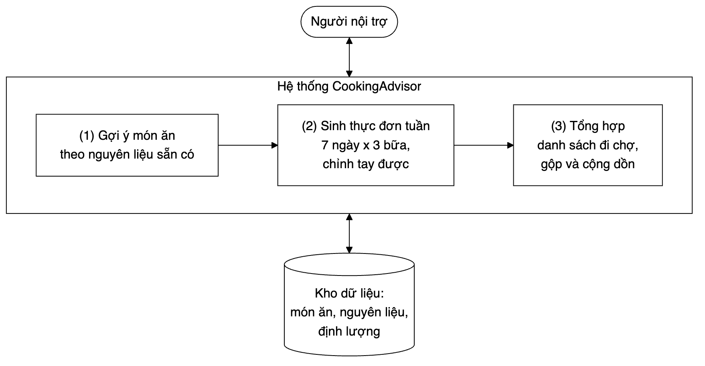{width=12.0cm}

*Hình 3.1. Sơ đồ mô tả bài toán ở mức tổng quát*

Luồng nghiệp vụ chính diễn ra như sau. Người dùng khai báo các nguyên liệu
đang có; hệ thống đối chiếu với kho công thức và trả về danh sách món được xếp
hạng theo mức độ phù hợp, ghi rõ món nào nấu được ngay và món nào còn thiếu
nguyên liệu gì. Khi cần lên kế hoạch cho cả tuần, hệ thống sinh tự động lịch
7 ngày với 3 bữa mỗi ngày, người dùng chỉnh tay từng ô nếu muốn. Cuối cùng, từ
thực đơn đã chốt, hệ thống gộp toàn bộ nguyên liệu của 21 suất ăn thành danh
sách đi chợ, cộng dồn khối lượng theo từng nguyên liệu và đơn vị.

Ba chức năng này tương ứng với ba bài toán con đã phân tích ở mục 1.1: truy
vấn ngược từ nguyên liệu, xếp lịch có ràng buộc, và gộp nhóm - tổng hợp. Phần
còn lại của chương trình bày yêu cầu, thiết kế dữ liệu và cách cài đặt từng
bài toán con đó.

## 3.2. Đặc tả yêu cầu

### 3.2.1. Xác định tác nhân

Hệ thống có ba tác nhân, phân biệt theo mức quyền truy cập tăng dần:

| Tác nhân | Mô tả | Cơ chế nhận diện |
|---|---|---|
| **Khách** | Người truy cập chưa đăng nhập | Không có phiên đăng nhập |
| **Người dùng** | Tài khoản đã đăng nhập, vai trò `User` | Thuộc tính `[Authorize]` |
| **Quản trị viên** | Tài khoản thuộc vai trò `Admin` | `[Authorize(Roles = "Admin")]` |

*Bảng 3.1. Các tác nhân của hệ thống*

Quan hệ giữa ba tác nhân là quan hệ kế thừa quyền: Người dùng có toàn bộ quyền
của Khách, Quản trị viên có toàn bộ quyền của Người dùng.

### 3.2.2. Yêu cầu chức năng

**Nhóm A - Chức năng dành cho Khách (không cần đăng nhập)**

| Mã | Tên chức năng | Mô tả |
|---|---|---|
| A1 | Xem trang chủ | Hiển thị danh mục, món nổi bật, số liệu tổng quan |
| A2 | Duyệt danh sách món ăn | Hiển thị dạng lưới, phân trang 9 món mỗi trang |
| A3 | Tìm kiếm theo tên món | Tìm theo chuỗi con trong tên |
| A4 | Lọc nâng cao | Theo danh mục, vùng miền, độ khó, thời gian nấu tối đa |
| A5 | Sắp xếp kết quả | Theo tên, thời gian nấu, năng lượng tăng hoặc giảm |
| A6 | Xem chi tiết món ăn | Thông số, nguyên liệu định lượng, các bước nấu |
| A7 | Gợi ý theo nguyên liệu | Chọn nguyên liệu đang có, nhận danh sách món xếp hạng |
| A8 | Đăng ký tài khoản | Tạo tài khoản mới, tự động gán vai trò `User` |
| A9 | Đăng nhập, đăng xuất | Xác thực bằng email và mật khẩu |

*Bảng 3.2. Yêu cầu chức năng dành cho Khách*

**Nhóm B - Chức năng dành cho Người dùng đã đăng nhập**

| Mã | Tên chức năng | Mô tả |
|---|---|---|
| B1 | Sinh thực đơn tuần | Tự động lấp 21 suất ăn, có tùy chọn vùng miền |
| B2 | Xem lịch thực đơn | Bảng 7 ngày × 3 bữa kèm tổng năng lượng theo ngày |
| B3 | Sửa thủ công từng bữa | Đổi món hoặc xóa món khỏi một ô |
| B4 | Xem danh sách thực đơn đã lưu | Liệt kê các thực đơn của riêng người dùng |
| B5 | Tạo danh sách đi chợ | Sinh từ một thực đơn, gộp và cộng dồn nguyên liệu |
| B6 | Đánh dấu đã mua | Tick từng nguyên liệu, hiển thị tiến độ |
| B7 | Quản lý món yêu thích | Thêm, bỏ và xem danh sách |

*Bảng 3.3. Yêu cầu chức năng dành cho Người dùng*

**Nhóm C - Chức năng dành cho Quản trị viên**

| Mã | Tên chức năng | Mô tả |
|---|---|---|
| C1 | Xem bảng điều khiển | Thống kê số món, nguyên liệu, danh mục |
| C2 | Quản lý món ăn | Thêm, sửa, xóa; gán nguyên liệu kèm định lượng |
| C3 | Quản lý nguyên liệu | Thêm, sửa, xóa; có kiểm tra ràng buộc tham chiếu |
| C4 | Quản lý danh mục | Thêm, sửa, xóa; có kiểm tra ràng buộc tham chiếu |

*Bảng 3.4. Yêu cầu chức năng dành cho Quản trị viên*

### 3.2.3. Yêu cầu phi chức năng

| Mã | Yêu cầu | Tiêu chí nghiệm thu |
|---|---|---|
| N1 | Bảo mật mật khẩu | Mật khẩu lưu dưới dạng băm, tối thiểu 8 ký tự |
| N2 | Phân quyền | Người dùng thường không truy cập được khu quản trị |
| N3 | Cách ly dữ liệu | Người dùng chỉ thao tác được trên thực đơn của mình |
| N4 | Tương thích màn hình | Hiển thị đúng từ 375 px tới 1440 px, không cuộn ngang |
| N5 | Khả năng tiếp cận | Tương phản màu đạt WCAG 2.1 mức AA |
| N6 | Tính đúng đắn thuật toán | Có kiểm thử đơn vị tự động cho ba thuật toán lõi |
| N7 | Khả năng tái lập | Dựng lại cơ sở dữ liệu bằng một lệnh trên máy khác |

*Bảng 3.5. Yêu cầu phi chức năng*

## 3.3. Mô hình cơ sở dữ liệu

### 3.3.1. Sơ đồ quan hệ thực thể

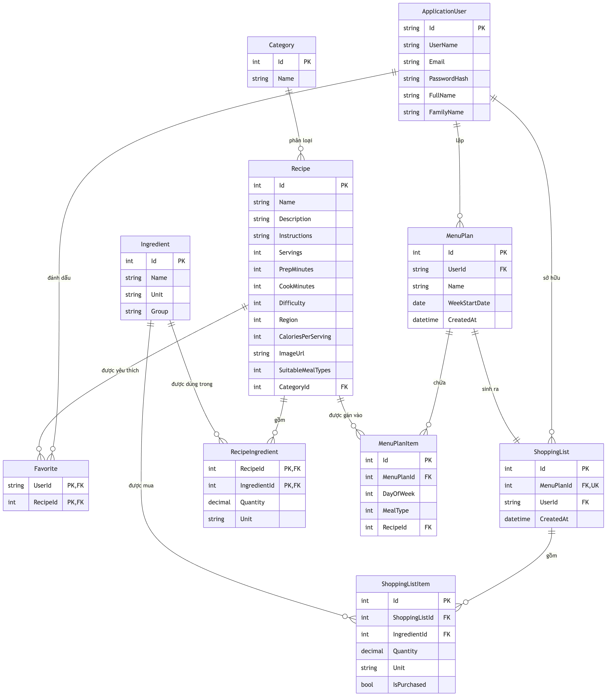{width=6.2cm}

*Hình 3.2. Sơ đồ ERD*

### 3.3.2. Mô tả các bảng

**Bảng `Recipe` (Món ăn)** - bảng trung tâm của hệ thống.

| Trường | Kiểu | Mô tả |
|---|---|---|
| `Id` | int | Khóa chính, tự tăng |
| `Name` | nvarchar | Tên món, bắt buộc |
| `Description` | nvarchar | Mô tả ngắn |
| `Instructions` | nvarchar | Các bước nấu, lưu dạng văn xuôi |
| `Servings` | int | Số khẩu phần |
| `PrepMinutes` | int | Thời gian chuẩn bị |
| `CookMinutes` | int | Thời gian nấu |
| `Difficulty` | int | Độ khó: 0 Dễ, 1 Trung bình, 2 Khó |
| `Region` | int | Vùng miền: 0 Bắc, 1 Trung, 2 Nam |
| `CaloriesPerServing` | int | Năng lượng mỗi khẩu phần |
| `ImageUrl` | nvarchar | Đường dẫn ảnh minh họa |
| `SuitableMealTypes` | int | Cờ nhị phân các bữa phù hợp |
| `CategoryId` | int | Khóa ngoại tới `Category` |

*Bảng 3.6. Cấu trúc bảng Recipe*

Trường `SuitableMealTypes` sử dụng kiểu liệt kê dạng cờ (`[Flags]`) với các giá
trị Breakfast = 1, Lunch = 2, Dinner = 4. Cách biểu diễn này cho phép lưu tổ hợp
nhiều bữa trong một số nguyên duy nhất, ví dụ giá trị 6 nghĩa là món phù hợp cho
cả bữa trưa và bữa tối. Phép kiểm tra một món có hợp bữa hay không quy về phép
`AND` bit, có chi phí hằng số.

**Bảng `RecipeIngredient` (Nguyên liệu của món)** - bảng trung gian, là mấu chốt
của cả ba thuật toán.

| Trường | Kiểu | Mô tả |
|---|---|---|
| `RecipeId` | int | Khóa chính thành phần, khóa ngoại tới `Recipe` |
| `IngredientId` | int | Khóa chính thành phần, khóa ngoại tới `Ingredient` |
| `Quantity` | decimal(10,2) | Khối lượng cần dùng |
| `Unit` | nvarchar | Đơn vị đo |

*Bảng 3.7. Cấu trúc bảng RecipeIngredient*

Bảng này dùng **khóa chính ghép** gồm hai khóa ngoại, bảo đảm một nguyên liệu chỉ
xuất hiện một lần trong mỗi món. Điểm thiết kế quan trọng là bảng mang thêm hai
thuộc tính `Quantity` và `Unit`: nếu chỉ lưu quan hệ nhiều - nhiều thuần túy thì
chức năng danh sách đi chợ không thể cộng dồn khối lượng, như đã phân tích ở mục
2.5.3.

**Bảng `MenuPlan` và `MenuPlanItem` (Thực đơn tuần)**

`MenuPlan` lưu thông tin chung của một thực đơn: người tạo, tên, tuần bắt đầu và
thời điểm tạo. `MenuPlanItem` lưu từng ô của lưới thực đơn, gồm `DayOfWeek` nhận
giá trị từ 0 tới 6 và `MealType` nhận giá trị 0 Sáng, 1 Trưa, 2 Tối. Một thực đơn
đầy đủ gồm 21 bản ghi `MenuPlanItem`.

**Bảng `ShoppingList` và `ShoppingListItem` (Danh sách đi chợ)**

`ShoppingList` liên kết với `MenuPlan` qua khóa ngoại `MenuPlanId` có **ràng buộc
duy nhất**, thể hiện quan hệ một - một: mỗi thực đơn chỉ có tối đa một danh sách
đi chợ. Đây là căn cứ để thao tác tạo lại danh sách được cài đặt theo hướng ghi
đè thay vì tạo bản ghi mới.

**Bảng `Favorite` (Món yêu thích)** dùng khóa chính ghép `(UserId, RecipeId)`,
bảo đảm một người dùng không thể đánh dấu trùng một món.

### 3.3.3. Thiết kế hành vi xóa

Hành vi xóa được cấu hình có chủ đích cho từng quan hệ, chia làm hai nhóm:

| Quan hệ | Hành vi | Lý do |
|---|---|---|
| `Recipe` → `RecipeIngredient` | Cascade | Xóa món thì các dòng nguyên liệu của nó không còn ý nghĩa |
| `MenuPlan` → `MenuPlanItem` | Cascade | Tương tự, các ô thuộc về thực đơn |
| `MenuPlan` → `ShoppingList` | Cascade | Danh sách đi chợ phụ thuộc hoàn toàn vào thực đơn |
| `ShoppingList` → `ShoppingListItem` | Cascade | Các dòng thuộc về danh sách |
| `ApplicationUser` → `MenuPlan`, `Favorite` | Cascade | Xóa tài khoản thì dữ liệu cá nhân đi theo |
| `Recipe` → `Favorite` | Cascade | Món bị xóa thì dấu yêu thích trên món đó không còn ý nghĩa |
| `Category` → `Recipe` | **Restrict** | Không cho xóa danh mục đang có món sử dụng |
| `Ingredient` → `RecipeIngredient` | **Restrict** | Không cho xóa nguyên liệu đang được dùng |
| `Ingredient` → `ShoppingListItem` | **Restrict** | Không cho xóa nguyên liệu đang nằm trong danh sách đi chợ |
| `ApplicationUser` → `ShoppingList` | **Restrict** | Danh sách đi chợ đã xóa lan truyền theo thực đơn, không cần thêm một đường Cascade thứ hai từ tài khoản |
| `Recipe` → `MenuPlanItem` | **Restrict** | Không cho xóa món đang nằm trong thực đơn của người dùng |

*Bảng 3.8. Hành vi xóa của các quan hệ trong cơ sở dữ liệu*

Nguyên tắc phân biệt là: dữ liệu **phụ thuộc sự tồn tại** thì xóa lan truyền, còn
dữ liệu **được tham chiếu** thì chặn xóa để tránh phá vỡ dữ liệu của người dùng
khác. Nếu để `Recipe` → `MenuPlanItem` là Cascade, quản trị viên xóa một món sẽ
âm thầm phá vỡ tính toàn vẹn của thực đơn đã lưu của mọi người dùng.

Hai quan hệ cùng trỏ tới `Recipe` được cấu hình khác nhau một cách có chủ đích:
`MenuPlanItem` là Restrict còn `Favorite` là Cascade. Lý do nằm ở bản chất dữ
liệu. Một suất ăn trong thực đơn là **sản phẩm có cấu trúc** mà người dùng đã bỏ
công lập và chỉnh sửa; mất một suất là thực đơn thủng một ô. Ngược lại, dấu yêu
thích chỉ là **liên kết đánh dấu** tới món; khi món không còn tồn tại thì dấu đó
không còn đối tượng để trỏ tới, giữ lại cũng không hiển thị được gì. Nếu cấu hình
Favorite là Restrict, quản trị viên sẽ không thể xóa một món chỉ vì có người từng
đánh dấu yêu thích nó, một ràng buộc gây phiền mà không bảo vệ được giá trị nào.

### 3.3.4. Khởi tạo dữ liệu mẫu

Lớp `DbInitializer` thực hiện ba việc khi ứng dụng khởi động: áp dụng các
migration còn thiếu, tạo hai vai trò `Admin` và `User` cùng tài khoản quản trị
mặc định, và nạp dữ liệu mẫu nếu bảng `Recipes` còn rỗng. Dữ liệu mẫu gồm 26 món
ăn Việt Nam, 40 nguyên liệu và 10 danh mục.

Điều kiện "chỉ nạp khi bảng còn rỗng" bảo đảm thao tác khởi động là **lũy đẳng**:
chạy lại ứng dụng nhiều lần không tạo ra dữ liệu trùng lặp.

## 3.4. Lược đồ use case

Hình 3.3 tổng hợp các ca sử dụng của ba tác nhân đã xác định ở mục 3.5.1; quan hệ kế thừa quyền giữa các tác nhân được thể hiện bằng việc tác nhân cấp cao dùng được mọi ca của cấp thấp hơn.

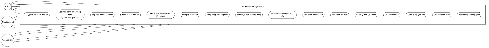{width=12.0cm}

*Hình 3.3. Sơ đồ use-case tổng quát*

## 3.5. Kiến trúc hệ thống

Hệ thống được tổ chức theo mô hình phân tầng, cụ thể hóa mẫu MVC đã trình bày ở
mục 2.1. Điểm khác biệt so với mẫu MVC cơ bản là việc bổ sung **tầng Service**
nằm giữa Controller và tầng truy cập dữ liệu.

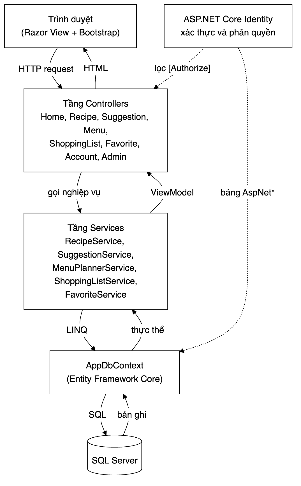{width=4.4cm}

*Hình 3.4. Kiến trúc phân tầng và luồng xử lý một yêu cầu*

Lý do tách tầng Service, như đã lập luận ở mục 2.1.1, là để logic nghiệp vụ không
phụ thuộc vào hạ tầng web. Nhờ đó ba thuật toán lõi có thể được kiểm thử bằng
kiểm thử đơn vị mà không cần khởi động máy chủ web hay mô phỏng đối tượng
`HttpContext`. Kết quả cụ thể của lựa chọn này được trình bày ở mục 4.4.

Cấu trúc thư mục của ứng dụng web như sau:

```
CookingAdvisor/
├── Controllers/      Tiếp nhận yêu cầu, gọi Service, trả View
├── Areas/Admin/      Khu vực quản trị, tách riêng bằng cơ chế Area
├── Services/         Logic nghiệp vụ, nơi đặt ba thuật toán lõi
├── Models/           Thực thể EF Core và các kiểu liệt kê
├── ViewModels/       Dữ liệu truyền giữa Controller và View
├── Data/             AppDbContext và DbInitializer
├── Views/            Giao diện Razor
├── TagHelpers/       Tag helper tự viết cho hệ thống biểu tượng
├── Migrations/       Lịch sử thay đổi lược đồ cơ sở dữ liệu
└── wwwroot/          Tài nguyên tĩnh: CSS, JavaScript, phông chữ, ảnh
```

## 3.6. Thiết kế lớp

### 3.6.1. Lớp thực thể

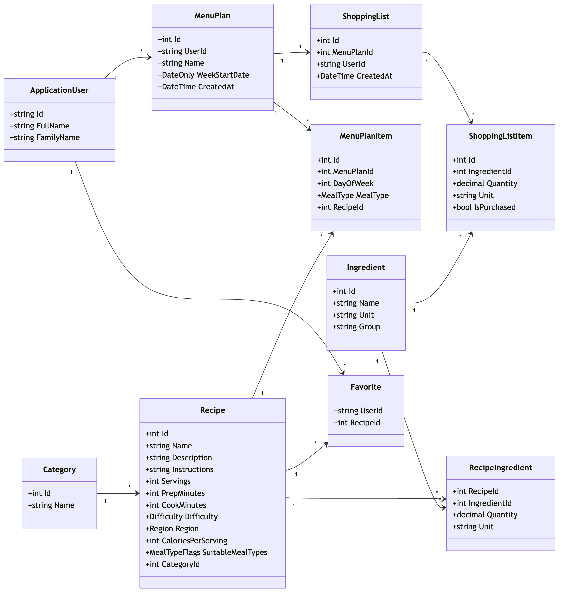{width=6.8cm}

*Hình 3.5. Sơ đồ lớp tầng thực thể*

### 3.6.2. Lớp dịch vụ và lớp điều khiển

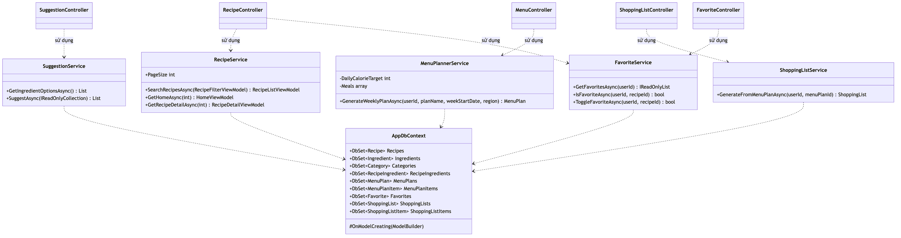{width=12.0cm}

*Hình 3.6. Sơ đồ lớp tầng dịch vụ và quan hệ với tầng điều khiển*

Bảng sau tóm tắt trách nhiệm của từng lớp dịch vụ:

| Lớp | Trách nhiệm chính |
|---|---|
| `RecipeService` | Tìm kiếm, lọc, sắp xếp, phân trang; lấy chi tiết món; dữ liệu trang chủ |
| `SuggestionService` | Thuật toán gợi ý theo nguyên liệu |
| `MenuPlannerService` | Thuật toán sinh thực đơn tuần |
| `ShoppingListService` | Thuật toán gộp nhóm sinh danh sách đi chợ |
| `FavoriteService` | Thêm, bỏ, kiểm tra và liệt kê món yêu thích |

*Bảng 3.9. Trách nhiệm của các lớp dịch vụ*

Các lớp dịch vụ được đăng ký vào bộ chứa tiêm phụ thuộc với vòng đời `Scoped`,
tương ứng với vòng đời của `AppDbContext`.

## 3.7. Thiết kế luồng xử lý

### 3.7.1. Luồng gợi ý theo nguyên liệu

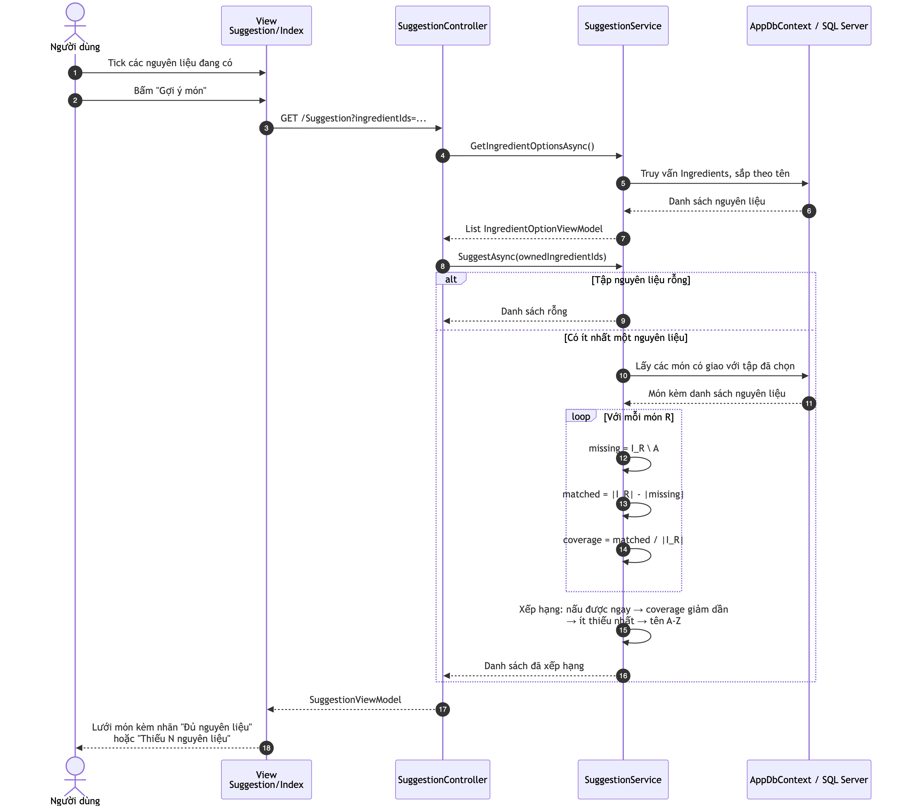{width=7.8cm}

*Hình 3.7. Sơ đồ tuần tự chức năng gợi ý theo nguyên liệu*

### 3.7.2. Luồng sinh thực đơn tuần

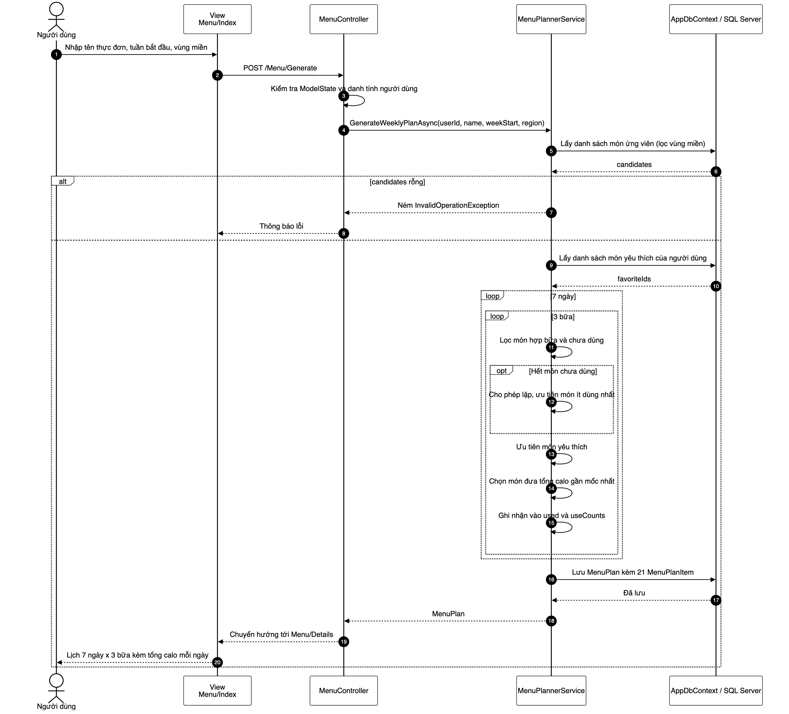{width=7.7cm}

*Hình 3.8. Sơ đồ tuần tự chức năng sinh thực đơn tuần*

### 3.7.3. Luồng sinh danh sách đi chợ

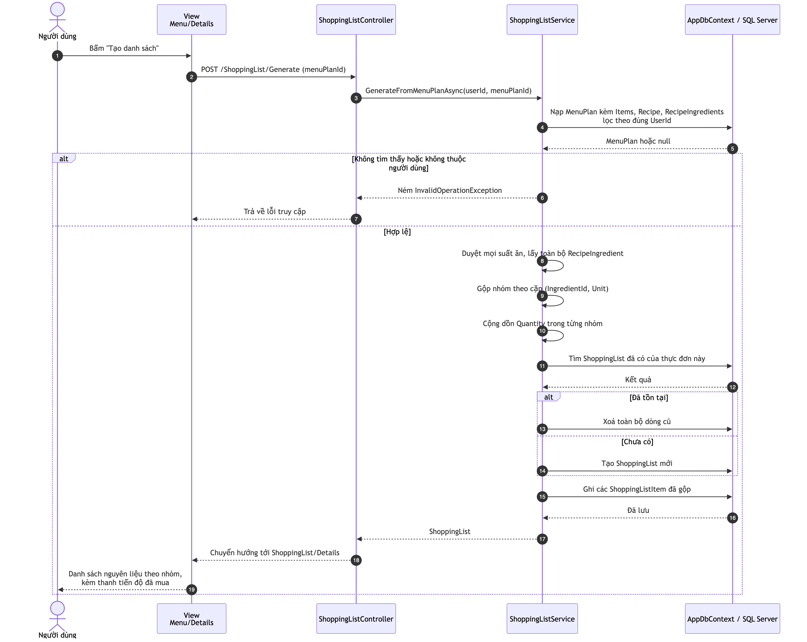{width=8.8cm}

*Hình 3.9. Sơ đồ tuần tự chức năng sinh danh sách đi chợ*

Điểm đáng chú ý ở luồng này là bước nạp dữ liệu có kèm điều kiện lọc theo
`UserId`. Nhờ đó, nếu người dùng cố tình gửi mã thực đơn của người khác, truy vấn
trả về rỗng và hệ thống ném ngoại lệ, thay vì sinh danh sách đi chợ từ dữ liệu
không thuộc quyền của họ. Đây là cách hiện thực yêu cầu phi chức năng N3 đã nêu ở
mục 3.2.3.

## 3.8. Cài đặt các thuật toán lõi

### 3.8.1. Thuật toán gợi ý theo nguyên liệu

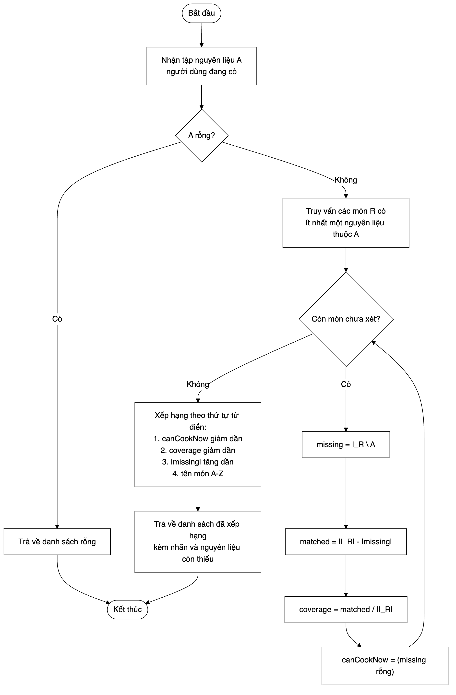{width=4.6cm}

*Hình 3.10. Lưu đồ thuật toán gợi ý theo nguyên liệu*

**Mã giả**

```
THUẬT TOÁN GoiYTheoNguyenLieu
Đầu vào : A - tập mã nguyên liệu người dùng đang có
Đầu ra  : danh sách món đã xếp hạng, kèm nhãn và nguyên liệu còn thiếu

 1  nếu A rỗng thì
 2      trả về danh sách rỗng
 3  hết nếu
 4
 5  A ← chuyển A thành bảng băm            // tra cứu O(1)
 6  R ← truy vấn các món có ít nhất một nguyên liệu thuộc A
 7  KetQua ← danh sách rỗng
 8
 9  với mỗi món r thuộc R lặp
10      I_r      ← tập nguyên liệu của r
11      missing  ← { tên nguyên liệu i | i thuộc I_r và i không thuộc A }
12      missing  ← sắp xếp missing theo thứ tự bảng chữ cái
13      matched  ← |I_r| - |missing|
14      coverage ← matched / |I_r|
15      canCook  ← (missing rỗng)
16      thêm (r, matched, missing, coverage, canCook) vào KetQua
17  hết lặp
18
19  sắp xếp KetQua theo thứ tự từ điển:
20      khóa 1: canCook            giảm dần   // nấu được ngay lên trước
21      khóa 2: coverage           giảm dần
22      khóa 3: |missing|          tăng dần
23      khóa 4: tên món            tăng dần   // bảo đảm thứ tự tất định
24
25  trả về KetQua
```

**Giải thích các quyết định cài đặt**

*Dòng 6 - lọc sớm tại tầng cơ sở dữ liệu.* Điều kiện "có ít nhất một nguyên liệu
thuộc A" được đẩy xuống câu truy vấn thay vì lọc trong bộ nhớ. Những món không
chung nguyên liệu nào với tập đã chọn chắc chắn có `coverage = 0`, không đáng
được gợi ý, nên việc loại bỏ sớm giảm khối lượng dữ liệu phải chuyển lên tầng ứng
dụng.

*Dòng 5 - dùng bảng băm.* Phép kiểm tra thuộc tập ở dòng 11 được thực hiện
$|I_r|$ lần cho mỗi món. Nếu dùng danh sách tuyến tính, chi phí mỗi phép kiểm tra
là $O(|A|)$; với bảng băm, chi phí trung bình là $O(1)$.

*Dòng 12 - sắp xếp tên nguyên liệu thiếu.* Không ảnh hưởng tới thứ hạng, nhưng
làm cho nhãn "Thiếu: X, Y" hiển thị ổn định giữa các lần chạy, thuận tiện cho
kiểm thử tự động.

*Dòng 23 - khóa sắp xếp cuối cùng.* Như đã lập luận ở mục 2.5.1, khóa này bảo đảm
kết quả có thứ tự tất định.

**Độ phức tạp:** $O(nk + n\log n)$ với $n$ là số món thỏa điều kiện lọc và $k$ là
số nguyên liệu trung bình mỗi món.

### 3.8.2. Thuật toán sinh thực đơn tuần

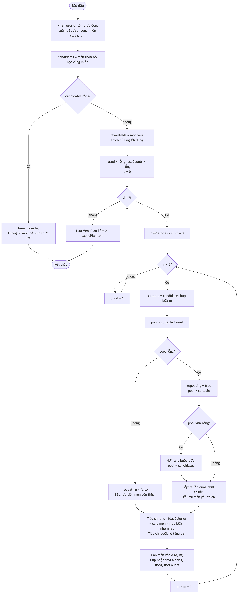{width=2.8cm}

*Hình 3.11. Lưu đồ thuật toán sinh thực đơn tuần*

**Mã giả**

```
THUẬT TOÁN SinhThucDonTuan
Đầu vào : userId, tenThucDon, tuanBatDau, vungMien (tuỳ chọn)
Đầu ra  : đối tượng MenuPlan chứa 21 MenuPlanItem
Hằng số : MUC_TIEU_CALO_NGAY = 2000
          BUA[] = [ (Sáng, cờ Breakfast), (Trưa, cờ Lunch), (Tối, cờ Dinner) ]

 1  candidates ← các món thoả bộ lọc vùng miền        // ràng buộc CỨNG
 2  nếu candidates rỗng thì ném ngoại lệ
 3
 4  favoriteIds ← tập mã món yêu thích của userId
 5  used        ← tập rỗng          // các món đã dùng trong tuần
 6  useCounts   ← từ điển rỗng      // số lần mỗi món đã được dùng
 7  items       ← danh sách rỗng
 8
 9  với d ← 0 đến 6 lặp                               // 7 ngày
10      dayCalories ← 0
11      với m ← 0 đến 2 lặp                           // 3 bữa
12          (bua, co) ← BUA[m]
13          mealTarget ← MUC_TIEU_CALO_NGAY × (m + 1) / 3
14
15          suitable ← { c thuộc candidates | c.SuitableMealTypes CÓ cờ co }
16          pool     ← suitable \ used
17          repeating ← (pool rỗng)
18
19          nếu repeating thì pool ← suitable          // nới ràng buộc KHÔNG LẶP
20          nếu pool rỗng   thì pool ← candidates      // nới ràng buộc HỢP BỮA
21
22          nếu repeating thì
23              ordered ← sắp pool theo: useCounts[c] tăng dần,
24                                       rồi (c thuộc favoriteIds) giảm dần
25          ngược lại
26              ordered ← sắp pool theo: (c thuộc favoriteIds) giảm dần
27          hết nếu
28
29          chosen ← phần tử đầu của ordered sau khi sắp tiếp theo:
30                       |dayCalories + c.Calo - mealTarget| tăng dần,
31                       rồi c.Id tăng dần
32
33          dayCalories ← dayCalories + chosen.Calo
34          thêm chosen vào used
35          useCounts[chosen] ← useCounts[chosen] + 1
36          thêm MenuPlanItem(d, bua, chosen) vào items
37      hết lặp
38  hết lặp
39
40  lưu MenuPlan(userId, tenThucDon, tuanBatDau, items)
41  trả về MenuPlan
```

**Giải thích các quyết định cài đặt**

*Dòng 1 và 19-20 - thứ tự nới lỏng ràng buộc.* Ràng buộc vùng miền được áp ngay
từ đầu và không bao giờ được nới. Hai ràng buộc còn lại được nới theo thứ tự:
"không lặp" trước, "hợp bữa" sau. Lý do là việc lặp lại một món trong tuần gây
khó chịu ít hơn so với việc đề xuất một món hoàn toàn không hợp bữa, chẳng hạn đề
xuất món tráng miệng cho bữa sáng.

*Dòng 13 - mốc năng lượng lũy tiến theo bữa.* Giá trị `mealTarget` được tính lũy
tiến theo chỉ số bữa, bằng $\frac{2000 \times (m+1)}{3}$, cho các mốc lần lượt là
667, 1333 và 2000 kcal. Cách tính này khiến tiêu chí ở dòng 30 so sánh **tổng
năng lượng tích lũy tới hết bữa hiện tại** với mốc mong đợi, thay vì so sánh riêng
từng bữa một cách độc lập.

*Dòng 22-27 - hai chế độ sắp xếp khác nhau.* Đây là điểm cài đặt quan trọng nhất
và cũng là nơi phát sinh khiếm khuyết đã nêu ở mục 2.5.2. Khi còn món chưa dùng
(dòng 26), tiêu chí đầu tiên là ưu tiên món yêu thích. Nhưng khi buộc phải lặp
(dòng 23-24), tiêu chí đầu tiên phải chuyển thành **số lần đã dùng ít nhất**.

Nếu bỏ qua sự phân biệt này và luôn dùng nhánh dòng 26, thì trong nhánh lặp mọi
món đều "chưa từng bị loại", nên tiêu chí quyết định thực tế lùi về dòng 30, tức
là khoảng cách năng lượng. Do trạng thái `dayCalories` lặp lại theo chu kỳ giữa
các ngày, cùng một món luôn cho khoảng cách nhỏ nhất và được chọn lại liên tục.
Kết quả đo được trên bộ dữ liệu thử là một món chiếm 12 trong số các suất còn
trống trong khi nhiều món khác không được dùng lần nào.

*Dòng 31 - khóa sắp xếp cuối.* Sắp theo `Id` tăng dần để bảo đảm với cùng đầu
vào, thuật toán luôn sinh ra cùng một thực đơn. Tính chất tất định này là điều
kiện cần để viết kiểm thử tự động.

**Độ phức tạp:** $O(S \cdot n \log n)$ với $S = 21$ suất và $n$ số món ứng viên.

### 3.8.3. Thuật toán sinh danh sách đi chợ

**Mã giả**

```
THUẬT TOÁN SinhDanhSachDiCho
Đầu vào : userId, menuPlanId
Đầu ra  : đối tượng ShoppingList

 1  plan ← nạp MenuPlan kèm Items → Recipe → RecipeIngredients
 2          với điều kiện Id = menuPlanId VÀ UserId = userId
 3  nếu plan là null thì ném ngoại lệ          // chặn truy cập chéo người dùng
 4
 5  tatCa ← danh sách rỗng
 6  với mỗi suất s thuộc plan.Items lặp        // duyệt theo SUẤT, không theo MÓN
 7      thêm toàn bộ s.Recipe.RecipeIngredients vào tatCa
 8  hết lặp
 9
10  nhom ← gộp nhóm tatCa theo khóa ghép (IngredientId, Unit)
11  ketQua ← danh sách rỗng
12  với mỗi nhóm g thuộc nhom lặp
13      thêm ShoppingListItem(g.IngredientId, g.Unit, tổng g.Quantity) vào ketQua
14  hết lặp
15
16  list ← tìm ShoppingList có MenuPlanId = menuPlanId
17  nếu list tồn tại thì
18      xóa toàn bộ dòng cũ của list           // ghi đè, không tạo bản ghi mới
19  ngược lại
20      list ← tạo ShoppingList mới
21  hết nếu
22
23  gán ketQua vào list.Items và lưu
24  trả về list
```

**Giải thích các quyết định cài đặt**

*Dòng 2 - lọc theo `UserId` ngay trong truy vấn.* Việc kiểm tra quyền sở hữu được
thực hiện ở tầng truy vấn chứ không phải bằng câu lệnh `if` sau khi đã nạp dữ
liệu. Cách này an toàn hơn vì không tồn tại nhánh nào có thể vô tình bỏ qua bước
kiểm tra.

*Dòng 6 - duyệt theo suất ăn.* Nếu duyệt theo tập món khác nhau, một món xuất
hiện ba lần trong tuần chỉ được tính nguyên liệu một lần, dẫn tới mua thiếu.

*Dòng 10 - khóa gộp nhóm ghép cặp.* Như đã phân tích ở mục 2.5.3, đơn vị đo phải
nằm trong khóa gộp nhóm để không cộng dồn hai giá trị khác đơn vị.

*Dòng 16-21 - ghi đè thay vì tạo mới.* Do ràng buộc duy nhất trên `MenuPlanId`
(mục 3.3.2), mỗi thực đơn chỉ có tối đa một danh sách đi chợ. Khi người dùng sửa
thực đơn rồi tạo lại danh sách, hệ thống xóa các dòng cũ và ghi lại từ đầu.

**Độ phức tạp:** $O(S \cdot k)$ với $S$ là số suất ăn và $k$ là số nguyên liệu
trung bình mỗi món.

## 3.9. Một số điểm cài đặt khác

### 3.9.1. Tìm kiếm, lọc và sắp xếp

Toàn bộ tham số tìm kiếm được gom vào một lớp `RecipeFilterViewModel` và ánh xạ
tự động nhờ cơ chế model binding. Các điều kiện lọc được ghép dần vào đối tượng
`IQueryable`, do đó chỉ một câu lệnh SQL duy nhất được sinh ra dù người dùng chọn
bao nhiêu điều kiện.

Tùy chọn sắp xếp được biểu diễn bằng kiểu liệt kê `RecipeSortOrder`. Việc dùng
kiểu liệt kê thay vì chuỗi ký tự có ý nghĩa về an toàn: **bản thân kiểu liệt kê
đóng vai trò danh sách trắng**, giá trị không hợp lệ trên thanh địa chỉ sẽ được
ánh xạ về giá trị mặc định, nên không có chuỗi nào do người dùng nhập vào có thể
đi tới biểu thức sắp xếp.

Mọi phương án sắp xếp đều kết thúc bằng khóa phụ là tên món. Thiếu khóa này, các
món có cùng giá trị sắp xếp sẽ không có thứ tự tất định và một món có thể xuất
hiện ở hai trang khác nhau khi phân trang.

### 3.9.2. Bảo mật

| Nguy cơ | Biện pháp trong hệ thống |
|---|---|
| Chèn mã SQL | Toàn bộ truy vấn qua LINQ của EF Core, tham số hóa tự động |
| Lộ mật khẩu | Identity lưu giá trị băm có muối, không lưu mật khẩu gốc |
| Giả mạo yêu cầu liên trang | Token chống giả mạo trên mọi biểu mẫu POST |
| Truy cập vượt quyền chức năng | `[Authorize(Roles = "Admin")]` trên toàn bộ khu quản trị |
| Truy cập vượt quyền dữ liệu | Lọc theo `UserId` ngay trong truy vấn |
| Lộ chuỗi kết nối | Lưu trong User Secrets, không đưa vào mã nguồn |

*Bảng 3.10. Nguy cơ bảo mật và biện pháp áp dụng*


```{=openxml}
<w:p><w:r><w:br w:type="page"/></w:r></w:p>
```
# CHƯƠNG 4. KẾT QUẢ NGHIÊN CỨU

## 4.1. Môi trường triển khai và dữ liệu thử nghiệm

Hệ thống được chạy thử trên môi trường sau:

| Thành phần | Cấu hình |
|---|---|
| Nền tảng | .NET 10, ASP.NET Core MVC |
| Cơ sở dữ liệu | SQL Server 2022 chạy trong container |
| Trình duyệt kiểm thử | Google Chrome |
| Độ phân giải kiểm thử | 1440 × 900 và 390 × 844 |

*Bảng 4.1. Môi trường thử nghiệm*

Dữ liệu thử nghiệm do `DbInitializer` nạp tự động:

| Loại dữ liệu | Số lượng |
|---|---|
| Món ăn | 26 |
| Nguyên liệu | 40 |
| Danh mục | 10 |
| Tài khoản mặc định | 1 quản trị viên |

*Bảng 4.2. Dữ liệu thử nghiệm*

## 4.2. Giao diện các chức năng

### 4.2.1. Trang chủ và duyệt món ăn

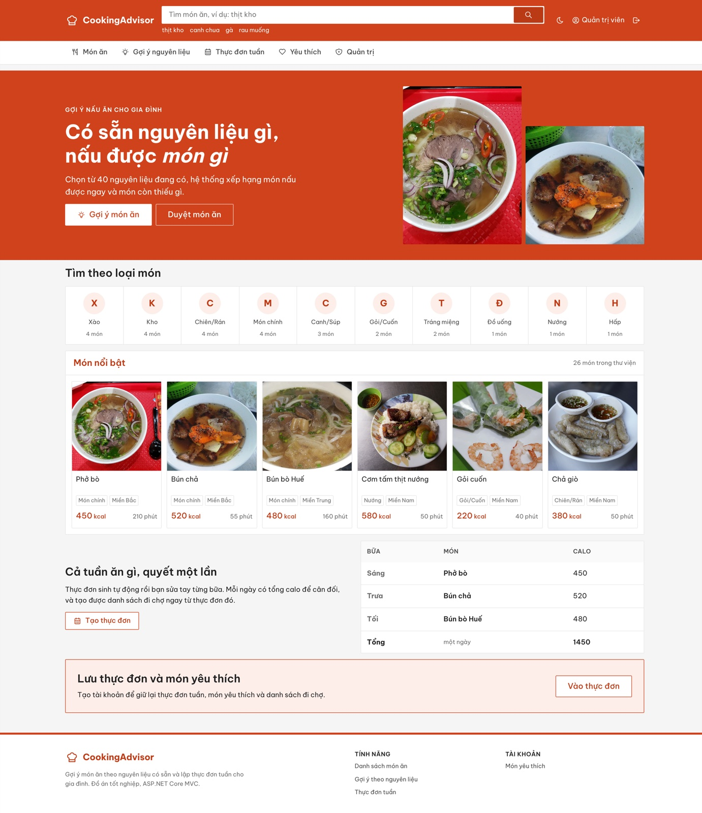{width=6.0cm}

*Hình 4.1. Trang chủ*

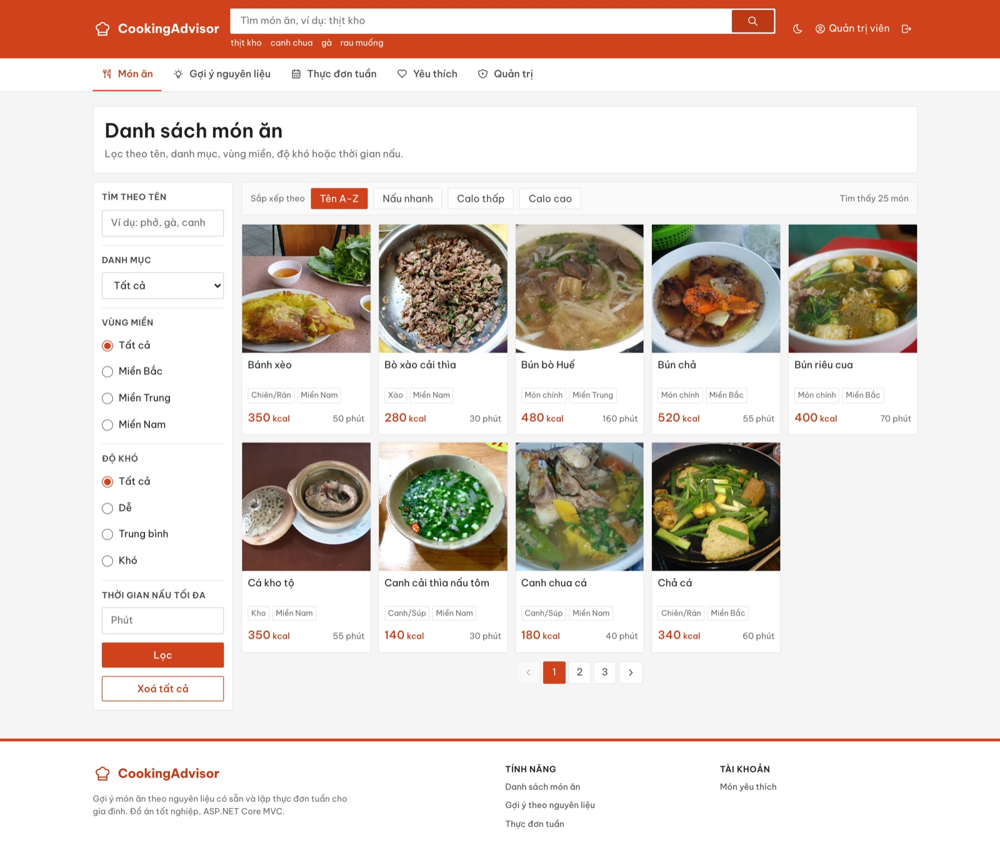{width=8.2cm}

*Hình 4.2. Trang danh sách món ăn với bộ lọc bên trái và lưới kết quả*

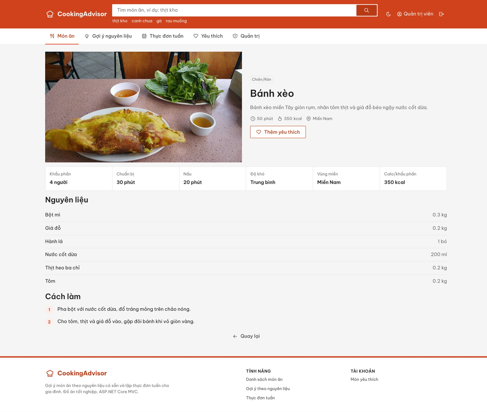{width=8.3cm}

*Hình 4.3. Trang chi tiết món ăn*

### 4.2.2. Tìm kiếm, lọc và sắp xếp

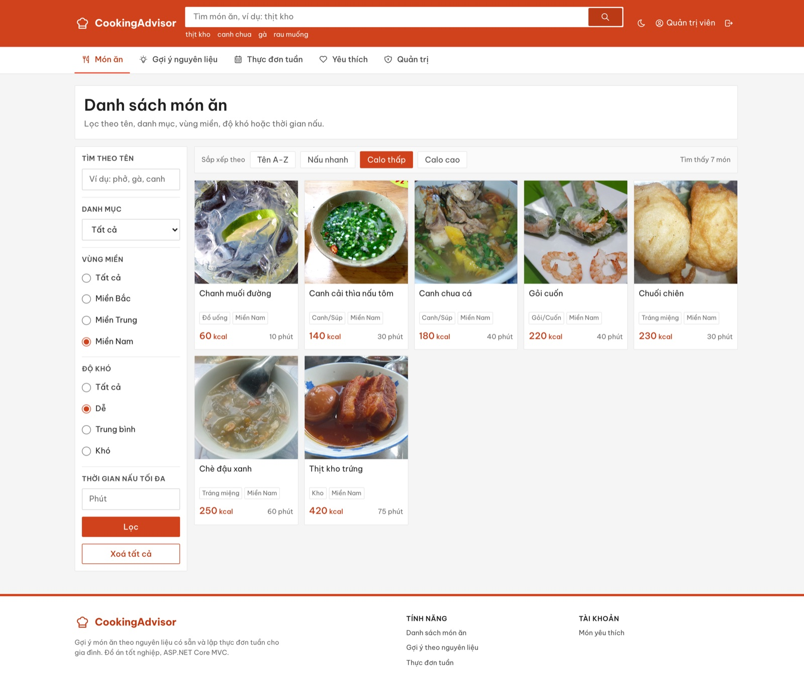{width=8.2cm}

*Hình 4.4. Kết quả khi lọc theo vùng miền Nam, độ khó Dễ và sắp xếp theo năng
lượng tăng dần*

Kết quả cho thấy bộ lọc và tùy chọn sắp xếp hoạt động đồng thời: số món giảm từ
25 xuống còn tập con thỏa mãn cả hai điều kiện, đồng thời thứ tự hiển thị tuân
theo tiêu chí đã chọn. Các liên kết sắp xếp và phân trang đều giữ nguyên trạng
thái lọc hiện tại.

### 4.2.3. Gợi ý theo nguyên liệu

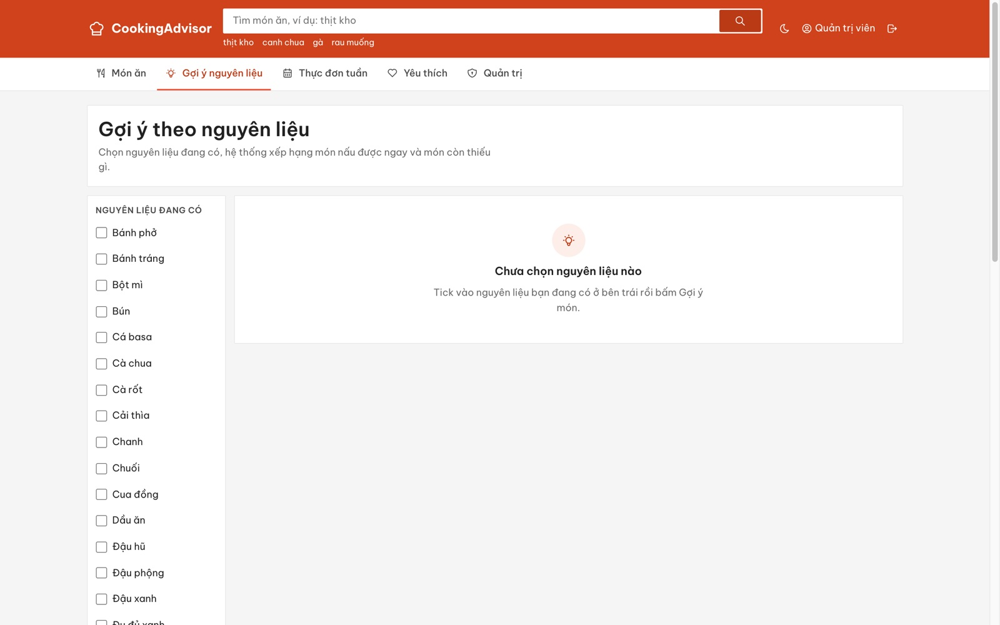{width=11.2cm}

*Hình 4.5. Trạng thái ban đầu khi người dùng chưa chọn nguyên liệu nào*

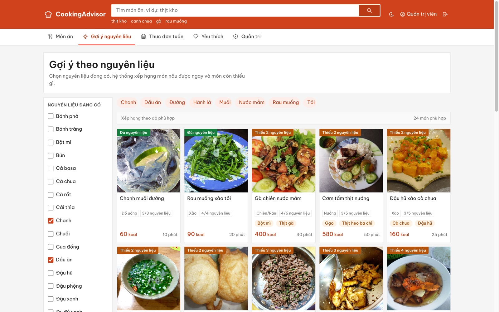{width=11.2cm}

*Hình 4.6. Kết quả gợi ý với 8 nguyên liệu đầu vào*

Với đầu vào gồm 8 nguyên liệu (chanh, dầu ăn, đường, hành lá, muối, nước mắm, rau
muống, tỏi), hệ thống trả về **24 món phù hợp**, trong đó **2 món nấu được ngay**
và 22 món còn thiếu nguyên liệu. Hai món nấu được ngay được xếp lên đầu danh sách
và mang nhãn màu xanh "Đủ nguyên liệu"; các món còn lại mang nhãn màu hổ phách
ghi rõ số nguyên liệu còn thiếu, kèm danh sách tên nguyên liệu đó ngay dưới tên
món. Kết quả này thể hiện đúng thứ tự ưu tiên đã thiết kế ở mục 3.8.1.

### 4.2.4. Thực đơn tuần

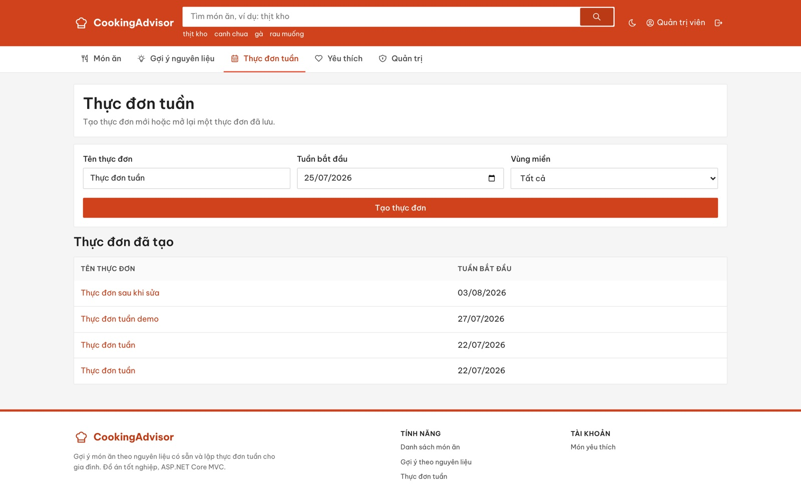{width=11.2cm}

*Hình 4.7. Biểu mẫu sinh thực đơn và danh sách thực đơn đã lưu*

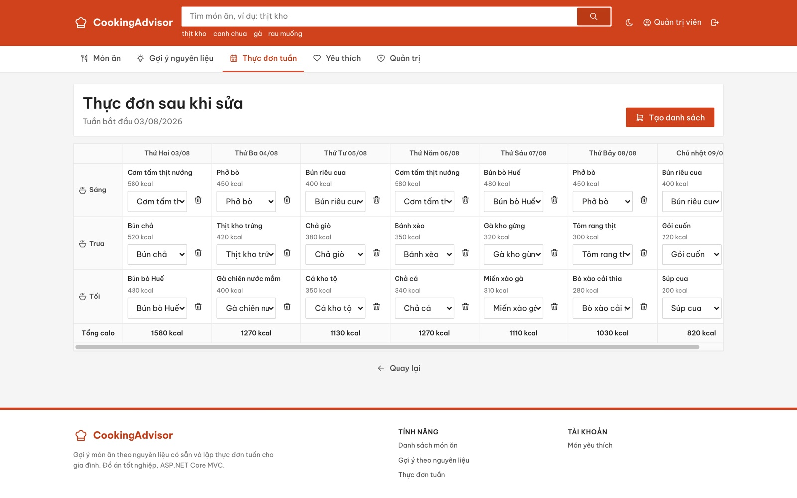{width=11.2cm}

*Hình 4.8. Lịch thực đơn 7 ngày × 3 bữa*

Lưới thực đơn hiển thị đủ 21 suất ăn. Mỗi ô gồm tên món, năng lượng của món, một
hộp chọn để đổi sang món khác và một nút xóa. Dòng cuối cùng hiển thị tổng năng
lượng theo từng ngày, lần lượt là 1580, 1270, 1130, 1270, 1110, 1030 và 820 kcal.

### 4.2.5. Danh sách đi chợ

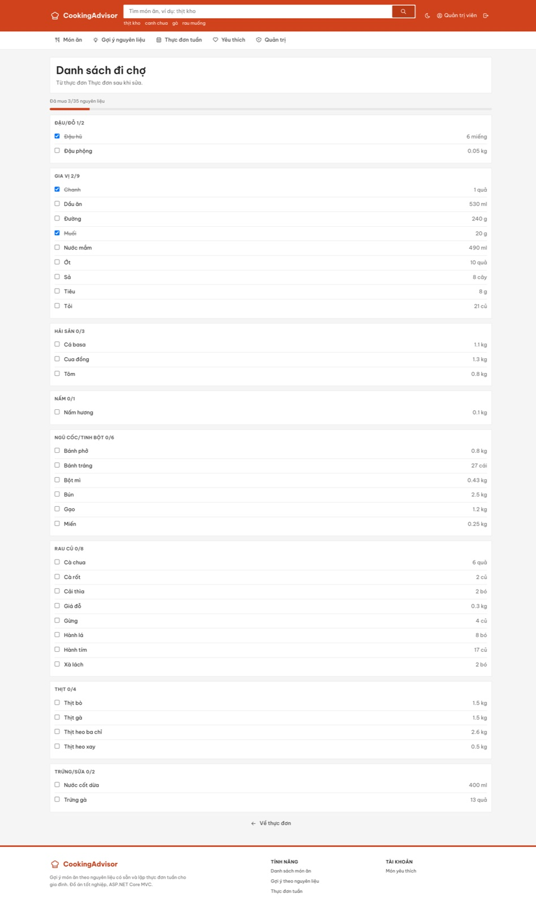{width=4.1cm}

*Hình 4.9. Danh sách đi chợ sinh từ thực đơn ở Hình 4.8*

Từ thực đơn 21 suất ăn, hệ thống sinh ra danh sách gồm **35 dòng nguyên liệu**
được gộp theo **8 nhóm**: Đậu/Đỗ, Gia vị, Hải sản, Nấm, Ngũ cốc/Tinh bột, Rau củ,
Thịt và Trứng/Sữa. Thanh tiến độ ở đầu trang cập nhật theo số nguyên liệu đã
đánh dấu mua.

### 4.2.6. Tài khoản và phân quyền

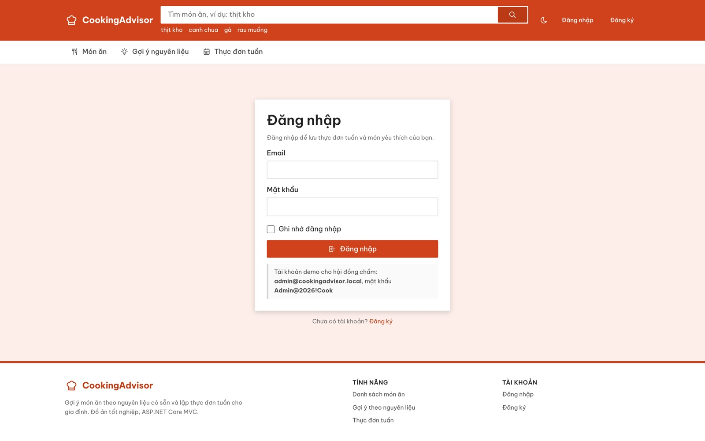{width=11.2cm}

*Hình 4.10. Màn hình đăng nhập*

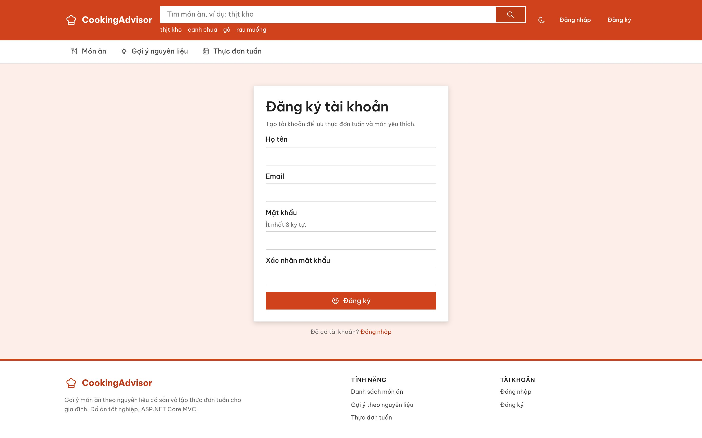{width=11.2cm}

*Hình 4.11. Màn hình đăng ký tài khoản*

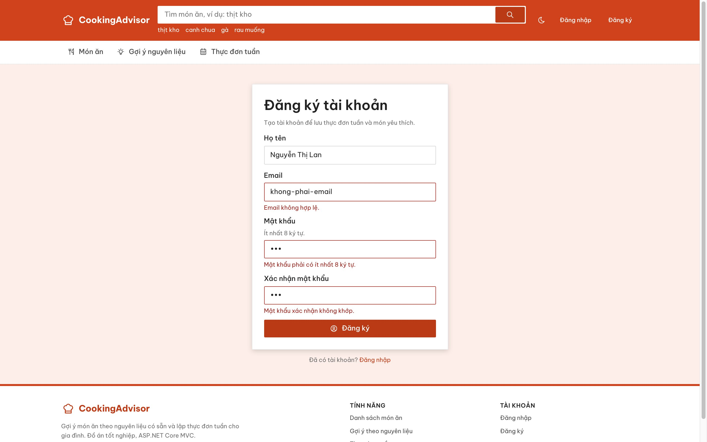{width=11.2cm}

*Hình 4.12. Thông báo lỗi khi nhập dữ liệu không hợp lệ*

Hình 4.12 minh họa cơ chế kiểm tra hợp lệ hoạt động đồng thời trên ba trường: sai
định dạng email, mật khẩu ngắn hơn 8 ký tự và mật khẩu xác nhận không khớp. Thông
báo lỗi hiển thị bằng tiếng Việt ngay dưới ô nhập tương ứng, viền ô nhập chuyển
sang màu đỏ.

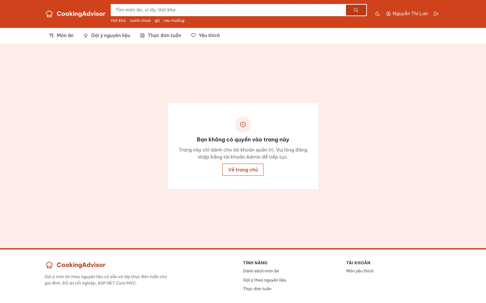{width=11.2cm}

*Hình 4.13. Kết quả khi tài khoản không phải quản trị viên truy cập khu vực quản trị*

Hình 4.13 xác nhận yêu cầu phi chức năng N2: một tài khoản vừa đăng ký với vai
trò `User` khi truy cập đường dẫn `/Admin/Recipes` bị chuyển hướng sang trang
thông báo không đủ quyền, kèm tham số `ReturnUrl` ghi nhận trang đã bị chặn.

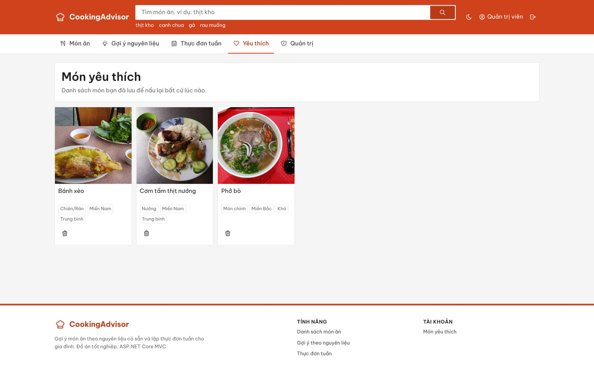{width=11.2cm}

*Hình 4.14. Danh sách món yêu thích*

### 4.2.7. Khu vực quản trị

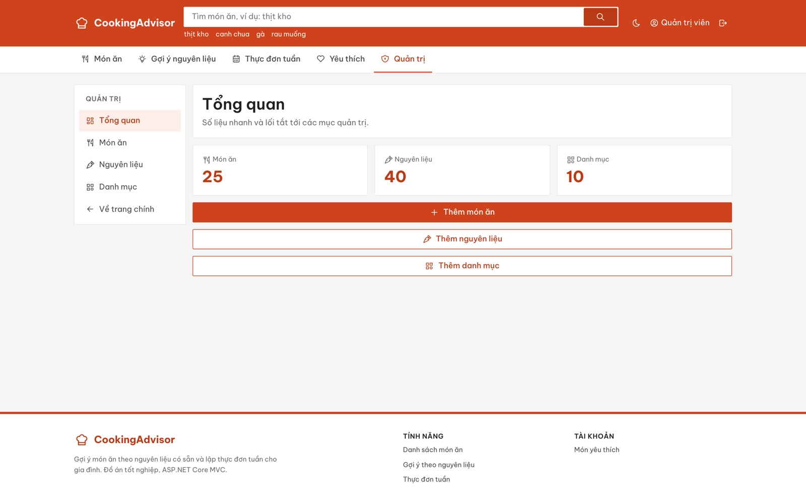{width=11.2cm}

*Hình 4.15. Bảng điều khiển quản trị*

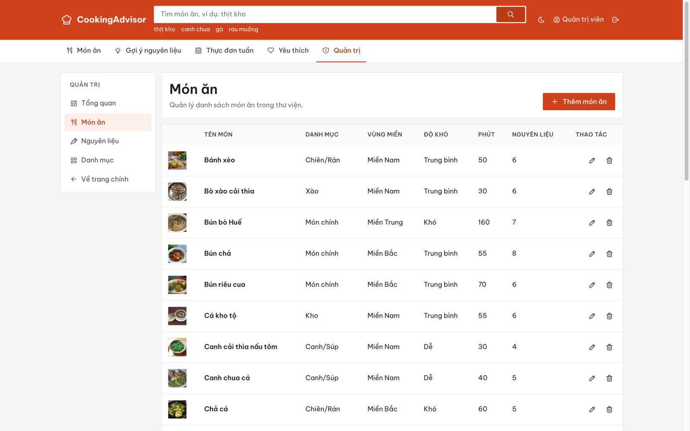{width=11.2cm}

*Hình 4.16. Danh sách quản lý món ăn*

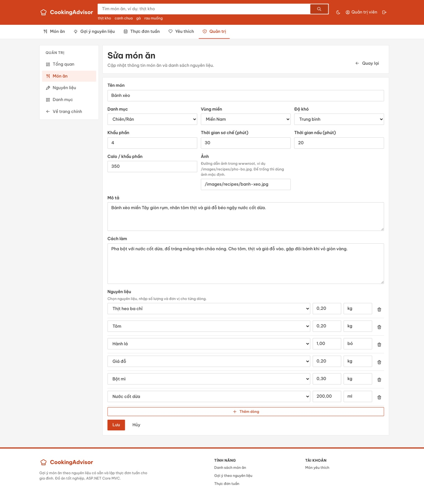{width=6.0cm}

*Hình 4.17. Biểu mẫu sửa món ăn với phần gán nguyên liệu*

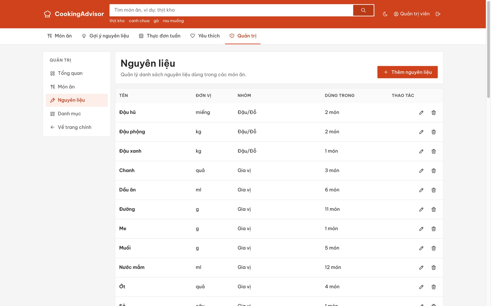{width=11.2cm}

*Hình 4.18. Danh sách quản lý nguyên liệu*

### 4.2.8. Giao diện đáp ứng và chế độ tối

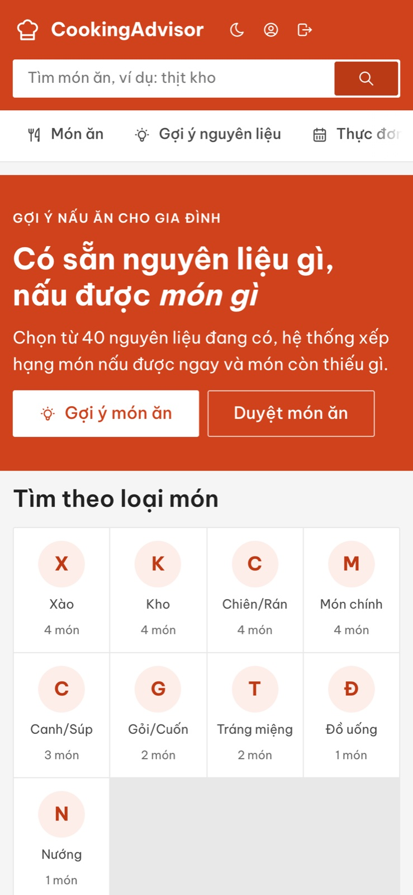{width=3.2cm}

*Hình 4.19. Trang chủ trên màn hình rộng 390 px*

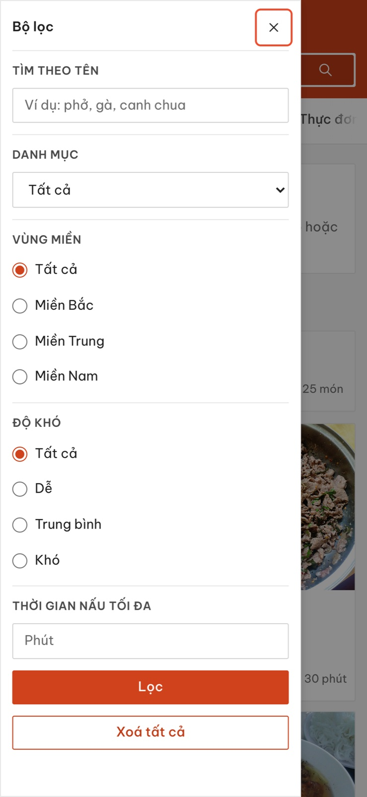{width=3.2cm}

*Hình 4.20. Bộ lọc chuyển thành ngăn kéo trượt trên màn hình hẹp*

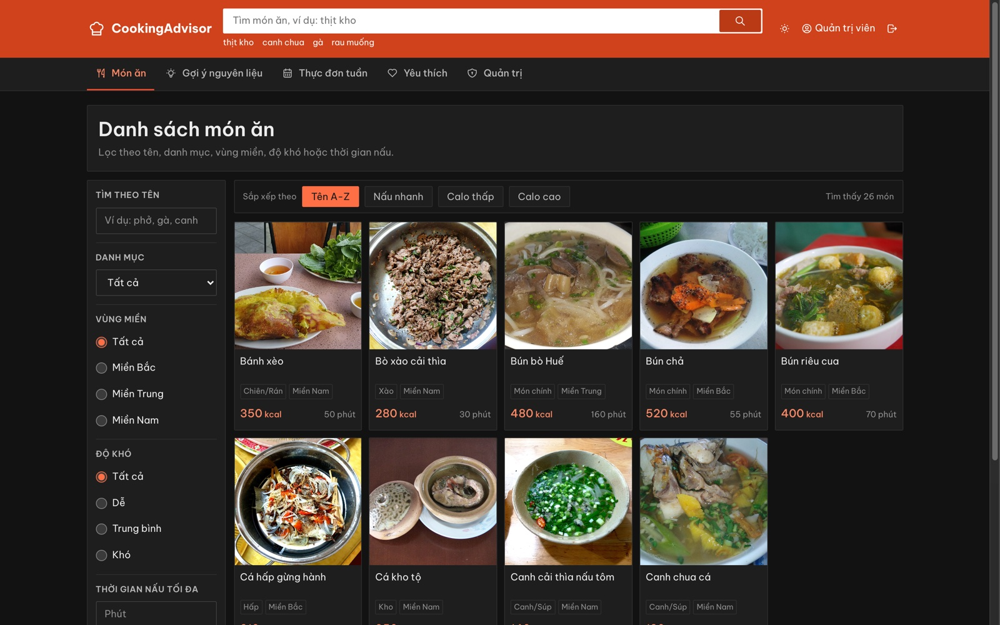{width=11.2cm}

*Hình 4.21. Giao diện ở chế độ tối*

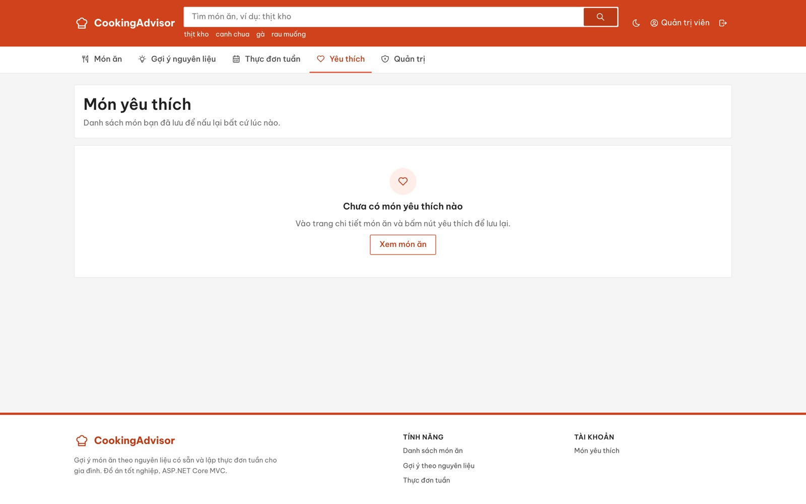{width=11.2cm}

*Hình 4.22. Ví dụ trạng thái khi chưa có dữ liệu*

## 4.3. Kịch bản demo

Kịch bản sau minh họa luồng sử dụng xuyên suốt ba chức năng lõi.

**Bước 1 - Tìm món từ nguyên liệu sẵn có.** Người dùng mở mục "Gợi ý nguyên
liệu", tick 8 nguyên liệu đang có trong bếp rồi bấm "Gợi ý món". Hệ thống trả về
24 món xếp hạng, trong đó 2 món nấu được ngay nằm ở đầu danh sách (Hình 4.6).

**Bước 2 - Đánh dấu món yêu thích.** Người dùng mở chi tiết một vài món và bấm
"Thêm yêu thích". Các món này sẽ được ưu tiên khi sinh thực đơn ở bước sau.

**Bước 3 - Sinh thực đơn tuần.** Người dùng chuyển sang mục "Thực đơn tuần", nhập
tên thực đơn, chọn tuần bắt đầu và bấm "Tạo thực đơn". Hệ thống sinh đủ 21 suất
ăn trong một thao tác (Hình 4.8).

**Bước 4 - Chỉnh tay từng bữa.** Với ô nào chưa vừa ý, người dùng chọn món khác
từ hộp chọn ngay trong ô đó. Tổng năng lượng của ngày tương ứng được tính lại.

**Bước 5 - Xuất danh sách đi chợ.** Người dùng bấm "Tạo danh sách". Hệ thống gộp
nguyên liệu của toàn bộ 21 suất thành 35 dòng theo 8 nhóm (Hình 4.9).

**Bước 6 - Đi chợ.** Khi mua xong từng nguyên liệu, người dùng tick vào ô tương
ứng; dòng đó bị gạch ngang và thanh tiến độ tăng lên.

## 4.4. Kết quả kiểm thử

### 4.4.1. Phương pháp kiểm thử

Kiểm thử được thực hiện ở mức **kiểm thử đơn vị** bằng thư viện xUnit, tập trung
vào ba lớp dịch vụ chứa thuật toán lõi cùng chức năng sắp xếp danh sách món. Cơ
sở dữ liệu được thay bằng nhà cung cấp **EF Core In-Memory**, nhờ đó các ca kiểm
thử chạy độc lập, không phụ thuộc vào SQL Server và không để lại dữ liệu thừa.
Mỗi ca kiểm thử tạo một cơ sở dữ liệu riêng mang tên ngẫu nhiên, bảo đảm các ca
không ảnh hưởng lẫn nhau.

Việc kiểm thử được ở mức này là kết quả trực tiếp của quyết định kiến trúc đã nêu
ở mục 3.5: vì logic nghiệp vụ nằm ở tầng Service chứ không nằm trong Controller,
nên có thể khởi tạo và kiểm thử trực tiếp mà không cần hạ tầng web.

Cần lưu ý một giới hạn của cách tiếp cận này: nhà cung cấp In-Memory **không
thực thi** ràng buộc duy nhất, khóa ngoại hay quy tắc so sánh chuỗi của SQL
Server. Vì vậy các ca kiểm thử ở đây kiểm chứng logic của thuật toán, còn các
hành vi phụ thuộc vào cơ sở dữ liệu thật (tranh chấp ghi đồng thời, vi phạm
khóa ngoại, thứ tự sắp xếp theo bảng mã tiếng Việt) nằm ngoài vùng phủ và được
kiểm tra thủ công trên môi trường chạy thật.

### 4.4.2. Bảng ca kiểm thử

**Nhóm 1 - `SuggestionService` (thuật toán gợi ý theo nguyên liệu)**

| Mã | Tên ca kiểm thử | Mục tiêu kiểm chứng | Kết quả |
|---|---|---|---|
| TC-01 | `SuggestAsync_EmptyIngredientSet_ReturnsEmpty` | Tập nguyên liệu rỗng trả về danh sách rỗng | Đạt |
| TC-02 | `SuggestAsync_AllIngredientsOwned_IsCookableWithNoMissing` | Có đủ nguyên liệu thì món được đánh dấu nấu được ngay, danh sách thiếu rỗng | Đạt |
| TC-03 | `SuggestAsync_SomeIngredientsMissing_ListsMissingNamesAndCoverage` | Liệt kê đúng tên nguyên liệu thiếu và tính đúng độ phủ | Đạt |
| TC-04 | `SuggestAsync_NoMatchedIngredient_RecipeIsExcluded` | Món không chung nguyên liệu nào bị loại khỏi kết quả | Đạt |
| TC-05 | `SuggestAsync_RanksCookableFirstThenCoverageThenFewerMissing` | Thứ tự xếp hạng đúng theo bốn tiêu chí | Đạt |
| TC-06 | `GetIngredientOptionsAsync_ReturnsAllIngredientsOrderedByName` | Danh sách nguyên liệu trả về đầy đủ và sắp theo tên | Đạt |

*Bảng 4.3. Ca kiểm thử thuật toán gợi ý theo nguyên liệu*

**Nhóm 2 - `MenuPlannerService` (thuật toán sinh thực đơn tuần)**

| Mã | Tên ca kiểm thử | Mục tiêu kiểm chứng | Kết quả |
|---|---|---|---|
| TC-07 | `GenerateWeeklyPlanAsync_FillsAll21Slots` | Sinh đủ 21 suất ăn | Đạt |
| TC-08 | `GenerateWeeklyPlanAsync_EnoughRecipes_NoRepeatsWithinWeek` | Thư viện đủ lớn thì không lặp món trong tuần | Đạt |
| TC-09 | `GenerateWeeklyPlanAsync_FewRecipes_AllowsRepeatsButStillFills21` | Thư viện nhỏ vẫn lấp đủ 21 suất bằng cách cho lặp | Đạt |
| TC-10 | `GenerateWeeklyPlanAsync_FewRecipes_SpreadsRepeatsEvenly` | Khi buộc lặp thì rải đều, không dồn vào một món | Đạt |
| TC-11 | `GenerateWeeklyPlanAsync_ScarceBreakfastRecipes_VariesBreakfastAcrossWeek` | Bữa sáng thiếu món vẫn đa dạng qua các ngày | Đạt |
| TC-12 | `GenerateWeeklyPlanAsync_RespectsRegionFilter` | Ràng buộc vùng miền không bị nới | Đạt |
| TC-13 | `GenerateWeeklyPlanAsync_PrefersFavoriteRecipe` | Món yêu thích được ưu tiên chọn | Đạt |
| TC-14 | `GenerateWeeklyPlanAsync_NoRecipesAvailable_Throws` | Không có món nào thì ném ngoại lệ | Đạt |
| TC-15 | `GenerateWeeklyPlanAsync_PersistsMenuPlanAndItems` | Thực đơn và các suất được lưu xuống cơ sở dữ liệu | Đạt |

*Bảng 4.4. Ca kiểm thử thuật toán sinh thực đơn tuần*

**Nhóm 3 - `ShoppingListService` (thuật toán sinh danh sách đi chợ)**

| Mã | Tên ca kiểm thử | Mục tiêu kiểm chứng | Kết quả |
|---|---|---|---|
| TC-16 | `GenerateFromMenuPlanAsync_AggregatesSameIngredientAndUnitAcrossRecipes` | Cùng nguyên liệu, cùng đơn vị ở nhiều món được cộng dồn | Đạt |
| TC-17 | `GenerateFromMenuPlanAsync_KeepsSeparateRowsForDifferentUnits` | Cùng nguyên liệu khác đơn vị được tách thành hai dòng | Đạt |
| TC-18 | `GenerateFromMenuPlanAsync_RepeatedRecipeOccurrences_MultipliesQuantity` | Món lặp trong tuần thì khối lượng nhân lên tương ứng | Đạt |
| TC-19 | `GenerateFromMenuPlanAsync_Regenerate_ReplacesOldItems` | Tạo lại thì ghi đè, không nhân đôi dữ liệu | Đạt |
| TC-20 | `GenerateFromMenuPlanAsync_EmptyPlan_CreatesShoppingListWithNoItems` | Thực đơn rỗng vẫn tạo được danh sách rỗng hợp lệ | Đạt |
| TC-21 | `GenerateFromMenuPlanAsync_NonexistentPlan_Throws` | Thực đơn không tồn tại thì ném ngoại lệ | Đạt |
| TC-22 | `GenerateFromMenuPlanAsync_PlanOwnedByDifferentUser_Throws` | Không truy cập được thực đơn của người dùng khác | Đạt |
| TC-23 | `GenerateFromMenuPlanAsync_PersistsMenuPlanIdAndUserId` | Lưu đúng liên kết tới thực đơn và người dùng | Đạt |

*Bảng 4.5. Ca kiểm thử thuật toán sinh danh sách đi chợ*

**Nhóm 4 - `RecipeService` (tìm kiếm và sắp xếp)**

| Mã | Tên ca kiểm thử | Mục tiêu kiểm chứng | Kết quả |
|---|---|---|---|
| TC-24 | `Defaults_to_alphabetical_order` | Mặc định sắp theo tên món | Đạt |
| TC-25 | `Sorts_by_total_time_using_prep_plus_cook` | Sắp theo tổng thời gian chuẩn bị cộng nấu | Đạt |
| TC-26 | `Sorts_by_calories_in_both_directions` (calo tăng dần) | Sắp đúng chiều tăng | Đạt |
| TC-27 | `Sorts_by_calories_in_both_directions` (calo giảm dần) | Sắp đúng chiều giảm | Đạt |
| TC-28 | `Breaks_ties_by_name_so_paging_cannot_repeat_a_dish` | Có khóa phá vỡ thế cân bằng, phân trang không lặp món | Đạt |
| TC-29 | `Sort_survives_alongside_a_filter_and_is_echoed_back` | Sắp xếp hoạt động cùng bộ lọc và được phản hồi lại giao diện | Đạt |

*Bảng 4.6. Ca kiểm thử chức năng tìm kiếm và sắp xếp*

### 4.4.3. Kết quả chạy kiểm thử

Lệnh `dotnet test src/CookingAdvisor.sln` cho kết quả:

```
Test run for .../CookingAdvisor.Tests.dll (.NETCoreApp,Version=v10.0)
A total of 1 test files matched the specified pattern.

Passed!  - Failed:     0, Passed:    29, Skipped:     0, Total:    29,
Duration: 337 ms - CookingAdvisor.Tests.dll (net10.0)
```

Tổng hợp:

| Nhóm | Số ca | Đạt | Không đạt |
|---|---|---|---|
| `SuggestionService` | 6 | 6 | 0 |
| `MenuPlannerService` | 9 | 9 | 0 |
| `ShoppingListService` | 8 | 8 | 0 |
| `RecipeService` | 6 | 6 | 0 |
| **Tổng** | **29** | **29** | **0** |

*Bảng 4.7. Tổng hợp kết quả kiểm thử theo nhóm*

### 4.4.4. Khiếm khuyết phát hiện qua kiểm thử

Quá trình kiểm thử đã phát hiện hai khiếm khuyết mà quan sát bằng mắt thường khó
nhận ra. Đây là kết quả có giá trị nhất của phần kiểm thử.

**Khiếm khuyết 1 - Suy thoái tính đa dạng của thực đơn.**

*Hiện tượng.* Khi thư viện món không đủ lấp 21 suất mà không lặp, thuật toán chọn
lại đúng một món cho hầu hết các suất còn trống.

*Đo lường.* Trên bộ dữ liệu thử, một món xuất hiện 12 lần trong khi nhiều món
khác dùng được lại không được chọn lần nào.

*Nguyên nhân.* Như đã phân tích ở mục 3.8.2, trong nhánh phải lặp, tiêu chí quyết
định lùi về khoảng cách năng lượng. Do trạng thái năng lượng tích lũy lặp lại
theo chu kỳ, cùng một món luôn cho khoảng cách nhỏ nhất.

*Khắc phục.* Bổ sung tiêu chí ưu tiên món có số lần đã dùng ít nhất, đặt trước
tiêu chí năng lượng và chỉ áp dụng trong nhánh lặp.

*Kết quả sau khắc phục.* Thực đơn sinh ra đạt **17 món khác nhau trên 21 suất**.
Hai ca kiểm thử hồi quy TC-10 và TC-11 được bổ sung để ngăn khiếm khuyết tái
diễn.

**Khiếm khuyết 2 - Thứ tự không xác định khi phân trang.**

*Hiện tượng.* Khi sắp xếp theo năng lượng, các món có cùng giá trị năng lượng
không có thứ tự tất định giữa hai lần truy vấn, dẫn tới nguy cơ một món xuất hiện
ở cả trang trước và trang sau.

*Nguyên nhân.* Câu lệnh sắp xếp chỉ có một khóa duy nhất. Với các bản ghi có khóa
bằng nhau, hệ quản trị cơ sở dữ liệu được tự do trả về theo thứ tự bất kỳ.

*Khắc phục.* Bổ sung khóa sắp xếp phụ là tên món cho mọi phương án sắp xếp.

*Kiểm chứng.* Ca kiểm thử TC-28 dựng 12 món có cùng giá trị năng lượng, **nạp
theo thứ tự tên giảm dần** để loại trừ khả năng kết quả đúng chỉ nhờ trùng với
thứ tự chèn dữ liệu, sau đó yêu cầu hai trang liên tiếp và kiểm tra không có món
nào lặp lại. Ca kiểm thử này đã được xác nhận là **có hiệu lực**: khi tạm gỡ khóa
sắp xếp phụ khỏi mã nguồn, ca kiểm thử chuyển sang trạng thái không đạt; khi khôi
phục, ca kiểm thử đạt trở lại.

## 4.5. Kiểm thử giao diện

Ngoài kiểm thử tự động ở mức đơn vị, giao diện được kiểm tra thủ công trên trình
duyệt theo các tiêu chí phi chức năng đã nêu ở mục 3.5.3.

| Tiêu chí | Cách kiểm tra | Kết quả |
|---|---|---|
| N4 - Không cuộn ngang | Đo `scrollWidth` so với `clientWidth` ở 375 px trên các trang chính | Đạt, không trang nào cuộn ngang |
| N5 - Tương phản WCAG AA | Đo tỉ lệ tương phản của các cặp màu chữ và nền trên trang thật | Đạt, cặp thấp nhất 4,69:1 so với ngưỡng 4,5:1 |
| Chế độ tối | Chuyển chế độ và đo lại toàn bộ cặp màu | Đạt ở cả hai chế độ |
| Điều hướng bàn phím | Kiểm tra bộ lọc dạng ngăn kéo: mở, giữ tiêu điểm, đóng bằng phím Esc | Đạt |
| Nhật ký lỗi trình duyệt | Theo dõi bảng điều khiển của trình duyệt khi duyệt các trang | Không có lỗi |

*Bảng 4.8. Kết quả kiểm tra giao diện theo tiêu chí phi chức năng*

## 4.6. Đánh giá

### 4.6.1. Kết quả đạt được

Đối chiếu với sáu mục tiêu đề ra ở phần Mở đầu:

| Mục tiêu | Kết quả |
|---|---|
| 1. Quản lý kho dữ liệu món ăn | Đạt, 26 món với đầy đủ thuộc tính và định lượng nguyên liệu |
| 2. Thuật toán gợi ý theo nguyên liệu | Đạt, 6 ca kiểm thử đều đạt |
| 3. Thuật toán sinh thực đơn tuần | Đạt, 9 ca kiểm thử đều đạt |
| 4. Sinh danh sách đi chợ | Đạt, 8 ca kiểm thử đều đạt |
| 5. Xác thực và phân quyền | Đạt, kiểm chứng bằng Hình 4.13 |
| 6. Kiểm chứng bằng kiểm thử tự động | Đạt, 29 ca kiểm thử, phát hiện 2 khiếm khuyết thực tế |

*Bảng 4.9. Đối chiếu kết quả đạt được với mục tiêu đề ra*

### 4.6.2. Hạn chế

Hệ thống còn các hạn chế sau, được nêu đầy đủ để làm cơ sở cho phần Hướng phát
triển ở Chương 5:

1. **Gợi ý chưa xét định lượng.** Thuật toán hiện chỉ xét việc **có hay không có**
   một nguyên liệu, chưa xét người dùng có **đủ khối lượng** hay không. Một người
   có 50 gam thịt vẫn được gợi ý món cần 500 gam.
2. **Chưa cá nhân hóa.** Kết quả gợi ý chỉ phụ thuộc tập nguyên liệu đầu vào,
   giống nhau với mọi người dùng. Lịch sử nấu ăn chưa được khai thác.
3. **Dinh dưỡng ở mức thô.** Mới dừng ở năng lượng theo khẩu phần, chưa bóc tách
   đạm, béo, tinh bột hay vi chất.
4. **Ảnh minh họa nhập bằng đường dẫn,** chưa có chức năng tải ảnh lên.
5. **Chưa có đổi mật khẩu, quên mật khẩu và xác thực email.**
6. **Khu quản trị chưa phân trang và chưa có tìm kiếm.** Với quy mô dữ liệu mẫu
   hiện tại thì chưa gây trở ngại, nhưng sẽ là hạn chế khi số món tăng lên.
7. **Thuật toán lập thực đơn là tham lam,** không bảo đảm nghiệm tối ưu toàn cục
   về cân đối năng lượng.
8. **Chưa kiểm thử tích hợp và kiểm thử giao diện tự động.** Phần giao diện mới
   được kiểm tra thủ công.


```{=openxml}
<w:p><w:r><w:br w:type="page"/></w:r></w:p>
```
# CHƯƠNG 5. KẾT LUẬN VÀ HƯỚNG PHÁT TRIỂN

## 5.1. Kết luận

Đồ án đã hoàn thành việc xây dựng **CookingAdvisor**, một ứng dụng web hỗ trợ
người nấu ăn trong gia đình ở ba khâu: tìm món từ nguyên liệu sẵn có, lập thực
đơn cho cả tuần và tổng hợp danh sách đi chợ.

### 5.1.1. Kết quả đạt được

**Về mặt chức năng,** hệ thống cung cấp 20 chức năng phân thành ba nhóm theo mức quyền
truy cập, chạy hoàn chỉnh đầu-cuối trên cơ sở dữ liệu mẫu gồm 26 món ăn Việt Nam, 40
nguyên liệu và 10 danh mục. Toàn bộ sáu mục tiêu đặt ra ở phần Mở đầu đều đã đạt,
với kết quả kiểm chứng cụ thể trình bày ở mục 4.6.1.

**Về mặt thuật toán,** ba thuật toán lõi đã được thiết kế, cài đặt và kiểm chứng:

- *Thuật toán gợi ý theo nguyên liệu* sử dụng độ phủ tập hợp kết hợp xếp hạng bốn
  tiêu chí. Đóng góp đáng chú ý ở đây là lập luận chọn độ phủ thay cho hệ số
  Jaccard: do Jaccard là độ đo đối xứng nên nó phạt cả phần nguyên liệu dư của
  người dùng, dẫn tới việc một món nấu được ngay có thể bị xếp hạng rất thấp.
- *Thuật toán sinh thực đơn tuần* theo hướng tham lam có ràng buộc, với thứ tự
  nới lỏng ràng buộc được quy định rõ ràng và ràng buộc vùng miền được giữ cứng.
- *Thuật toán sinh danh sách đi chợ* gộp nhóm theo khóa ghép (nguyên liệu, đơn
  vị), bảo đảm không cộng dồn nhầm hai giá trị khác đơn vị.

**Về mặt kiểm chứng,** bộ 29 ca kiểm thử đơn vị đã phát hiện được hai khiếm
khuyết mà việc quan sát bằng mắt thường khó nhận ra:

1. *Suy thoái tính đa dạng của thực đơn.* Khi thư viện món không đủ lớn, tiêu chí
   phụ theo năng lượng khiến thuật toán chọn lại đúng một món cho hầu hết các suất
   còn trống, đo được là một món chiếm 12 suất. Sau khi bổ sung tiêu chí rải đều
   theo số lần đã dùng, thực đơn đạt 17 món khác nhau trên 21 suất.
2. *Thứ tự không xác định khi phân trang.* Việc sắp xếp chỉ theo một khóa duy nhất
   khiến các bản ghi có giá trị bằng nhau không có thứ tự ổn định, dẫn tới nguy cơ
   một món xuất hiện ở hai trang. Đã khắc phục bằng khóa sắp xếp phụ theo tên món.

Việc phát hiện được hai khiếm khuyết này là minh chứng cho giá trị thực tế của
kiểm thử tự động, đồng thời cho thấy quyết định kiến trúc tách tầng Service khỏi
tầng Controller (mục 3.5) đã phát huy tác dụng: nếu logic nằm trong Controller,
việc viết các ca kiểm thử này sẽ khó khăn hơn nhiều.

**Về mặt giao diện,** hệ thống hiển thị đúng trên dải màn hình từ 375 px tới
1440 px, không xuất hiện cuộn ngang, hỗ trợ chế độ tối và đạt chuẩn tương phản
WCAG 2.1 mức AA với cặp màu thấp nhất đo được là 4,69:1.

### 5.1.2. Đóng góp của đồ án

So với các ứng dụng đã khảo sát ở mục 1.2, đồ án có ba điểm khác biệt:

**Thứ nhất, tích hợp trọn vẹn ba chức năng trong một luồng công việc liền mạch.**
Các sản phẩm khảo sát thường mạnh ở một khâu và thiếu ở khâu khác. Mealime lập
được thực đơn nhưng không hỗ trợ truy vấn ngược từ nguyên liệu. Paprika quản lý
công thức và danh sách đi chợ tốt nhưng không tự động hóa việc lập thực đơn. Các
trang trong nước chủ yếu dừng ở việc cung cấp nội dung.

**Thứ hai, dữ liệu món ăn Việt Nam được chuẩn hóa về định lượng.** Bảng trung
gian giữa món ăn và nguyên liệu mang thêm thuộc tính khối lượng và đơn vị. Đây là
điều kiện tiên quyết để danh sách đi chợ có thể cộng dồn chính xác, điều mà các
nền tảng có nội dung do cộng đồng đóng góp khó bảo đảm.

**Thứ ba, thuật toán minh bạch và kiểm chứng được.** Toàn bộ tiêu chí xếp hạng và
thứ tự nới lỏng ràng buộc đều được phát biểu tường minh, có mã giả, có lưu đồ và
có ca kiểm thử tương ứng.

### 5.1.3. Hạn chế

Đồ án còn tám hạn chế đã nêu chi tiết ở mục 4.6.2. Trong đó, ba hạn chế có ảnh
hưởng lớn nhất tới trải nghiệm người dùng là:

- Thuật toán gợi ý mới xét việc **có hay không có** một nguyên liệu, chưa xét
  người dùng có **đủ khối lượng** hay không.
- Kết quả gợi ý **giống nhau với mọi người dùng**, chưa khai thác lịch sử nấu ăn
  để cá nhân hóa.
- Thông tin dinh dưỡng mới dừng ở **năng lượng theo khẩu phần**, chưa bóc tách
  các thành phần dinh dưỡng chi tiết.

## 5.2. Hướng phát triển

### 5.2.1. Hoàn thiện các thuật toán hiện có

**Gợi ý có xét định lượng.** Mở rộng mô hình dữ liệu để người dùng khai báo được
khối lượng nguyên liệu đang có, không chỉ khai báo có hay không. Khi đó điều kiện
"nấu được ngay" trở thành: với mọi nguyên liệu $i$ của món, khối lượng người dùng
có phải lớn hơn hoặc bằng khối lượng công thức yêu cầu. Thay đổi này cũng cho
phép danh sách đi chợ **trừ đi phần đã có**, chỉ liệt kê phần còn thiếu.

**Lập thực đơn theo hướng tối ưu.** Thay chiến lược tham lam bằng một thuật toán
tìm kiếm cục bộ hoặc quy hoạch ràng buộc, để tổng năng lượng theo ngày bám sát
mục tiêu hơn. Có thể bổ sung các ràng buộc mới như cân đối nhóm thực phẩm trong
tuần hoặc tránh lặp cùng một nguyên liệu chính trong hai ngày liên tiếp.

**Cá nhân hóa kết quả gợi ý.** Khi hệ thống đã tích lũy đủ dữ liệu về lịch sử nấu
ăn và món yêu thích, có thể áp dụng kỹ thuật lọc cộng tác để bổ sung một tiêu chí
xếp hạng dựa trên mức độ phù hợp với khẩu vị của từng người dùng. Cần lưu ý đây
là hướng chỉ khả thi khi đã có người dùng thực, do các phương pháp này gặp vấn đề
khởi đầu nguội trên hệ thống mới.

### 5.2.2. Mở rộng chức năng

| Hướng mở rộng | Nội dung |
|---|---|
| Dinh dưỡng chi tiết | Bổ sung đạm, béo, tinh bột, chất xơ; cảnh báo theo chế độ ăn hoặc bệnh lý |
| Quản lý tài khoản | Đổi mật khẩu, quên mật khẩu, xác thực email, trang hồ sơ cá nhân |
| Tải ảnh lên | Thay việc nhập đường dẫn ảnh bằng chức năng tải tệp và tự tạo ảnh thu nhỏ |
| Cộng đồng | Cho phép người dùng đóng góp công thức, đánh giá và bình luận |
| Chia sẻ thực đơn | Xuất thực đơn tuần ra tệp hoặc chia sẻ qua đường dẫn công khai |
| In danh sách đi chợ | Xuất bản in hoặc tệp PDF để mang theo khi đi chợ |

*Bảng 5.1. Các hướng mở rộng chức năng*

### 5.2.3. Cải thiện kỹ thuật

**Phân trang và tìm kiếm cho khu quản trị.** Hiện các danh sách trong khu quản
trị hiển thị toàn bộ bản ghi. Với quy mô dữ liệu mẫu thì chưa gây trở ngại, nhưng
sẽ trở thành hạn chế khi số món tăng lên.

**Bổ sung kiểm thử tích hợp và kiểm thử giao diện tự động.** Hiện phần giao diện
mới được kiểm tra thủ công. Có thể bổ sung kiểm thử tích hợp cho các luồng
Controller và kiểm thử giao diện tự động cho các kịch bản chính.

**Ứng dụng di động.** Bối cảnh sử dụng thực tế của chức năng danh sách đi chợ là
khi người dùng đang ở chợ hoặc siêu thị. Một ứng dụng di động có khả năng hoạt
động ngoại tuyến sẽ phù hợp hơn giao diện web.


```{=openxml}
<w:p><w:r><w:br w:type="page"/></w:r></w:p>
```
# DANH MỤC TÀI LIỆU THAM KHẢO

Danh mục xếp theo thứ tự từ điển và trình bày theo định dạng IEEE, thống nhất
cho toàn bộ báo cáo.

[1] Apple App Store, "Cookpad Recipes". [Online]. Địa chỉ:
https://apps.apple.com/us/app/cookpad-recipes/id340368403. [Truy cập ngày
25/07/2026].

[2] Apple App Store, "Mealime Meal Plans & Recipes". [Online]. Địa chỉ:
https://apps.apple.com/us/app/mealime-meal-plans-recipes/id1079999103. [Truy
cập ngày 25/07/2026].

[3] Apple App Store, "Paprika Recipe Manager 3". [Online]. Địa chỉ:
https://apps.apple.com/us/app/paprika-recipe-manager-3/id1303222628. [Truy cập
ngày 25/07/2026].

[4] CafeF, "Thị trường quá khốc liệt, Cooky - startup đi chợ online của
Founder ShopeeFood rời thị trường Hà Nội, chỉ còn hoạt động tại TPHCM".
[Online]. Địa chỉ:
https://cafef.vn/thi-truong-qua-khoc-liet-cooky-startup-di-cho-online-cua-founder-shopeefood-roi-thi-truong-ha-noi-chi-con-hoat-dong-tai-tphcm-188231205162148255.chn.
[Truy cập ngày 25/07/2026].

[5] Cookpad, "Cookpad Việt Nam". [Online]. Địa chỉ: https://cookpad.com/vn.
[Truy cập ngày 25/07/2026].

[6] T. H. Cormen, C. E. Leiserson, R. L. Rivest, C. Stein, Introduction to
Algorithms, 4th ed., MIT Press, Cambridge, MA, 2022.

[7] Esheep Kitchen, Trang chủ. [Online]. Địa chỉ:
https://www.esheepkitchen.com/. [Truy cập ngày 25/07/2026].

[8] C. D. Manning, P. Raghavan, H. Schütze, Introduction to Information
Retrieval, Cambridge University Press, Cambridge, 2008.

[9] Mealime, Trang chủ. [Online]. Địa chỉ: https://www.mealime.com/. [Truy cập
ngày 25/07/2026].

[10] Microsoft Learn, "Introduction to Identity on ASP.NET Core". [Online].
Địa chỉ:
https://learn.microsoft.com/en-us/aspnet/core/security/authentication/identity.
[Truy cập ngày 25/07/2026].

[11] Microsoft Learn, "Migrations Overview - EF Core". [Online]. Địa chỉ:
https://learn.microsoft.com/en-us/ef/core/managing-schemas/migrations/. [Truy
cập ngày 25/07/2026].

[12] Microsoft Learn, "Overview of ASP.NET Core MVC". [Online]. Địa chỉ:
https://learn.microsoft.com/en-us/aspnet/core/mvc/overview. [Truy cập ngày
25/07/2026].

[13] Paprika App, Trang chủ. [Online]. Địa chỉ: https://www.paprikaapp.com/.
[Truy cập ngày 25/07/2026].

[14] Plan to Eat, "Yummly is Closing: Discover the Best Meal Planning
Alternative". [Online]. Địa chỉ:
https://www.plantoeat.com/blog/2024/12/yummly-is-closing-discover-the-best-meal-planning-alternative/.
[Truy cập ngày 25/07/2026].

[15] Yummly, kiểm tra trực tiếp trong quá trình khảo sát: truy vấn
https://www.yummly.com/ trả về mã chuyển hướng HTTP 301 tới
https://www.kitchenaid.com/recipes; tên miền help.yummly.com không phân giải
được. [Ngày kiểm tra 25/07/2026].


```{=openxml}
<w:p><w:r><w:br w:type="page"/></w:r></w:p>
```
# PHỤ LỤC

## Phụ lục A. Hướng dẫn cài đặt và chạy hệ thống

Hệ thống dùng EF Core theo hướng Code-First nên cơ sở dữ liệu được dựng tự động
từ migrations, **không cần nhập tệp sao lưu `.bak`**. Cùng một mã nguồn chạy giống
hệt nhau trên macOS và Windows; điểm khác biệt duy nhất là **chuỗi kết nối**, vốn
nằm trong cấu hình chứ không nằm trong mã nguồn.

### A.1. Chuẩn bị công cụ

```bash
dotnet --version                          # cần từ 10.0 trở lên
dotnet tool install --global dotnet-ef    # nếu chưa có
```

### A.2. Dựng SQL Server

Chọn một trong ba cách, kết quả như nhau.

**Cách A - Docker (khuyến nghị, giống nhau trên macOS và Windows)**

macOS dùng OrbStack hoặc Docker Desktop; Windows dùng Docker Desktop. Cùng một
tệp `docker-compose.yml`:

```bash
cd setup
docker compose up -d
# SQL Server lắng nghe ở localhost:1433, tài khoản sa / CookAdvisor@2026
```

Mật khẩu SA mặc định chỉ dùng cho môi trường phát triển cục bộ, có thể đổi bằng
biến môi trường `MSSQL_SA_PASSWORD` trước khi chạy lệnh trên. Trên máy Apple
Silicon, ảnh container chạy dưới giả lập amd64, cấu hình đã có sẵn trong tệp
compose.

**Cách B - SQL Server cài trực tiếp trên Windows**

Cài bản Express hoặc Developer, bật chế độ xác thực hỗn hợp và dùng tài khoản
`sa` hoặc tạo login riêng.

**Cách C - LocalDB (Windows, nhẹ nhất cho demo)**

Có sẵn khi cài Visual Studio.

### A.3. Cấu hình chuỗi kết nối

Chuỗi kết nối chứa mật khẩu nên **không được đưa vào mã nguồn**. Đặt qua User
Secrets:

```bash
cd src/CookingAdvisor
dotnet user-secrets set "ConnectionStrings:DefaultConnection" "<chuỗi phù hợp>"
```

| Môi trường | Chuỗi kết nối |
|---|---|
| Docker (macOS/Windows) | `Server=localhost,1433;Database=CookingAdvisor;User Id=sa;Password=CookAdvisor@2026;TrustServerCertificate=True` |
| SQL Server cài trực tiếp (Windows) | `Server=localhost;Database=CookingAdvisor;User Id=sa;Password=<mật khẩu của bạn>;TrustServerCertificate=True` |
| LocalDB (Windows) | `Server=(localdb)\MSSQLLocalDB;Database=CookingAdvisor;Trusted_Connection=True;TrustServerCertificate=True` |

Tham số `TrustServerCertificate=True` cần thiết vì chứng chỉ của môi trường phát
triển là chứng chỉ tự ký. Tiếng Việt được lưu bằng kiểu `nvarchar` (Unicode) nên
hiển thị đúng trên mọi môi trường.

### A.4. Tạo cơ sở dữ liệu và chạy ứng dụng

```bash
# từ thư mục gốc của repository
dotnet ef database update --project src/CookingAdvisor   # dựng lược đồ
dotnet run --project src/CookingAdvisor                  # chạy ứng dụng
```

Ở lần chạy đầu tiên, lớp `DbInitializer` nạp dữ liệu mẫu gồm danh mục, nguyên
liệu, 26 món ăn và tài khoản quản trị.

### A.5. Cách thay thế cho Windows: dùng script T-SQL

Nếu máy Windows chưa cài công cụ dòng lệnh `dotnet-ef`, có thể dựng lược đồ bằng
script T-SQL đã xuất sẵn tại `setup/sql/InitialCreate.sql`. Mở tệp bằng SQL Server
Management Studio hoặc `sqlcmd`, kết nối tới máy chủ, chọn hoặc tạo cơ sở dữ liệu
`CookingAdvisor` rồi thực thi.

Script này có tính lũy đẳng: nó tự kiểm tra bảng `__EFMigrationsHistory` nên chạy
lại nhiều lần không gây lỗi. Script được sinh ra từ toàn bộ chuỗi migrations hiện có
nên lược đồ giống hệt bản dựng qua EF Core; khi có migration mới cần sinh lại
script theo lệnh trong `setup/README.md`.

Lưu ý: script chỉ tạo **lược đồ** (bảng, cột, khóa ngoại), không chứa dữ liệu
mẫu. Sau khi thực thi xong vẫn cần chạy ứng dụng **một lần** để `DbInitializer`
nạp dữ liệu, vì phần nạp dữ liệu nằm trong mã C# chứ không nằm trong tệp SQL.

### A.6. Tài khoản mặc định

| Vai trò | Email | Mật khẩu |
|---|---|---|
| Quản trị viên | `admin@cookingadvisor.local` | `Admin@2026!Cook` |

Tài khoản này được tạo tự động khi chạy ứng dụng lần đầu trên cơ sở dữ liệu
trống, chỉ dùng cho môi trường demo của đồ án.

### A.7. Chạy kiểm thử

```bash
dotnet test src/CookingAdvisor.sln
```

Bộ kiểm thử dùng nhà cung cấp EF Core In-Memory nên chạy được mà không cần khởi
động SQL Server.

## Phụ lục B. Cấu trúc mã nguồn

```
CookingAdvisor/
├── setup/                       Tài nguyên cài đặt
│   ├── docker-compose.yml       Cấu hình container SQL Server
│   ├── sql/InitialCreate.sql    Script T-SQL dựng lược đồ
│   └── README.md                Hướng dẫn cài đặt
├── src/
│   ├── CookingAdvisor.sln
│   ├── CookingAdvisor/          Project web
│   │   ├── Controllers/         Tầng điều khiển
│   │   ├── Areas/Admin/         Khu vực quản trị
│   │   ├── Services/            Tầng nghiệp vụ, chứa ba thuật toán lõi
│   │   ├── Models/              Thực thể EF Core và kiểu liệt kê
│   │   ├── ViewModels/          Dữ liệu truyền cho View
│   │   ├── Data/                AppDbContext và DbInitializer
│   │   ├── Views/               Giao diện Razor
│   │   ├── TagHelpers/          Tag helper cho hệ thống biểu tượng
│   │   ├── Migrations/          Lịch sử thay đổi lược đồ
│   │   └── wwwroot/             CSS, JavaScript, phông chữ, ảnh
│   └── CookingAdvisor.Tests/    Dự án kiểm thử xUnit
└── thesis/                      Tài liệu đồ án
    ├── doc/                     Bản .docx của báo cáo
    ├── pdf/                     Bản .pdf để nộp
    ├── images/                  Ảnh chụp giao diện
    └── diagrams/                Sơ đồ (mã nguồn Mermaid và ảnh)
```

## Phụ lục C. Nguồn ảnh minh họa món ăn

Toàn bộ 26 ảnh món ăn sử dụng trong hệ thống được tải từ **Wikimedia Commons**,
đều thuộc các giấy phép cho phép sử dụng tự do (CC0, Public Domain, CC BY, CC
BY-SA). Ảnh đã được giảm kích thước về 900 px chiều ngang.

Danh sách đầy đủ gồm tên món, tên tệp, tác giả, giấy phép và đường dẫn tới trang
nguồn được lưu tại:

```
src/CookingAdvisor/wwwroot/images/recipes/CREDITS.md
```

Bảng dưới đây trích một số mục tiêu biểu:

| Món ăn | Tác giả | Giấy phép |
|---|---|---|
| Phở bò | Andy Li | CC0 |
| Bún chả | Phương Huy | Public Domain |
| Bún bò Huế | Baoothersks | CC BY-SA 4.0 |
| Cơm tấm thịt nướng | Tokeisan | Public Domain |
| Gỏi cuốn | Tran Hai Duong | CC0 |
| Chả giò | Satdeep Gill | CC BY-SA 4.0 |
| Bánh xèo | Orderinchaos | CC BY-SA 4.0 |
| Rau muống xào tỏi | Andy Wright | CC BY 2.0 |

## Phụ lục D. Mã nguồn tiêu biểu

### D.1. Thuật toán gợi ý theo nguyên liệu

Trích từ `src/CookingAdvisor/Services/SuggestionService.cs`:

```csharp
public async Task<List<RecipeSuggestionViewModel>> SuggestAsync(
    IReadOnlyCollection<int> ownedIngredientIds)
{
    var owned = ownedIngredientIds.ToHashSet();
    if (owned.Count == 0)
        return [];

    // Recipes sharing no ingredient with the owned set are not worth suggesting.
    var recipes = await db.Recipes
        .Where(r => r.RecipeIngredients.Any(ri => owned.Contains(ri.IngredientId)))
        .Select(r => new { /* ... */ })
        .ToListAsync();

    return recipes
        .Select(r =>
        {
            var missing = r.Ingredients
                .Where(i => !owned.Contains(i.IngredientId))
                .Select(i => i.Name)
                .OrderBy(name => name)
                .ToList();

            return new RecipeSuggestionViewModel
            {
                TotalIngredientCount = r.Ingredients.Count,
                MatchedCount = r.Ingredients.Count - missing.Count,
                MissingIngredients = missing
                /* ... */
            };
        })
        .OrderByDescending(s => s.CanCookNow)
        .ThenByDescending(s => s.Coverage)
        .ThenBy(s => s.MissingIngredients.Count)
        .ThenBy(s => s.Name)
        .ToList();
}
```

### D.2. Xử lý trường hợp phải lặp món trong thuật toán lập thực đơn

Trích từ `src/CookingAdvisor/Services/MenuPlannerService.cs`. Đây là đoạn khắc
phục khiếm khuyết suy thoái tính đa dạng đã trình bày ở mục 4.4.4:

```csharp
var suitable = candidates.Where(c => c.SuitableMealTypes.HasFlag(flag)).ToList();
var pool = suitable.Where(c => !used.Contains(c.Id)).ToList();

// Repeats only become necessary once every suitable dish has been
// used; meal-type suitability is relaxed only after that.
var repeating = pool.Count == 0;
if (repeating) pool = suitable;
if (pool.Count == 0) pool = candidates;

var ordered = repeating
    // Variety beats preference once repeats are unavoidable: without
    // this key the calorie tie-break returns the same dish for every
    // remaining slot, so one dish fills the week and the rest go unused.
    ? pool.OrderBy(c => useCounts.GetValueOrDefault(c.Id))
        .ThenByDescending(c => favoriteIds.Contains(c.Id))
    : pool.OrderByDescending(c => favoriteIds.Contains(c.Id));

var chosen = ordered
    .ThenBy(c => Math.Abs(dayCalories + c.CaloriesPerServing - mealTarget))
    .ThenBy(c => c.Id)
    .First();
```

### D.3. Gộp nhóm sinh danh sách đi chợ

Trích từ `src/CookingAdvisor/Services/ShoppingListService.cs`:

```csharp
var plan = await db.MenuPlans
    .Include(p => p.Items).ThenInclude(i => i.Recipe).ThenInclude(r => r.RecipeIngredients)
    .FirstOrDefaultAsync(p => p.Id == menuPlanId && p.UserId == userId);

if (plan is null)
    throw new InvalidOperationException("Menu plan not found.");

var aggregated = plan.Items
    .SelectMany(i => i.Recipe.RecipeIngredients)
    .GroupBy(ri => (ri.IngredientId, ri.Unit))
    .Select(g => new ShoppingListItem
    {
        IngredientId = g.Key.IngredientId,
        Unit = g.Key.Unit,
        Quantity = g.Sum(ri => ri.Quantity)
    })
    .ToList();
```

### D.4. Ca kiểm thử tiêu biểu

Trích từ `src/CookingAdvisor.Tests/Services/RecipeServiceSortTests.cs`. Ca kiểm
thử này đã được xác nhận là có hiệu lực bằng cách tạm gỡ khóa sắp xếp phụ khỏi mã
nguồn và quan sát ca kiểm thử chuyển sang trạng thái không đạt:

```csharp
[Fact]
public async Task Breaks_ties_by_name_so_paging_cannot_repeat_a_dish()
{
    using var db = CreateDb();
    // Every dish shares one calorie value, so the tie-break is the only thing
    // deciding the order. Seeded in reverse name order on purpose: if the
    // tie-break were missing, the provider would fall back to insertion order
    // and page 1 would start at "Món 12" instead of "Món 01".
    var recipes = Enumerable.Range(1, RecipeService.PageSize + 3)
        .Select(i => BuildRecipe(i, $"Món {i:D2}", 10, 10, 500))
        .Reverse()
        .ToArray();
    await SeedAsync(db, recipes);

    var service = new RecipeService(db);
    var firstPage = await service.SearchRecipesAsync(
        new RecipeFilterViewModel { Sort = RecipeSortOrder.CaloriesDesc, Page = 1 });
    var secondPage = await service.SearchRecipesAsync(
        new RecipeFilterViewModel { Sort = RecipeSortOrder.CaloriesDesc, Page = 2 });

    Assert.Equal(
        Enumerable.Range(1, RecipeService.PageSize).Select(i => $"Món {i:D2}"),
        firstPage.Recipes.Select(r => r.Name));

    var seen = firstPage.Recipes.Select(r => r.Id)
        .Concat(secondPage.Recipes.Select(r => r.Id))
        .ToList();

    Assert.Equal(seen.Count, seen.Distinct().Count());
    Assert.Equal(recipes.Length, seen.Count);
}
```
